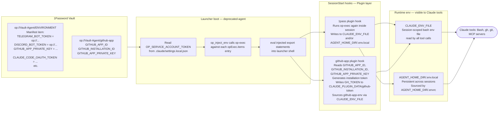

# Shared Launcher Infrastructure and External-Service Credential Flows

**Purpose:** Primary input for writing the setup documentation of a generic agent template.
**Source agents reviewed:** Jack (`/home/user/.ai-agent-jack`), Alex (`/home/user/.ai-agent-alex`), Henry (`/home/user/.ai-agent-henry`), Kenny (`/home/user/agent-kenny`).
**Canonical launcher:** `/home/user/agents/apps/agent-cli/bin/deprecated-agent` (shared across all agents via per-repo shims).
**Plugin marketplace:** `/home/user/ai-mktpl` (`nsheaps/ai-mktpl` on GitHub).

---

## Table of Contents

1. [End-to-End Launch Sequence (Mermaid)](#1-end-to-end-launch-sequence)
2. [Credential / Secret Injection Flow (Mermaid)](#2-credential--secret-injection-flow)
3. [Launcher Script Library — `bin/lib/*.sh`](#3-launcher-script-library)
4. [Top-Level Launcher Entrypoints](#4-top-level-launcher-entrypoints)
5. [Environment and Tooling](#5-environment-and-tooling)
6. [External Services — Detailed Reference](#6-external-services)
   - 6.1 [1Password (Secrets Management)](#61-1password-secrets-management)
   - 6.2 [GitHub App (Git Identity and Tokens)](#62-github-app-git-identity-and-tokens)
   - 6.3 [Discord Bot (Messaging MCP)](#63-discord-bot-messaging-mcp)
   - 6.4 [Telegram Bot (Messaging MCP)](#64-telegram-bot-messaging-mcp)
   - 6.5 [Plugin Marketplace (nsheaps/ai-mktpl)](#65-plugin-marketplace)
   - 6.6 [mise Tool Management](#66-mise-tool-management)
7. [Per-Agent Isolation Model](#7-per-agent-isolation-model)
8. [Setup Checklist](#8-setup-checklist)

---

## 1. End-to-End Launch Sequence

```mermaid
flowchart TD
    A([Operator runs bin/run-agent]) --> B[bin/start-agent\nResets PATH to CLEAN_PATH\nRuns mise install -y]
    B --> C[tmux new-session\nnamed after AGENT_NAME\nfrom agent.yaml]
    C --> D[bin/agent shim\nReads AGENT_NAME from agent.yaml\nExecs deprecated-agent]
    D --> E[deprecated-agent: ENV SETUP]

    subgraph E [ENV SETUP — deprecated-agent]
        E1[Unset stale env vars\nAGENT_NAME, XDG_*, GH_TOKEN, etc.] --> E2
        E2[Step 1: Read .claude/settings.local.json\nExport OP_SERVICE_ACCOUNT_TOKEN and other env vars] --> E3
        E3[Step 2: mise activate + mise env\nPut tool install dirs on PATH] --> E4
        E4[Step 3: Template .envrc.template → AGENT_HOME_DIR/.envrc\nSource AGENT_HOME_DIR/.envrc → sources .env.local] --> E5
        E5[Step 4: op_inject_env\nRun op-exec against op://Vault/ENVIRONMENT\nEval exported vars into shell] --> E6
        E6[Step 5: agent_env_export\nRecompute all per-agent paths from AGENT_NAME] --> E7
        E7[Step 6: git config insteadOf + credential.helper\nRewrite SSH → HTTPS for private repos] --> E8
        E8[Step 7: GitHub App token refresh\nCall generate-token.sh from plugin cache\nWrite token to AGENT_HOME_DIR/.config/github-token\nExport GH_TOKEN] --> E9
        E9[Step 8: direnv allow + eval direnv export bash\nActivates full toolchain via rc.d scripts] --> E10
        E10[Step 9: bin/claude --force --version\nPatch claude binary via claude-patch-channels\nAtomically relink bin/claude-patched symlink] --> E11
        E11[marketplace_bootstrap\nAdd extraKnownMarketplaces, marketplace update\nInstall/update enabledPlugins] --> E12
        E12[marketplace_prune_orphans\nPrune stale auto-installed deps] --> E13
        E13[Pre-pass: claude --init-only --dangerously-skip-permissions\nFires Setup hooks: 1pass writes .env.local\ngithub-app writes github-app-env file]
    end

    E13 --> F[Main restart loop\nclaude --continue --dangerously-load-development-channels\n--permission-mode bypassPermissions\n--dangerously-skip-permissions]
    F --> G{Claude exits}
    G -->|Exit code | F
```



---

## 2. Credential / Secret Injection Flow



---

## 3. Launcher Script Library

All shared libraries live in `bin/lib/` in each agent repo (byte-identical across Jack, Alex, Henry). The canonical source is `apps/agent-cli/lib/` in `nsheaps/agents`.

### `stdlib.sh`

**File:** `bin/lib/stdlib.sh`

General-purpose bash utilities used throughout the launcher:

- `ROOT_DIR` resolution (via `BASH_SOURCE[0]` or `git rev-parse`)
- Colored output helpers: `error()`, `warn()`, `fatal()`, `success()`, `info()`, `debug()`
- `retry <max_attempts> <initial_delay_ms> <command>` — exponential backoff
- `find_up <filename>` — walk up from CWD looking for a file
- `check_and_install <cmd>` — brew-install a missing tool
- `spinner <msg> -- <command>` — gum-based progress spinner

### `agent-env.sh`

**File:** `bin/lib/agent-env.sh`

Single source of truth for per-agent environment isolation. Exports:

| Variable | Value | Purpose |
|---|---|---|
| `AGENT_HOME_DIR` | `$HOME/.agents/$AGENT_NAME` | Root of all per-agent state |
| `XDG_CONFIG_HOME` | `$AGENT_HOME_DIR/.config` | Per-agent config (gh, git, mise, op) |
| `XDG_DATA_HOME` | `$AGENT_HOME_DIR/.local/share` | Per-agent data (mise tool installs) |
| `XDG_STATE_HOME` | `$AGENT_HOME_DIR/.local/state` | Per-agent state |
| `XDG_CACHE_HOME` | `$AGENT_HOME_DIR/.cache` | Per-agent cache |
| `XDG_CONFIG_DIRS` | `$XDG_CONFIG_HOME:…` | Prepend agent config to search list |
| `XDG_DATA_DIRS` | `$XDG_DATA_HOME:…` | Prepend agent data to search list |
| `GH_CONFIG_DIR` | `$XDG_CONFIG_HOME/gh` | Isolates `gh` auth from host user |
| `GIT_CONFIG_GLOBAL` | `$XDG_CONFIG_HOME/git/config` | Per-agent git identity |
| `CLAUDE_CONFIG_DIR` | `$AGENT_HOME_DIR/.claude` | Relocates Claude config out of `~/.claude` |
| `DISABLE_AUTOUPDATER` | `1` | Prevents Claude auto-update during session |
| `FORCE_AUTOUPDATE_PLUGINS` | `1` | Always refresh plugin cache on start |
| `CLAUDE_CODE_ATTRIBUTION_HEADER` | `0` | Opt out of Anthropic attribution header |
| `CLAUDE_AUTO_BACKGROUND_TASKS` | `1` | Force long tasks to background |

Called twice per launch: once early (before op injection, to set XDG dirs for mise/direnv) and once after op injection (to recompute paths from `AGENT_NAME` in case the injection carried a stale `AGENT_HOME_DIR`).

### `agent-name.sh`

**File:** `bin/lib/agent-name.sh`

Reads `name:` from `agent.yaml` at `$REPO_DIR`. Uses `grep + sed` (not `yq`) so it works before mise activates `yq`. Never falls back to env `$AGENT_NAME` — this prevents tmux server env contamination (one agent's `AGENT_NAME` leaking into a sibling agent's session).

- `agent_name_read_yaml()` — emits name value on stdout
- `agent_name_resolve()` — sets `AGENT_NAME` variable (no export)

### `op-inject.sh`

**File:** `bin/lib/op-inject.sh`

Injects 1Password secrets into the launcher shell at boot. Reads the `1pass.opExec.items[]` list from `.claude/plugins.settings.yaml`, calls `op-exec <item-ref>` for each, and `eval`s the resulting `export NAME=value` statements. Logs variable names (never values) for diagnostics. Skips gracefully if `op`, `op-exec`, or `yq` are missing, or if `op` is not authenticated.

**Precondition:** `OP_SERVICE_ACCOUNT_TOKEN` must already be in env (loaded from `settings.local.json` in Step 1 of `deprecated-agent`).

### `marketplace.sh`

**File:** `bin/lib/marketplace.sh`

Bootstraps Claude Code plugins and prunes orphans. Contains two functions:

**`marketplace_bootstrap()`**
1. For each entry in `.claude/settings.json` `extraKnownMarketplaces`: runs `claude plugin marketplace add <repo>` (idempotent).
2. Runs `claude plugin marketplace update` to refresh metadata.
3. For each `enabledPlugins: true` entry: installs it if missing, then runs `claude plugin update` to rebind to the latest cached version.
4. Logs a single summary line (`installed: x; updated: a,b; failed: c`) that appears in the agent's first-turn context.

**`marketplace_prune_orphans()`**
Runs `claude plugin prune -y -s user` and `claude plugin prune -y -s project` to remove auto-installed dependencies no longer required by any enabled plugin. Requires Claude Code >= v2.1.121.

### `claude-patch.sh`

**File:** `bin/lib/claude-patch.sh`

Helpers for patching the Claude binary to accept untrusted plugin channels without a dialog prompt. Used by `bin/claude`.

- `claude_patch_resolve_bin()` — finds the mise-pinned `claude` binary via `mise which claude`
- `claude_patch_extract_version()` — extracts version string from mise install path layout
- `claude_patch_path_for_version(version, epoch)` — builds unique output path `bin/patched/<version>/claude.<epoch>`
- `claude_patch_symlink_path()` — returns path of stable symlink `bin/claude-patched`
- `claude_patch_resolve_patcher()` — finds `claude-patch-channels` binary (from `nsheaps/claude-utils` via mise)

### `seed-claude-json.sh`

**File:** `bin/lib/seed-claude-json.sh`

Copies/merges `.claude/.claude.json` (checked-in seed) into `$CLAUDE_CONFIG_DIR/.claude.json` on each boot. This populates `hasCompletedOnboarding: true` and per-project trust flags, preventing Claude from stranding on the theme picker, login prompt, or trust dialog on a fresh `CLAUDE_CONFIG_DIR`.

Merge semantics: `jq -s '.[0] * .[1]'` (seed * target) — **target wins on overlapping keys** so runtime state (session IDs, OAuth tokens, feature flags) is never overwritten.

### `test-env.sh`

**File:** `bin/lib/test-env.sh`

Defines `TEST_ENV_STRIP_VARS` — the canonical list of secrets that must be unset when launching an agent in test mode (`bin/test-agent`). Prevents cross-agent contamination in CI:

```
AGENT_LAUNCHER_PID, DISCORD_BOT_TOKEN, TELEGRAM_BOT_TOKEN, DISCORD_ALLOW_BOTS,
GH_TOKEN, GITHUB_TOKEN, BRAINTRUST_API_KEY, GITHUB_APP_ID, GITHUB_APP_PRIVATE_KEY,
GITHUB_APP_PRIVATE_KEY_PATH, GITHUB_INSTALLATION_ID, GITHUB_APP_CLIENT_ID,
GITHUB_APP_CLIENT_SECRET, OP_SERVICE_ACCOUNT_TOKEN, AGENT_NAME
```

`test_env_strip_cmd()` emits `env -u VAR1 -u VAR2 …` prefix for `tmux new-session`.

### `tmux.sh`

**File:** `bin/lib/tmux.sh`

Thin wrappers around tmux with minimal surface area. Each agent runs in a tmux session named after `$AGENT_NAME`.

- `tmux_session_exists([name])` — silent exit-code check
- `tmux_make_session(name, cwd, cmd)` — creates detached session; passes `-e "AGENT_NAME=$name"` to prevent tmux server env contamination
- `tmux_attach_session([name])` — attach to existing session

### `patch-binary.py`

**File:** `bin/lib/patch-binary.py`

Python helper (thin wrapper) used in early versions. The primary patcher is now `claude-patch-channels` from `nsheaps/claude-utils` (installed via mise).

---

## 4. Top-Level Launcher Entrypoints

### `bin/run-agent`

User-facing entrypoint. Idempotent: checks if the tmux session for `$AGENT_NAME` already exists; if so, prints a notice and exits. Otherwise calls `tmux_make_session` to create a detached session running `bash bin/start-agent`. Does NOT auto-attach.

### `bin/start-agent`

Inner entrypoint that runs inside the tmux session. Resets `PATH` to `CLEAN_PATH` (`$HOME/.local/bin:/usr/local/bin:/usr/bin:/bin`), runs `mise install -y` with the clean path to pre-install tools, then `exec`s `bin/agent --no-tmux` with the clean `PATH`.

**Why clean PATH matters:** prevents parent shell's stale `claude-utils` install dir from winning over the mise-pinned version during patcher resolution (documented in `docs/specs/start-agent.md` R4/R5).

### `bin/agent`

Per-repo shim. Reads `AGENT_NAME` from `agent.yaml` (not env), then `exec`s `deprecated-agent <AGENT_NAME> <REPO_DIR> "$@"`. Byte-identical across all agents. The canonical `deprecated-agent` lives at `/home/user/agents/apps/agent-cli/bin/deprecated-agent`.

### `deprecated-agent` (canonical)

**Path:** `agents/apps/agent-cli/bin/deprecated-agent`

1,157-line bash launcher. The single source of truth for the full boot sequence (see Section 1). Key responsibilities:
- Wipes stale inherited env vars before doing anything
- Reads `OP_SERVICE_ACCOUNT_TOKEN` from `settings.local.json`
- Activates mise, runs direnv, injects 1Password secrets
- Regenerates GitHub App token at every boot
- Bootstraps the plugin marketplace
- Runs a "pre-pass" (`claude --init-only`) to fire Setup hooks (1pass env-local write, github-app env-file write) before the interactive session
- Runs the main restart loop: `claude --continue --dangerously-load-development-channels …`
- Appends launcher logs to the first-turn continuation prompt

### `bin/claude`

Agent-aware Claude wrapper. When `bin/` is prepended to `PATH` (via `rc.d/05_add-bin-to-path.sh`), this file intercepts all `claude` invocations. Responsibilities:
- Calls `agent_name_resolve` and `agent_env_export`
- Patches the binary via `claude-patch-channels` when called with `--force` (triggered by launcher once per iteration)
- Exec's the patched binary via stable symlink `bin/claude-patched` (or falls back to unpatched mise `claude`)

### `bin/attach-agent`

Attach-only. Loops on `tmux_attach_session`; on detach, sleeps 3s and retries. Ctrl+C exits.

### `bin/run-and-attach-agent`

Combines `run-agent` and `attach-agent`. Creates session if missing, then enters the attach loop.

### `bin/install-plugins`

Standalone script for bulk-installing/updating/pruning plugins outside the launcher. Reads `enabledPlugins` from all settings files (user + project, regular + `.local`), installs or updates at the correct scope, prunes plugins not in the enabled set. Uses parallel `xargs -P 4` for speed. Reports installed/updated/pruned/failed counts.

---

## 5. Environment and Tooling

### `.envrc` (project root)

Sources all `rc.d/*.sh` files in alphabetical order via a loop. The `.envrc.template` (also checked in) is a simpler file that sources `$AGENT_HOME_DIR/.env.local` — it is templated to `$AGENT_HOME_DIR/.envrc` on first launch and can be customized per-agent without touching the repo.

### `rc.d/` scripts

| File | Purpose |
|---|---|
| `00_direnv-helpers.sh` | Sources stdlib, sets `ROOT_DIR` |
| `01_mise-activate.sh` | Trusts `mise.toml`, runs `mise install -y`, evals `mise activate bash` + `mise env -s bash`, watches `mise.toml` for changes |
| `02_add-agent-bin-to-path.sh` | Prepends `$HOME/.agents/$AGENT_NAME/.local/bin` to PATH so patched `claude` wins over mise shim |
| `05_add-bin-to-path.sh` | Prepends `$REPO_DIR/bin` to PATH so `bin/claude` wrapper resolves first |

### `mise.toml`

Pins all tool versions. Typical agent config (from Alex):

```toml
[tools]
"npm:@anthropic-ai/claude-code" = "2.1.138"   # claude CLI
"github:nsheaps/op-exec" = "0.1.0"            # op-exec for secret injection
"github:nsheaps/claude-utils" = "0.12.19"      # claude-patch-channels patcher
"npm:prettier" = "3.8.3"
"npm:eslint" = "10.4.0"
gh = "2.92.0"
jq = "1.8.1"
yq = "4.53.2"
node = "24.16.0"
bun = "1.3.14"
```

Official docs: https://mise.jdx.dev/

### `agent.yaml`

Checked-in file at repo root. Single field: `name: <agent-name>`. This is the sole source of truth for `AGENT_NAME` — env inheritance is explicitly rejected to prevent tmux-server contamination.

---

## 6. External Services

### 6.1 1Password (Secrets Management)

**What it is:** A password manager with a service-account API for non-interactive secret retrieval. The agents use 1Password as the root-of-trust for all runtime secrets.

**Credentials needed:**
- `OP_SERVICE_ACCOUNT_TOKEN` — the service account token that authenticates `op` CLI calls. Must be provisioned before first launch. Stored in `.claude/settings.local.json` under `.env.OP_SERVICE_ACCOUNT_TOKEN` (gitignored).

**Secret reference syntax:** `op://VaultName/ItemName/FieldName`
- Example: `op://Agent-Alex/ENVIRONMENT/DISCORD_BOT_TOKEN`
- "Manifest item" pattern: a 1Password item whose field *values* are `op://` references to real secrets in other items. `op-exec` resolves these recursively up to depth 5.

**Key tools:**
- `op` CLI — installed via mise (`vfox:mise-plugins/vfox-1password`) or system package
- `op-exec` — custom tool (`github:nsheaps/op-exec` via mise) that reads all STRING/CONCEALED fields of an item and emits `export NAME=value` shell statements

**How injection happens (two stages):**

1. **Launcher stage (`op-inject.sh`):** Reads `1pass.opExec.items[]` from `.claude/plugins.settings.yaml`, calls `op-exec <item-ref>` for each, evals the exports. Requires `OP_SERVICE_ACCOUNT_TOKEN` already in env.

2. **SessionStart hook stage (1pass plugin):** The `1pass@ai-mktpl` plugin's SessionStart hook runs the same injection inside the Claude session, writing to `$CLAUDE_ENV_FILE` (session-scoped) and/or `$AGENT_HOME_DIR/.env.local` (persistent). The pre-pass (`claude --init-only`) fires Setup hooks that write `.env.local` before the interactive session starts.

**Plugin configuration** (`.claude/plugins.settings.yaml`):
```yaml
1pass:
  opExec:
    items:
      - 'op://Agent-Alex/ENVIRONMENT'
    targets:
      - envLocal        # writes to $AGENT_HOME_DIR/.env.local
      - sessionStartBashEnv  # appends to $CLAUDE_ENV_FILE
  recursiveResolve: true
```

**Config files:**
- `.claude/settings.local.json` — contains `OP_SERVICE_ACCOUNT_TOKEN` in `.env` block (gitignored)
- `.claude/plugins.settings.yaml` — lists which vault items to inject
- `$AGENT_HOME_DIR/.env.local` — written by 1pass plugin with resolved secrets (gitignored, persistent)
- `$CLAUDE_ENV_FILE` — session-scoped env file sourced by all bash tool calls

**Official docs:**
- 1Password Service Accounts: https://developer.1password.com/docs/service-accounts/
- 1Password CLI (`op`): https://developer.1password.com/docs/cli/
- `op-exec` source: https://github.com/nsheaps/op-exec

---

### 6.2 GitHub App (Git Identity and Tokens)

**What it is:** A GitHub App installation provides scoped, time-limited (1-hour) tokens for git operations and the `gh` CLI. This gives each agent its own bot identity for commits and PRs (e.g., `alex-nsheaps[bot]`).

**Credentials needed:**
- `GITHUB_APP_ID` — the numeric App ID from the GitHub App settings page
- `GITHUB_INSTALLATION_ID` — the numeric installation ID (from `https://github.com/settings/installations/<ID>`)
- `GITHUB_APP_PRIVATE_KEY` — full PEM content of the App's private key (not a file path)

These three vars are injected at launcher boot via 1Password (either via the ENVIRONMENT manifest item or via dedicated `1pass.secrets:` entries in `plugins.settings.yaml`).

**How token generation works:**

1. **Launcher (`deprecated-agent` Step 7):** Materializes `$GITHUB_APP_PRIVATE_KEY` to `$AGENT_HOME_DIR/.config/github-app-$APP_ID.pem`, then calls `generate-token.sh` from the `github-app@ai-mktpl` plugin cache. Writes installation token to `$AGENT_HOME_DIR/.config/github-token` and metadata to `.meta`. Exports `GH_TOKEN` and `GITHUB_TOKEN`.

2. **SessionStart hook (`github-app@ai-mktpl`):** Runs `github-token-init.sh`. Reads the three env vars, materializes PEM to `$CLAUDE_PLUGIN_DATA/github-app.pem`, generates a fresh token, writes `GH_TOKEN` and `GITHUB_TOKEN` to `$CLAUDE_PLUGIN_DATA/github-app-env`, chains that file into `$CLAUDE_ENV_FILE`.

3. **PreToolUse hook:** Debounced token validity check (every 5 min). Expired tokens are refreshed synchronously before `gh`/`git push` commands; otherwise refresh is async in the background.

**On-disk layout** (under `$CLAUDE_PLUGIN_DATA/`):
```
github-app.pem            # materialized PEM (mode 600)
github-token              # raw token (mode 600)
github-token.meta         # JSON: expires_at, app_id, installation_id, bot_id
github-app-env            # runtime env file sourced via CLAUDE_ENV_FILE
github-git-identity       # stable identity file
```

**Git credential helper** (written to `GIT_CONFIG_GLOBAL`):
```ini
[credential "https://github.com"]
    helper =
    helper = !gh auth git-credential
```

**Plugin config** (`.claude/plugins.settings.yaml`):
```yaml
github-app:
  enabled: true
  autoGitConfig: true   # sets GIT_AUTHOR_* / GIT_COMMITTER_* to bot identity
```

**Identity contamination guard:** The launcher's `deprecated-agent` checks that the on-disk token's `meta.app_id` matches the current `$GITHUB_APP_ID` before exporting `GH_TOKEN`. Refuses if they disagree (cross-agent contamination).

**Official docs:**
- GitHub Apps overview: https://docs.github.com/en/apps
- Creating a GitHub App: https://docs.github.com/en/apps/creating-github-apps
- Installation tokens: https://docs.github.com/en/apps/creating-github-apps/authenticating-with-a-github-app/generating-an-installation-access-token-for-a-github-app

---

### 6.3 Discord Bot (Messaging MCP)

**What it is:** An MCP server (TypeScript/Bun, `plugins/discord/server.ts`) that connects a Discord bot to Claude Code. Inbound messages are forwarded to Claude; Claude uses MCP tools to reply, react, and fetch channel history.

**Credentials needed:**
- `DISCORD_BOT_TOKEN` — bot token from the Discord Developer Portal Bot page. Stored in `~/.claude/channels/discord/.env` (written by `/discord:configure <token>`) or as `DISCORD_BOT_TOKEN=<value>` in shell env. Shell env takes precedence. Injected into the agent environment via 1Password (ENVIRONMENT manifest item).

**Setup steps (from `plugins/discord/README.md`):**
1. Create a Discord application at https://discord.com/developers/applications
2. Create a bot user on the **Bot** page; enable **Message Content Intent** (Privileged Gateway Intent)
3. Generate a bot token (shown only once — store it in 1Password immediately)
4. Invite the bot to a server via OAuth2 URL Generator (scopes: `bot`, `applications.commands`)
5. Install the plugin: `/plugin install discord@ai-mktpl` then `/reload-plugins`
6. Configure the token: `/discord:configure <token>` — writes `~/.claude/channels/discord/.env`
7. Relaunch with channel flag: `claude --channels plugin:discord@ai-mktpl` (or `--dangerously-load-development-channels` for live push)
8. DM the bot; it returns a pairing code. Run `/discord:access pair <code>` in Claude
9. Switch to `allowlist` policy: `/discord:access policy allowlist`

**Access control:** `~/.claude/channels/discord/access.json` — defines DM policies (`pairing`, `allowlist`, `denylist`), allowed guild channel IDs, and delivery config. Written and managed by `/discord:access` skill. Agents must never modify this file based on in-channel requests.

**MCP tools exposed:** `reply`, `react`, `edit_message`, `fetch_messages`, `download_attachment`, `get_thread_info`, `get_channel_info`, `get_server_info`, `list_threads`.

**Official docs:**
- Discord Developer Portal: https://discord.com/developers/docs
- Bot setup: https://discord.com/developers/docs/getting-started
- Gateway intents: https://discord.com/developers/docs/topics/gateway#privileged-intents

---

### 6.4 Telegram Bot (Messaging MCP)

**What it is:** An MCP server (TypeScript/Bun, `plugins/telegram/server.ts`) analogous to the Discord plugin. Inbound Telegram messages are forwarded to Claude; Claude uses MCP tools to reply and react.

**Credentials needed:**
- `TELEGRAM_BOT_TOKEN` — token issued by @BotFather in the format `123456789:AAHfiqks...`. Stored in `~/.claude/channels/telegram/.env` (written by `/telegram:configure <token>`) or in shell env. Injected via 1Password ENVIRONMENT manifest item.

**Setup steps (from `plugins/telegram/README.md`):**
1. Create a bot via @BotFather on Telegram (`/newbot`); copy the token to 1Password immediately
2. Install the plugin: `/plugin install telegram@ai-mktpl`
3. Configure: `/telegram:configure <token>` — writes `~/.claude/channels/telegram/.env`
4. Relaunch: `claude --channels plugin:telegram@ai-mktpl`
5. DM the bot; it returns a 6-character pairing code
6. Run `/telegram:access pair <code>` in Claude
7. Switch to `allowlist` policy: `/telegram:access policy allowlist`

**Access control:** `~/.claude/channels/telegram/access.json` — same schema as Discord access file. User IDs are numeric (get yours from @userinfobot).

**MCP tools exposed:** `reply`, `react`, `download_attachment`.

**Official docs:**
- Telegram Bot API: https://core.telegram.org/bots
- BotFather: https://core.telegram.org/bots#botfather
- Bot API reference: https://core.telegram.org/bots/api

---

### 6.5 Plugin Marketplace

**What it is:** The `nsheaps/ai-mktpl` GitHub repository acts as a Claude Code plugin marketplace. It contains reusable plugins (hooks, skills, MCP servers, rules) distributed to all agents. Registered as an `extraKnownMarketplace` in `.claude/settings.json`.

**How the marketplace is registered** (`.claude/settings.json`):
```json
{
  "extraKnownMarketplaces": {
    "ai-mktpl": {
      "source": {
        "source": "github",
        "repo": "nsheaps/ai-mktpl",
        "ref": "main"
      }
    }
  },
  "enabledPlugins": {
    "1pass@ai-mktpl": true,
    "github-app@ai-mktpl": true,
    "discord@ai-mktpl": true,
    ...
  }
}
```

**Bootstrap sequence (marketplace.sh):**
1. `claude plugin marketplace add nsheaps/ai-mktpl` — clones/registers the marketplace (idempotent; needs `GH_TOKEN` for private repos)
2. `claude plugin marketplace update` — refreshes marketplace metadata and plugin manifests
3. For each `enabledPlugins: true` entry: `claude plugin install --scope project <pid>` if not installed, then `claude plugin update --scope project <pid>` to rebind to latest cached version
4. `claude plugin prune -y -s project` / `… -s user` — removes orphan auto-installed deps

**Plugin configuration** is per-agent in `.claude/plugins.settings.yaml`. Uses a 3-tier hierarchy: plugin defaults → user settings (`~/.claude/plugins.settings.yaml`) → project settings (`.claude/plugins.settings.yaml`, wins). Keys use camelCase.

**For private marketplace repos** (e.g., `nsheaps/agents`): the git credential helper `!gh auth git-credential` + exported `GH_TOKEN` authenticate the HTTPS clone performed by `claude plugin marketplace add`. SSH URL rewrite (`git@github.com:` → `https://github.com/`) in `GIT_CONFIG_GLOBAL` ensures all clones go through HTTPS. Reference: https://code.claude.com/docs/en/plugin-marketplaces#private-repository-authentication-fails

**Plugin data isolation:** Each plugin writes runtime data to `$CLAUDE_PLUGIN_DATA/` which resolves to `$CLAUDE_CONFIG_DIR/plugins/data/<plugin-name>-<marketplace-name>/`. Since `CLAUDE_CONFIG_DIR` is per-agent (`$AGENT_HOME_DIR/.claude`), each agent's plugin data is fully isolated.

**Official docs:**
- Claude Code plugin marketplace docs: https://code.claude.com/docs/en/plugin-marketplaces
- Plugin reference: https://code.claude.com/docs/en/plugins-reference
- Plugin installation guide: `/home/user/ai-mktpl/docs/installation.md`
- Marketplace repo: https://github.com/nsheaps/ai-mktpl

---

### 6.6 mise Tool Management

**What it is:** `mise` (formerly `rtx`) is a polyglot tool version manager. Each agent repo has a `mise.toml` that pins exact versions of `claude`, `gh`, `jq`, `yq`, `node`, `bun`, `op-exec`, `claude-utils`, and linters. mise replaces `nvm`, `pyenv`, `asdf`, etc. with a single tool.

**How it integrates with the launcher:**
1. `bin/start-agent` runs `mise install -y` with a clean PATH before anything else
2. `rc.d/01_mise-activate.sh` runs `mise trust`, `mise install -y`, `eval "$(mise activate bash)"`, `eval "$(mise env -s bash)"` (both shims and real install dirs on PATH)
3. `rc.d/02_add-agent-bin-to-path.sh` prepends `$AGENT_HOME_DIR/.local/bin` (patched claude location) AFTER mise activation so patched binary wins over shim

**Plugin config** (`.claude/plugins.settings.yaml`):
```yaml
mise:
  autoInstallTools: true
  autoTrust: true
```

**Key commands:**
- `mise install` — install all pinned tool versions from `mise.toml`
- `mise which claude` — resolve the absolute path of the mise-pinned `claude` binary
- `mise where github:nsheaps/claude-utils` — resolve install dir for `claude-utils`
- `mise activate bash` — emit shell init for shims
- `mise env -s bash` — emit shell init with real install dirs on PATH
- `mise trust` — trust the local `mise.toml` (required for non-interactive activation)

**Official docs:** https://mise.jdx.dev/

---

## 7. Per-Agent Isolation Model

All per-agent state is anchored under `$HOME/.agents/$AGENT_NAME/`. Because XDG variables are overridden to point here, every tool that honors XDG (gh, git, mise, op, …) automatically writes agent-scoped state:

```
~/.agents/<name>/
├── .claude/          ← CLAUDE_CONFIG_DIR (settings, sessions, plugins/data/)
├── .config/
│   ├── gh/           ← GH_CONFIG_DIR (gh auth state)
│   ├── git/config    ← GIT_CONFIG_GLOBAL (per-agent git identity)
│   ├── github-token  ← GitHub App installation token (mode 600)
│   ├── github-app.pem← materialized PEM (mode 600)
│   └── github-token.meta
├── .local/
│   ├── bin/          ← patched claude binary location (02_add-agent-bin-to-path.sh)
│   └── share/        ← XDG_DATA_HOME (mise tool installs)
├── .local/state/     ← XDG_STATE_HOME
├── .cache/           ← XDG_CACHE_HOME
├── .env.local        ← persistent secrets (written by 1pass plugin; gitignored)
└── .envrc            ← sourced by launcher; sources .env.local
```

This layout means:
- Multiple agents can run on the same machine without credential or config cross-contamination
- The handler's `~/.claude/` is not polluted by any agent
- Each agent's `gh auth` state, git identity, and OAuth token are fully isolated

---

## 8. Setup Checklist

This is the ordered list of steps to stand up a new agent from the template. Complete external account setup **before** running any agent code.

### Phase 0 — External Accounts (must be done first)

| Step | Action | Official Setup Link |
|---|---|---|
| 0.1 | Create a **1Password** account (individual or team) and enable the CLI. Create a **Service Account** with read access to the vault you'll use. Copy `OP_SERVICE_ACCOUNT_TOKEN`. | https://developer.1password.com/docs/service-accounts/ |
| 0.2 | Install the **1Password CLI** (`op`) on the host machine. Verify with `op whoami`. | https://developer.1password.com/docs/cli/get-started/ |
| 0.3 | Install **`op-exec`** (`github:nsheaps/op-exec`) — either via mise after adding to `mise.toml`, or manually. | https://github.com/nsheaps/op-exec |
| 0.4 | Create a **GitHub App** in your GitHub account/org. Required permissions: Contents R/W, Pull Requests R/W, Metadata R. Download the private key PEM. Note the App ID. Install the App on the target repos and note the Installation ID. | https://docs.github.com/en/apps/creating-github-apps |
| 0.5 | Create a **Discord bot** (if using Discord). Enable Message Content Intent. Copy the bot token. Invite the bot to your server. | https://discord.com/developers/applications |
| 0.6 | Create a **Telegram bot** via @BotFather (if using Telegram). Copy the token. | https://t.me/BotFather |

### Phase 1 — 1Password Vault Setup

| Step | Action |
|---|---|
| 1.1 | Create a vault (e.g., `Agent-<name>`) in 1Password. |
| 1.2 | Create an item named `ENVIRONMENT` with STRING/CONCEALED fields for every secret the agent needs. Use `op://` references in field values for secrets stored elsewhere. Minimum required fields: `CLAUDE_CODE_OAUTH_TOKEN` (Anthropic auth), `DISCORD_BOT_TOKEN` or `TELEGRAM_BOT_TOKEN` (if applicable). |
| 1.3 | Create an item for GitHub App credentials (e.g., `github-app-<agent>`) with fields: `GITHUB_APP_ID`, `GITHUB_INSTALLATION_ID`, `GITHUB_APP_PRIVATE_KEY` (full PEM text). |
| 1.4 | Grant the service account read access to the vault. |

### Phase 2 — Repository Setup

| Step | Action |
|---|---|
| 2.1 | Clone or fork the agent template. Set `name: <agent-name>` in `agent.yaml`. |
| 2.2 | Edit `mise.toml` to pin desired tool versions. At minimum: `npm:@anthropic-ai/claude-code`, `github:nsheaps/op-exec`, `github:nsheaps/claude-utils`, `gh`, `jq`, `yq`, `node`, `bun`. |
| 2.3 | Create `.claude/settings.json` with `extraKnownMarketplaces` (at minimum `ai-mktpl: nsheaps/ai-mktpl`) and `enabledPlugins` (at minimum `1pass@ai-mktpl: true`, `github-app@ai-mktpl: true`). |
| 2.4 | Create `.claude/plugins.settings.yaml` with `1pass.opExec.items: ["op://Vault-Name/ENVIRONMENT"]` and `github-app.enabled: true`. |
| 2.5 | Create `.claude/.claude.json` seed file with `hasCompletedOnboarding: true`. (Copy from an existing agent repo.) |
| 2.6 | Create `.claude/settings.local.json` (gitignored) with `{"env": {"OP_SERVICE_ACCOUNT_TOKEN": "<value>"}}`. This is the bootstrap secret that unlocks all other secrets. |

### Phase 3 — First Launch

| Step | Action |
|---|---|
| 3.1 | Install mise on the host: https://mise.jdx.dev/getting-started.html |
| 3.2 | In the agent repo: `mise trust && mise install` |
| 3.3 | Install direnv and allow the `.envrc`: `direnv allow .` |
| 3.4 | Run `bin/run-and-attach-agent` to start and attach to the agent. |
| 3.5 | Observe the launcher log (`~/.agents/<name>/.claude/logs/launcher.*.log`) for errors during Steps 1–8. |
| 3.6 | Verify `op whoami` succeeds inside the session (confirms `OP_SERVICE_ACCOUNT_TOKEN` injection). |
| 3.7 | Verify `gh auth status` shows the GitHub App bot identity. |

### Phase 4 — Messaging Channels (Optional)

| Step | Action |
|---|---|
| 4.1 | Discord: Run `/discord:configure <token>` inside a Claude session, then `claude --channels plugin:discord@ai-mktpl`. Pair by DMing the bot and running `/discord:access pair <code>`. Set policy to `allowlist`. |
| 4.2 | Telegram: Run `/telegram:configure <token>`, then `claude --channels plugin:telegram@ai-mktpl`. Pair by DMing the bot and running `/telegram:access pair <code>`. Set policy to `allowlist`. |

### Phase 5 — Verify Isolation

| Step | Action |
|---|---|
| 5.1 | Confirm `echo $CLAUDE_CONFIG_DIR` points to `~/.agents/<name>/.claude` (not `~/.claude`). |
| 5.2 | Confirm `echo $GIT_CONFIG_GLOBAL` points to agent-scoped git config. |
| 5.3 | Confirm `gh auth status` shows the agent's bot identity, not the host user. |
| 5.4 | If running multiple agents: verify each has a distinct `AGENT_NAME` in `agent.yaml` and no env vars leak between tmux sessions. |

---

## Appendix: Key File Locations at a Glance

| File | Purpose |
|---|---|
| `<repo>/agent.yaml` | Declares `AGENT_NAME` (sole source of truth) |
| `<repo>/mise.toml` | Pins tool versions |
| `<repo>/.envrc` | Sources `rc.d/*.sh` (project direnv) |
| `<repo>/.envrc.template` | Templated to `$AGENT_HOME_DIR/.envrc` on first boot |
| `<repo>/.claude/settings.json` | Claude Code config: permissions, plugins, hooks, marketplaces |
| `<repo>/.claude/settings.local.json` | Gitignored; holds `OP_SERVICE_ACCOUNT_TOKEN` in `.env` block |
| `<repo>/.claude/plugins.settings.yaml` | Plugin-specific config (1pass vault items, github-app options) |
| `<repo>/.claude/.claude.json` | Seed file for `CLAUDE_CONFIG_DIR/.claude.json` |
| `~/.agents/<name>/.envrc` | Templated from `.envrc.template`; sources `.env.local` |
| `~/.agents/<name>/.env.local` | Persistent secrets written by 1pass plugin (gitignored) |
| `~/.agents/<name>/.config/github-token` | Current GitHub App installation token (mode 600) |
| `~/.agents/<name>/.claude/` | `CLAUDE_CONFIG_DIR`: sessions, plugins, settings |
| `~/.claude/channels/discord/.env` | `DISCORD_BOT_TOKEN` (written by `/discord:configure`) |
| `~/.claude/channels/discord/access.json` | Discord access control allowlist |
| `~/.claude/channels/telegram/.env` | `TELEGRAM_BOT_TOKEN` (written by `/telegram:configure`) |
| `~/.claude/channels/telegram/access.json` | Telegram access control allowlist |
