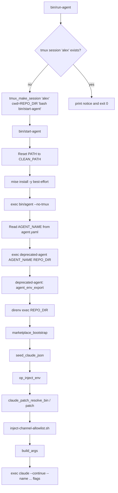
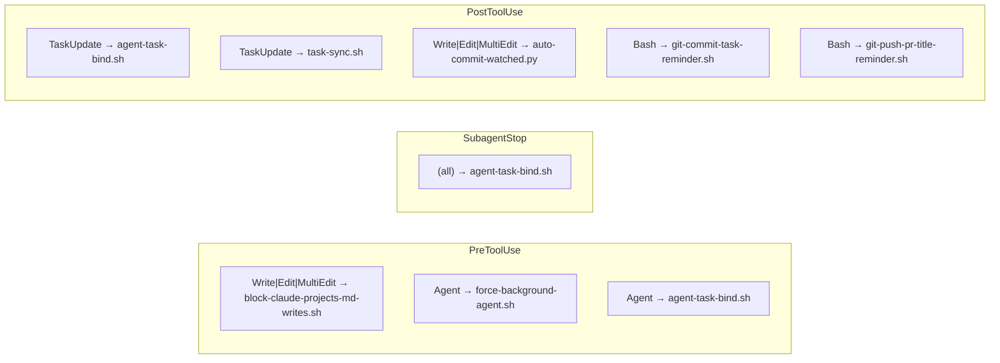

# Alex Picard Agent — Comprehensive Technical Report

**Source repo:** `nsheaps/.ai-agent-alex` (`/home/user/.ai-agent-alex`)
**Report purpose:** Design input for a generic agent template (`/home/user/agent-template`)
**Report date:** 2026-06-09

---

## Table of Contents

1. [Repository Overview](#1-repository-overview)
2. [Launch / Runtime Architecture](#2-launch--runtime-architecture)
3. [bin/lib Launcher Library](#3-binlib-launcher-library)
4. [Claude Code Configuration (.claude/)](#4-claude-code-configuration-claude)
5. [Hook Lifecycle](#5-hook-lifecycle)
6. [Skills](#6-skills)
7. [Rules](#7-rules)
8. [Hookify Config Files](#8-hookify-config-files)
9. [TypeScript / Bun Monorepo (packages/)](#9-typescript--bun-monorepo-packages)
10. [CI/CD (GitHub Actions)](#10-cicd-github-actions)
11. [Tool Version Management (mise)](#11-tool-version-management-mise)
12. [Environment and Secrets](#12-environment-and-secrets)
13. [External Services and Dependencies](#13-external-services-and-dependencies)
14. [Scheduled Tasks](#14-scheduled-tasks)
15. [Memory and Contacts](#15-memory-and-contacts)
16. [Persona, Handler, and Identity Files](#16-persona-handler-and-identity-files)
17. [Generic vs Alex-Specific Breakdown](#17-generic-vs-alex-specific-breakdown)

---

## 1. Repository Overview

`/home/user/.ai-agent-alex` is a Claude Code agent repository implementing a test-and-validation agent persona ("Alex Picard"). It is the most feature-rich of the three sibling agent repos (alex, jack, henry), distinguished by:

- A **TypeScript/Bun monorepo** (`packages/`) that compiles standalone CLI tools shipped as a plugin.
- A **rich `bin/lib/` launcher library** implementing XDG isolation, 1Password injection, binary patching, marketplace bootstrap, and tmux session management.
- **Seven project-local hooks** covering auto-commit, agent-task binding, memory write blocking, background-agent enforcement, and git discipline reminders.
- **Fourteen local skills** covering agent infrastructure auditing, launcher debugging, environment diagnostics, and workflow utilities.
- **Three hookify config files** that manage file-event and bash-event behavioral guards.
- **Five GitHub Actions workflows** covering CI, PR review dispatch, PR status forwarding, sync-to-edge, and repo settings.

---

## 2. Launch / Runtime Architecture

### 2.1 Entry Points

| Script | Purpose |
|---|---|
| `bin/run-agent` | **User-facing entry point.** Idempotent: starts a detached tmux session if none exists; no-ops if already running. |
| `bin/run-and-attach-agent` | Same as `run-agent` but auto-attaches after session creation. |
| `bin/attach-agent` | Attach to an existing session. Never creates one. |
| `bin/start-agent` | **Inner process entrypoint.** Resets PATH to a clean baseline, pre-installs mise tools, then `exec`s `bin/agent --no-tmux`. |
| `bin/agent` | **Thin shim.** Reads `agent.yaml` for `AGENT_NAME`, then delegates to `nsheaps/agents/apps/agent-cli/bin/deprecated-agent`. |
| `bin/claude` | Wrapper around the mise-pinned `claude` binary; applies the channel-allowlist patch via `bin/lib/claude-patch.sh`. |

### 2.2 Session Name Resolution

All launcher scripts derive `AGENT_NAME` from `agent.yaml` (`name: alex`) using a minimal `grep+sed` parser — deliberately avoiding `yq` because mise is not yet activated at that point in the launch sequence. Env inheritance of `AGENT_NAME` is intentionally rejected to prevent identity contamination when one agent's tmux server starts sessions for another agent.

**File:** `bin/lib/agent-name.sh` — `agent_name_resolve()` function.  
**Spec:** `docs/specs/start-agent.md`.

### 2.3 Launch Sequence (mermaid)



### 2.4 Per-Agent Isolation via XDG

`bin/lib/agent-env.sh` exports all per-agent paths derived from `AGENT_HOME_DIR=$HOME/.agents/$AGENT_NAME`. The XDG overrides cause every tool that respects the spec (gh, git, mise, op) to write into the agent's namespace automatically:

| Variable | Value for Alex |
|---|---|
| `AGENT_HOME_DIR` | `$HOME/.agents/alex` |
| `CLAUDE_CONFIG_DIR` | `$AGENT_HOME_DIR/.claude` |
| `XDG_CONFIG_HOME` | `$AGENT_HOME_DIR/.config` |
| `XDG_DATA_HOME` | `$AGENT_HOME_DIR/.local/share` |
| `XDG_STATE_HOME` | `$AGENT_HOME_DIR/.local/state` |
| `XDG_CACHE_HOME` | `$AGENT_HOME_DIR/.cache` |
| `GH_CONFIG_DIR` | `$XDG_CONFIG_HOME/gh` |
| `GIT_CONFIG_GLOBAL` | `$XDG_CONFIG_HOME/git/config` |

**File:** `bin/lib/agent-env.sh`

---

## 3. bin/lib Launcher Library

All files under `bin/lib/` are sourced (not executed) by the main launcher scripts.

### 3.1 `stdlib.sh`

Generic shell utility library. Provides:
- `ROOT_DIR` derivation from `BASH_SOURCE[0]`
- ANSI color constants and `error()`, `warn()`, `fatal()`, `success()`, `debug()`, `info()`, `hint()`, `up_next()`, `dryrun()`
- `debounce <lockfile> <wait> -- <cmd>` — file-lock debounce
- `yn_prompt` / `yn_prompt_default_yes` — interactive confirm prompts
- `check_and_install <cmd>` — install via Homebrew if missing
- `spinner <msg> -- <cmd>` — progress spinner (uses `gum`)
- `retry <max> <delay_ms> <cmd>` — exponential backoff retry
- `expand_path` / `find_up` / `find_files` / `find_files_with_extensions` — path utilities
- `required <cmds...>` — bail if tools are missing
- `sync_directory <src> <dst>` — rsync wrapper
- `create_dir_symlink <src> <tgt>` — symlink with dry-run support

**Reusability:** Entirely generic. No alex-specific content.

### 3.2 `agent-name.sh`

Resolves `AGENT_NAME` from `$REPO_DIR/agent.yaml` via `agent_name_resolve()`. Uses a no-dependency minimal YAML parser (grep+sed). Deliberately ignores any inherited `AGENT_NAME` env var to prevent cross-agent contamination when one agent's tmux server launches another.

**Reusability:** Fully generic (reads any `agent.yaml`).

### 3.3 `agent-env.sh`

Exports all per-agent XDG and Claude env vars via `agent_env_export()`. Sets:
- All XDG directories anchored to `$AGENT_HOME_DIR`
- `CLAUDE_CONFIG_DIR`, `GH_CONFIG_DIR`, `GIT_CONFIG_GLOBAL`
- `DISABLE_AUTOUPDATER=1`, `FORCE_AUTOUPDATE_PLUGINS=1`
- `CLAUDE_CODE_ATTRIBUTION_HEADER=0`
- `CLAUDE_AUTO_BACKGROUND_TASKS=1`
- `CLAUDE_CODE_DISABLE_FEEDBACK_SURVEY=1`
- `CLAUDE_CODE_DISABLE_FILE_CHECKPOINTING=1`
- `CLAUDE_CODE_ENABLE_AWAY_SUMMARY=1`
- `CLAUDE_CODE_ENABLE_BACKGROUND_PLUGIN_REFRESH=1`
- `CLAUDE_CODE_EXPERIMENTAL_AGENT_TEAMS=1`

**Reusability:** Fully generic. The specific env var set is a complete template for any agent.

### 3.4 `tmux.sh`

Three helpers: `tmux_session_exists [name]`, `tmux_make_session <name> <cwd> <cmd>`, `tmux_attach_session [name]`. Passes `AGENT_NAME=<name>` via `-e` on session creation to prevent env inheritance from an existing tmux server.

**Reusability:** Fully generic.

### 3.5 `claude-patch.sh`

Helpers for resolving, versioning, and patching the mise-pinned `claude` binary. The patch applies two modifications to allow loading development/marketplace channels without the interactive GrowthBook dialog. Key pattern: per-launch unique patched binary at `bin/patched/<version>/claude.<epoch>` with a stable symlink `bin/claude-patched` — eliminates "Text file busy" on rapid restarts because the old mmap'd binary is never overwritten.

Functions: `claude_patch_resolve_bin`, `claude_patch_extract_version`, `claude_patch_path_for_version`, `claude_patch_symlink_path`, `claude_patch_version_from_target`, `claude_patch_resolve_patcher`.

**Reusability:** Generic mechanism. The patch targets (channel-allowlist bypass) are tied to specific Claude CLI internals and may drift with version updates.

### 3.6 `patch-binary.py`

Python script (`bin/lib/patch-binary.py`) that applies the two channel-bypass patches to the Claude binary. Supports both JS-text mode (pre-2.1.119) and ELF binary mode (2.1.119+). Uses `--verbose` flag and `--check` mode (exit 3 if already patched). Enforces same-length replacement in ELF mode (padded with JS block comments) to avoid corrupting offsets.

**Reusability:** Generic mechanism against Claude CLI binary.

### 3.7 `marketplace.sh`

Two functions:
- `marketplace_bootstrap()` — reads `$REPO_DIR/.claude/settings.json`, calls `claude plugin marketplace add` for each `extraKnownMarketplaces` entry, then `marketplace update`, then installs/updates every `enabledPlugins: true` entry. Handles scope (user vs project) via `installed_plugins.json` lookup. Emits a structured summary log line that the launcher injects as first-turn context.
- `marketplace_prune_orphans()` — calls `claude plugin prune -y -s <scope>` for both user and project scopes. Gated on subcommand availability (claude ≥ v2.1.121).

**Reusability:** Fully generic given the settings.json contract.

### 3.8 `op-inject.sh`

`op_inject_env()` reads `1pass.opExec.items[]` from `.claude/plugins.settings.yaml` and `eval`-injects each item's exported env vars via `op-exec`. Logs injected variable *names* (not values). Skips gracefully if `op`, `op-exec`, or `yq` is unavailable.

**Reusability:** Generic given the `plugins.settings.yaml` schema for `1pass.opExec.items`.

### 3.9 `seed-claude-json.sh`

`seed_claude_json()` copies/merges the repo's checked-in `.claude/.claude.json` seed into `$CLAUDE_CONFIG_DIR/.claude.json`. Merge semantics: `jq -s '.[0] * .[1]'` with TARGET winning on conflict — so runtime state (auth tokens, migration flags, user preferences) is never overwritten by the seed. Skips if no change (semantic equality check via jq).

**Reusability:** Fully generic. The seed file content (`.claude/.claude.json`) is alex-specific.

### 3.10 `test-env.sh`

Defines `TEST_ENV_STRIP_VARS` (a list of secret-bearing env var names) and `test_env_strip_cmd()` that emits an `env -u VAR1 -u VAR2 ...` prefix for clean-env test launches. Used by `bin/test-agent`.

**Reusability:** The mechanism is generic; the list of var names needs to be updated per agent.

---

## 4. Claude Code Configuration (.claude/)

### 4.1 `settings.json`

**Path:** `.claude/settings.json`

Key configuration:

| Key | Value / Notes |
|---|---|
| `model` | `"opus"` |
| `effortLevel` | `"medium"` |
| `permissions.defaultMode` | `"bypassPermissions"` |
| `skipDangerousModePermissionPrompt` | `true` |
| `editorMode` | `"normal"` |
| `verbose` | `true` |
| `showThinkingSummaries` | `true` |
| `teammateMode` | `"tmux"` |
| `remoteControlAtStartup` | `true` |
| `inputNeededNotifEnabled` | `false` |
| `agentPushNotifEnabled` | `false` |
| `terminalProgressBarEnabled` | `true` |
| `CLAUDE_CODE_AUTO_COMPACT_WINDOW` (env) | `"500000"` |
| `DISCORD_ALLOW_BOTS` (env) | `"true"` |
| `attribution.commit` | Co-Authored-By trailer for Alex's GitHub App bot identity |
| `statusLine` | `bunx -y ccstatusline@latest` (external CLI tool) |

**Enabled plugins** (19 total across 3 marketplaces):

| Marketplace | Plugins |
|---|---|
| `ai-mktpl` (nsheaps/ai-mktpl) | 1pass, agentic-behavior, common-sense, dangerous-bypass, deep-research, discord, edit-utils, github, github-app, mise, scm-utils, sequential-thinking, skills-maintenance, shared-lib |
| `agents` (nsheaps/agents) | task-utils |
| `agents-observe` (simple10/agents-observe) | agents-observe |
| `claude-plugins-official` | playwright, plugin-dev, hookify |

**Permissions allow list** (pre-approved without prompt): Skill, Glob, Grep, WebSearch, WebFetch (6 domains), Bash (git read commands, gh read commands, basic file ops).

**Permissions ask list:** destructive git push variants, rm -rf.

**Permissions deny list:** `Bash(rm -rf /:*)`.

### 4.2 `.claude.json` Seed

**Path:** `.claude/.claude.json`

Contains: `hasCompletedOnboarding: true`, `bypassPermissionsModeAccepted: true`, `theme: "dark"`, and a `projects` entry for alex's repo path with trust dialogs accepted. This seed is merged into `$CLAUDE_CONFIG_DIR/.claude.json` at launch to skip the onboarding UI on a fresh `CLAUDE_CONFIG_DIR`.

### 4.3 `plugins.settings.yaml`

**Path:** `.claude/plugins.settings.yaml`

Plugin-specific configuration:

| Plugin | Key Config |
|---|---|
| `1pass` | `opExec.items: ['op://Agent-Alex/ENVIRONMENT']`; targets: `envLocal`, `sessionStartBashEnv`; `recursiveResolve: true` |
| `github-app` | `enabled: true`, `autoGitConfig: true` |
| `github` | `autoInstall: false` |
| `mise` | `autoInstallTools: true`, `autoTrust: true` |
| `task-utils` | `singleTaskBlocking: false`, `enabled: true`, `requireValidationSteps: true`, `requireInProgress: true` |

The `1pass` plugin resolves `op://Agent-Alex/ENVIRONMENT` — a 1Password item holding all of Alex's secret env vars (tokens, keys). The plugin's SessionStart hook writes a `.env.local` file in `$AGENT_HOME_DIR` and a bash-env file for session injection.

### 4.4 `SYSTEM-PROMPT-ADDENDUM.md`

**Path:** `.claude/SYSTEM-PROMPT-ADDENDUM.md`

Injected as system-prompt text via `--append-system-prompt-file`. Content: a numbered 10-step task-execution protocol requiring skill re-reading before implementation, iterative validation loops, and an event log in each task.

### 4.5 `scheduled-tasks.yaml`

**Path:** `.claude/scheduled-tasks.yaml`

Two cron tasks:

| ID | Schedule | Purpose |
|---|---|---|
| `self-poll-progress-check` | `3,8,13,18,23,28,33,38,43,48,53,58 * * * *` (every 5m, offset) | Delegates to `Skill(idle-5-min)` — catches stalled sub-agents |
| `15m-progress-check` | `7,22,37,52 * * * *` (every 15m, offset) | Reviews TaskList and conditionally posts to Discord only when material progress occurred |

Both crons fire offset from round minutes to avoid thundering-herd collisions.

---

## 5. Hook Lifecycle

### 5.1 Hook Registration (settings.json)



### 5.2 Individual Hook Details

#### `block-claude-projects-md-writes.sh` (PreToolUse: Write|Edit|MultiEdit)

Blocks writes of `*.md` files under `$CLAUDE_CONFIG_DIR/projects/`. Enforces the handler directive that memory/markdown must live in the agent repo (with linkable GitHub URLs), not in claude's internal project state dir.  
**Exit 2** to block; exit 0 to pass through.

#### `force-background-agent.sh` (PreToolUse: Agent)

Reads `tool_input.run_in_background` from the hook payload. If false or unset, forces it to true via `updatedInput` in the hook response JSON. Emits an `additionalContext` warning to the agent about the correction. Ensures all sub-agent dispatches are non-blocking.

#### `agent-task-bind.sh` (PreToolUse: Agent; SubagentStop; PostToolUse: TaskUpdate)

Complex multi-event hook (~33KB). Binds Agent() launches to tasks with `[identifier]` in the name:
- **PreToolUse (Agent):** Finds the task, claims it by prefixing subject with `Agent($id)`, sets status to in_progress. Denies if another agent has already claimed it (prevents duplicate agents on same task).
- **SubagentStop:** Renames subject to `Agent($id) - FINISHED`, resets to pending, captures artifacts, emits systemMessage to parent.
- **PostToolUse (TaskUpdate):** When a FINISHED task is moved forward (pending→in_progress), strips the FINISHED prefix.

State storage: `.claude/tmp/agent-task-bindings/<session_id>-<agent_id>.json`.

#### `task-sync.sh` (PostToolUse: TaskUpdate)

Syncs task state to the repo after TaskUpdate calls. (60s timeout.)

#### `auto-commit-watched.py` (PostToolUse: Write|Edit|MultiEdit)

Python PostToolUse hook. Watches two path patterns: `.claude/skills/**` and `docs/journal/**`. When a write matches, runs `git add <file> && git commit -m "auto: edit to <rel_path>" && git push`. Scopes commit to only the watched file (uses `git commit -- <path>` to avoid sweeping other staged changes). Returns a `systemMessage` with the commit SHA on success. Never blocks (always exits 0).

#### `git-commit-task-reminder.sh` (PostToolUse: Bash)

Detects `git commit` in the Bash command. Emits a throttled reminder (60s window) to keep tasks updated with PR links and commit links, and to have validation steps. Uses a lockfile in `.claude/tmp/`.

#### `git-push-pr-title-reminder.sh` (PostToolUse: Bash)

Detects `git push` in the Bash command. Emits a throttled reminder (300s window) to review PR title and body for accuracy and completeness after the push. 

---

## 6. Skills

All local skills are in `.claude/skills/<name>/SKILL.md`. They override same-named plugin skills per `rules/skill-resolution-order.md`. Each SKILL.md contains a `<!-- UPSTREAM: <target-plugin> -->` comment flagging the intended migration target.

### 6.1 Infrastructure / Diagnostic Skills

| Skill | Description | Upstream Target |
|---|---|---|
| `debug-launcher-logs` | Diagnose `bin/agent` launch failures by reading `.claude/logs/launcher.<EPOCH>.log`. Covers healthy vs broken `Running claude:` blocks, `set -euo pipefail` gotchas, function caching issues, `$REPO_DIR` derivation. | `agentic-behavior` |
| `debug-env-divergence` | Diagnose env-var divergence between agents. Covers the per-agent XDG isolation map, safe inspection patterns (never printing secret values), `CLAUDE_ENV_FILE` sourcing chain, and common missing-var scenarios. | `agentic-behavior` |
| `clear-session-env-bloat` | Fix `E2BIG` (env too large) failures caused by accumulating `session-env/*.sh` files (~120KB each). Procedure: rename session-env and shell-snapshots subdirs to `.bak`, restart agent. | `agent-utils` |

### 6.2 Cross-Agent Audit Skills

| Skill | Description | Upstream Target |
|---|---|---|
| `audit-cross-agent` | Driver that orchestrates the four sub-audits. Produces findings in the shared `docs/cross-agent-consistency.md` using L#/P#/S#/I# ID categories. | `agentic-behavior` |
| `audit-launcher-parity` | Diff `bin/agent` and related launcher files across alex/jack/henry. Identifies flag drift, missing helper libs, structural divergence. | `agentic-behavior` |
| `audit-shared-settings` | Diff `.claude/settings.json` across agents. Safe key-only inspection (never reads secret values). Produces I# findings. | `agentic-behavior` |
| `audit-shared-rules` | Diff `.claude/rules/` across agents. | `agentic-behavior` |
| `audit-plugin-state-cross` | Compare installed plugin versions and enabledPlugins across agents. | `agentic-behavior` |
| `audit-implementation-consistency` | Broader implementation consistency check. | `agentic-behavior` |
| `agent-utils-spec` | Spec document for the `agent-utils` plugin — describes the settings-drift problem and the three tools (config-merge, settings-merge, settings-write-guard). | `nsheaps/agents` |

### 6.3 Operational / Workflow Skills

| Skill | Description | Upstream Target |
|---|---|---|
| `validate-peer-agent-live` | Discord round-trip validation of a peer agent after restart. Uses a nonce ping and 90s wait. Explicitly prohibits tmux capture-pane as a substitute. | `agentic-behavior` |
| `pr-status` | Generate emoji-bucketed PR status lines via `nsheaps/agents/apps/pr-status-cli`. Covers both single-PR and `digest` (org-wide search) invocation modes. Also wraps `bin/agent-pr-status-digest` for agent-transcript-sourced PR discovery. | `agent-utils` or `pr-utils` plugin |
| `task-graph` | Generate mermaid dependency graph + flat task list from TaskList. Writes to `.claude/tmp/task-graph.md`. Runs `generate.sh` script. | `task-utils` |
| `journal-writing` | Guide for writing daily journal entries in `docs/journal/YYYY/MM/DD/`. Covers Sarah-tone feelings-mode vs technical-mode writing. Requires immediate push to main. | `journal-utils` |

---

## 7. Rules

**Path:** `.claude/rules/`

Alex has 5 local rules (fewer than Jack/Henry — most rules come from marketplace plugins like `common-sense`, `agentic-behavior`):

| Rule File | Purpose |
|---|---|
| `communication.md` | Channel selection (Telegram vs terminal), silence-by-default in shared channels, urgency signals, temp-file location (`.claude/tmp/`). |
| `memory-location.md` | Memory files belong in `memory/` at repo root (linkable GitHub URLs), NOT in `$CLAUDE_CONFIG_DIR/projects/`. Enforced by the `block-claude-projects-md-writes.sh` PreToolUse hook. |
| `scheduled-tasks.md` | Cron deduplication on session start: CronList first, then recreate only missing tasks. Covers compaction-continuation vs true restart distinction (critical for avoiding duplicate crons). |
| `secrets-and-shared-machine.md` | Never expose secret values. Never write agent-specific config to user-level paths. Safe env-var inspection patterns. |
| `skill-resolution-order.md` | Local skills (`.claude/skills/`) override same-named plugin skills. Enables fast local iteration without plugin PR cycle. |

---

## 8. Hookify Config Files

Hookify (`hookify@claude-plugins-official`) is a plugin that generates PreToolUse hooks from declarative rules defined in `hookify.*.local.md` files. Alex has three:

| File | Rule Name | Event | Action | Condition |
|---|---|---|---|---|
| `.claude/hookify.auto-commit-journal.local.md` | `auto-commit-journal` | `file` | `warn` | `file_path` regex-matches `(^|/)docs/journal/` |
| `.claude/hookify.auto-commit-skills.local.md` | `auto-commit-skills` | `file` | `warn` | `file_path` regex-matches `(^|/)\.claude/skills/` |
| `.claude/hookify.block-non-main-checkout.local.md` | `block-non-main-checkout` | `bash` | `block` | `command` regex-matches `git\s+(checkout|switch)\s+(?!main(\s|$)|--\s)` |

The journal and skills auto-commit rules complement the `auto-commit-watched.py` hook — the hookify rule provides a pre-execution warning, the Python hook does the actual commit post-execution.

The `block-non-main-checkout` rule enforces a "main-only checkout" policy on the agent repo — all PR/feature work must use `git worktree` instead of branch switching.

---

## 9. TypeScript / Bun Monorepo (packages/)

**Root config:** `package.json` (workspace `@agent-utils/monorepo`), `tsconfig.base.json`, `bunfig.toml`, `jest.config.cjs`.

The monorepo is the source for the `agent-utils` plugin in `nsheaps/agents`. Five packages:

### 9.1 `packages/shared`

Shared utilities used by all other packages:
- `json.ts` — `readJsonFile`, `stringifyJson`, `deepMergeTargetWins` (deep merge with conflict and promotion callbacks)
- `paths.ts` — `agentSettingsPath`, `userSettingsPath`, `userLocalSettingsPath`, `resolveAgentRepo`
- `log.ts` — `makeLogger` (wraps `console.warn`)

### 9.2 `packages/config-merge`

Generic JSON merge CLI. `mergeFiles(targetPath, sourcePath, opts)` — target-wins semantics. Promotes source-only keys into result. Returns `{ merged, conflicts, promotions }`.

**CLI binary:** `packages/config-merge/dist/config-merge` (compiled via `bun build --compile`).  
Flags: `--in-place`, `--quiet`, `--diff-only`.

### 9.3 `packages/settings-merge`

Settings-specific wrapper around `config-merge`. Two-stage merge:
1. `$CLAUDE_CONFIG_DIR/settings.local.json` → `$AGENT_REPO/.claude/settings.json`
2. `$CLAUDE_CONFIG_DIR/settings.json` → `$AGENT_REPO/.claude/settings.json`

Optionally backs up target to `settings.bak`. Handles missing source files gracefully.

**Use case:** Recover from settings drift where `/plugin install` wrote to user-scope but the repo-scope file wasn't updated.

**CLI binary:** `packages/settings-merge/dist/settings-merge`.

### 9.4 `packages/settings-write-guard`

PostToolUse hook that warns when any settings file write happens outside `$AGENT_REPO/.claude/settings.json`. Enforces the doctrine that user-scope settings are wiped on agent restart and only the repo-scope file persists.

**Currently warn-only** (not blocking — see `TODO` comment in `hook.ts`).

**CLI binary:** `packages/settings-write-guard/dist/settings-write-guard`.

### 9.5 `packages/upstream-check`

PostToolUse hook that periodically checks (throttled) whether the agent repo has upstream commits on current branch or default branch, and whether there are uncommitted local changes. Fetches from `origin` and runs `git rev-list --count`. Returns `systemMessage` + `additionalContext` when behind.

**Throttle:** configurable `throttleSeconds` (stored in a lockfile under `.claude/tmp/`).

### 9.6 Build / Test Infrastructure

- **Runtime:** Bun (pinned 1.3.14 in `mise.toml`)
- **Test runner:** Jest with `ts-jest` (NOT bun test — explicit handler directive)
- **Type checking:** `bun run --filter '*' typecheck`
- **Build:** `bun build --compile` per package produces standalone executables
- **Linting:** prettier (3.8.3, pinned) + eslint (10.4.0, pinned) — both pinned per incident where unpinned versions cascaded breaks

---

## 10. CI/CD (GitHub Actions)

**Path:** `.github/workflows/`

### 10.1 `ci.yaml`

Four jobs: `lint`, `typecheck`, `test`, `build`.

- **Auth:** Uses `nsheaps/github-actions/.github/actions/checkout-as-app` (GitHub App, SHA-pinned) for the lint job (needs write-back permissions). Other jobs use standard `actions/checkout`.
- **Lint job:** Runs `mise run format` (prettier --write), auto-commits any changes back to the PR branch via `stefanzweifel/git-auto-commit-action@v7`, then exits 1 if changes were made (so CI re-runs against the final state).
- **Test job:** `bun x jest --config jest.config.cjs --ci`
- **Build job:** Compiles all packages and verifies the three binaries exist and are executable.

### 10.2 `dispatch-review.yaml`

Forwards PR events to `nsheaps/agents/.github/workflows/review-dispatch.yaml@main` (the shared review gate). Fires on `pull_request` events when PR is open AND has `request-review` label. Uses `AUTOMATION_GITHUB_APP_ID` and `AUTOMATION_GITHUB_APP_PRIVATE_KEY` secrets.

### 10.3 `pr-status-dispatch.yaml`

Fires `repository_dispatch` event (`pr-status-refresh`) to `nsheaps/.org` whenever a PR changes state (opened, closed, reopened, ready/draft). Enables the org-level PR status digest to stay current in near-real-time without waiting for the 12h cron.

### 10.4 `sync-main-to-edge.yaml`

Syncs `main` → `*/edge` branches (placeholder per `.gitupstream` — no edge branches configured yet).

### 10.5 `apply-repo-settings.yaml`

Applies `.github/settings.yml` to the repository. Settings file is managed by `nsheaps/.github` org-wide sync.

---

## 11. Tool Version Management (mise)

**Path:** `mise.toml`

Key tools (all pinned):

| Tool | Version | Purpose |
|---|---|---|
| `npm:@anthropic-ai/claude-code` | `2.1.138` | The Claude CLI itself |
| `github:nsheaps/op-exec` | `0.1.0` | Wrapper for 1Password secret injection |
| `github:nsheaps/claude-utils` | `0.12.19` | `claude-patch-channels` binary for channel bypass patching |
| `npm:prettier` | `3.8.3` | Code formatter |
| `npm:eslint` | `10.4.0` | Linter |
| `gh` | `2.92.0` | GitHub CLI |
| `jq` | `1.8.1` | JSON processor |
| `yq` | `4.53.2` | YAML processor |
| `node` | `24.16.0` | Node.js (required by claude-code npm package) |
| `bun` | `1.3.14` | TypeScript runtime + package manager |

Mise tasks defined: `format`, `format-check`, `lint`, `lint-check` (prettier + bash -n syntax checking for all `bin/*` and `bin/lib/*.sh` scripts).

**Docs:** https://mise.jdx.dev/

---

## 12. Environment and Secrets

### 12.1 `.envrc` / `.envrc.template`

The `.envrc.template` (tracked) and `.envrc` (gitignored) follow this chain:

1. `.envrc` sources `$AGENT_HOME_DIR/.env.local` if it exists
2. `.env.local` is written by the 1pass plugin's SessionStart hook, sourcing secrets from `op://Agent-Alex/ENVIRONMENT`

The `.envrc.template` contains no secrets — just the chain setup.

### 12.2 `.env`

**Gitignored.** Contains secret values for local/dev use. Never read in CI. Per `secrets-and-shared-machine.md`, this file must never be `cat`-ted or read in conversation.

### 12.3 Secret Variable Names (no values printed)

From `bin/lib/test-env.sh` (the canonical strip list):

```
AGENT_LAUNCHER_PID, DISCORD_BOT_TOKEN, TELEGRAM_BOT_TOKEN, DISCORD_ALLOW_BOTS,
GH_TOKEN, GITHUB_TOKEN, BRAINTRUST_API_KEY, GITHUB_APP_ID, GITHUB_APP_PRIVATE_KEY,
GITHUB_APP_PRIVATE_KEY_PATH, GITHUB_INSTALLATION_ID, GITHUB_APP_CLIENT_ID,
GITHUB_APP_CLIENT_SECRET, OP_SERVICE_ACCOUNT_TOKEN, AGENT_NAME
```

### 12.4 Renovate

**Path:** `renovate.json`

Extends `local>nsheaps/renovate-config` — org-wide Renovate config managed centrally.

---

## 13. External Services and Dependencies

### 13.1 1Password

**Plugin:** `1pass@ai-mktpl`  
**CLI:** `op` (1Password CLI v2)  
**Custom tool:** `op-exec` (`github:nsheaps/op-exec@0.1.0`) — wraps a 1Password item, exports all fields as env vars.

**How used:** `op://Agent-Alex/ENVIRONMENT` vault item holds all of Alex's secrets. The `1pass` plugin's SessionStart hook resolves this item via `OP_SERVICE_ACCOUNT_TOKEN` (a service account token) and writes the results to `.env.local`. `bin/lib/op-inject.sh` also resolves items at launch time before claude starts.

**Docs:** https://developer.1password.com/docs/cli/

### 13.2 GitHub App

**Plugin:** `github-app@ai-mktpl`  
**Config:** `autoGitConfig: true` — the plugin writes `GIT_CONFIG_GLOBAL` to point at the app's credential helper and sets `user.name`/`user.email` to the bot identity.

**Identity:** `alex-nsheaps[bot]` (GitHub App installation). Co-authored commits carry `Co-Authored-By: Agent Alex Picard <alex-nsheaps[bot]@users.noreply.github.com>`.

**Secrets required:** `GITHUB_APP_ID`, `GITHUB_APP_PRIVATE_KEY`, `GITHUB_INSTALLATION_ID`.

**Docs:** https://docs.github.com/en/apps/creating-github-apps/about-creating-github-apps/about-creating-github-apps

### 13.3 Discord

**Plugin:** `discord@ai-mktpl`  
**MCP server:** Provided by the discord plugin. Exposes `mcp__plugin_discord_discord__reply`, `mcp__plugin_discord_discord__fetch_messages`, etc.

**How used:** Alex's primary communication channel. Rules mandate using `mcp__plugin_discord_discord__reply` (not transcript text) when handler messages arrive via Discord. Channel access controlled by `~/.claude/channels/discord/access.json`.

**Secret:** `DISCORD_BOT_TOKEN` (injected via 1pass/op-exec).

**Channel IDs used:** `1497431286661517353` (Alex's Discord DM channel with handler).

**Docs:** https://discord.com/developers/docs/intro

### 13.4 Anthropic / Claude API

**Plugin:** `agentic-behavior@ai-mktpl`, `deep-research@ai-mktpl`, and claude-code itself.

The agent runs as a long-lived `claude --continue` session. Model is `opus` (from `settings.json`). `CLAUDE_CODE_AUTO_COMPACT_WINDOW=500000` controls compaction threshold.

**Docs:** https://docs.anthropic.com/en/docs/claude-code/overview

### 13.5 mise

**Plugin:** `mise@ai-mktpl`

Manages all tool versions. `autoInstallTools: true`, `autoTrust: true` in `plugins.settings.yaml`. Called by `bin/start-agent` pre-launch and by the launcher loop.

**Docs:** https://mise.jdx.dev/

### 13.6 Custom Marketplaces

Three plugin marketplaces are registered via `extraKnownMarketplaces`:

| Name | Repo | Branch |
|---|---|---|
| `ai-mktpl` | `nsheaps/ai-mktpl` | `main` |
| `agents` | `nsheaps/agents` | (default) |
| `agents-observe` | `simple10/agents-observe` | (default) |

### 13.7 Renovate Bot

Automated dependency updates via Renovate, configured at `renovate.json`. Extends org-wide config at `nsheaps/renovate-config`.

**Docs:** https://docs.renovatebot.com/

---

## 14. Scheduled Tasks

Defined in `.claude/scheduled-tasks.yaml`. Two enabled tasks:

1. **`self-poll-progress-check`** (5-minute, offset): Invokes `Skill(idle-5-min)` from the `cron-utils` plugin. Detects stalled sub-agents or active-conversation idleness.

2. **`15m-progress-check`** (15-minute, offset): Inline prompt that reviews TaskList and conditionally posts to Discord only if material progress occurred. Offset at 7/22/37/52 to avoid collision with the 5m cron.

**Key rule (`scheduled-tasks.md`):** On session start, always call `CronList` BEFORE recreating crons from yaml. Compaction continuation preserves in-memory crons — re-creating them blindly produces duplicates.

---

## 15. Memory and Contacts

### 15.1 Memory

Alex's memory lives at `memory/` in the repo root (NOT in `$CLAUDE_CONFIG_DIR/projects/`). The handler requires linkable GitHub URLs. A `block-claude-projects-md-writes.sh` PreToolUse hook enforces this.

`memory/MEMORY.md` is the index. Individual files are `memory/feedback_<topic>.md` containing handler-corrected behaviors. As of this report, ~70 feedback memory files exist covering topics from Discord formatting to PR workflow to sub-agent delegation patterns.

### 15.2 Contacts

**Path:** `.claude/contacts/`

Three files: `nate-heaps.md` (admin), `ai-agent-jack.md` (basic), `ai-agent-henry.md` (basic). `HANDLER.md` is a pointer to `contacts/nate-heaps.md`.

---

## 16. Persona, Handler, and Identity Files

| File | Content |
|---|---|
| `.claude/PERSONA.md` | Alex Picard — test agent, validates agent infrastructure. Role: `test-agent` (defined in nsheaps/agents). |
| `.claude/HANDLER.md` | Pointer to `contacts/nate-heaps.md`. Handler is Nathan "Nate" Heaps (`nsheaps`). |
| `.claude/MEMORY.md` | Index stub (Alex is newer than Jack; few memory entries yet). |
| `.claude/SYSTEM-PROMPT-ADDENDUM.md` | 10-step task execution protocol injected as system prompt addendum. |
| `agent.yaml` | `name: alex` — single source of truth for agent identity. |
| `assets/img/profile.png` | Agent avatar image. |

---

## 17. Generic vs Alex-Specific Breakdown

### 17.1 Generic (Template-Ready)

These components belong in an agent template with `{{AGENT_NAME}}` / `{{HANDLER_NAME}}` / `{{BOT_IDENTITY}}` placeholders:

| Component | File(s) | Template notes |
|---|---|---|
| XDG isolation exports | `bin/lib/agent-env.sh` | Replace nothing — derive all paths from `AGENT_NAME` |
| tmux session management | `bin/lib/tmux.sh`, `bin/run-agent`, `bin/attach-agent`, `bin/run-and-attach-agent`, `bin/start-agent` | No per-agent content |
| stdlib utilities | `bin/lib/stdlib.sh` | Fully generic |
| Agent name resolution | `bin/lib/agent-name.sh` | Reads `agent.yaml`; no changes needed |
| Binary patching | `bin/lib/claude-patch.sh`, `bin/lib/patch-binary.py` | No per-agent content (targets Claude CLI internals) |
| Marketplace bootstrap | `bin/lib/marketplace.sh` | Reads from `settings.json`; no per-agent content |
| Secret injection | `bin/lib/op-inject.sh` | Reads from `plugins.settings.yaml`; replace item refs |
| .claude.json seed | `bin/lib/seed-claude-json.sh`, `.claude/.claude.json` | Replace project path in `.claude.json` |
| Force-background hook | `.claude/hooks/force-background-agent.sh` | No per-agent content |
| Git discipline hooks | `.claude/hooks/git-commit-task-reminder.sh`, `git-push-pr-title-reminder.sh` | No per-agent content |
| TypeScript packages | `packages/config-merge`, `packages/settings-merge`, `packages/settings-write-guard`, `packages/settings-merge`, `packages/upstream-check`, `packages/shared` | Source of agent-utils plugin — generic tooling |
| CI jobs | `.github/workflows/ci.yaml` | Replace bot identity secrets refs |
| mise tool set | `mise.toml` | Replace tool versions as needed; structure is generic |
| Scheduled task structure | `.claude/scheduled-tasks.yaml` | Replace cron prompts; structure is generic |
| Memory rule | `.claude/rules/memory-location.md` | Replace agent repo path |
| Secrets rule | `.claude/rules/secrets-and-shared-machine.md` | Generic (no alex-specific content) |
| Skill resolution rule | `.claude/rules/skill-resolution-order.md` | Generic |
| SYSTEM-PROMPT-ADDENDUM.md | `.claude/SYSTEM-PROMPT-ADDENDUM.md` | Generic workflow protocol |
| Block-checkout hookify | `.claude/hookify.block-non-main-checkout.local.md` | Generic |
| Auto-commit hookify configs | `.claude/hookify.auto-commit-journal.local.md`, `.claude/hookify.auto-commit-skills.local.md` | Generic path patterns |

### 17.2 Alex-Specific (Placeholders or Replace)

| Component | File(s) | What makes it alex-specific |
|---|---|---|
| Persona | `.claude/PERSONA.md` | "Alex Picard", test-agent role |
| Identity | `agent.yaml` | `name: alex` |
| 1Password vault item | `.claude/plugins.settings.yaml` (`op://Agent-Alex/ENVIRONMENT`) | Alex's vault item name |
| GitHub App bot identity | `.claude/settings.json` (`attribution.commit`) | `alex-nsheaps[bot]` email |
| Discord channel ID | `.claude/scheduled-tasks.yaml` | Hardcoded channel `1497431286661517353` |
| Memory files | `memory/*.md` | All feedback entries are Alex's experiences with Nate |
| Contacts | `.claude/contacts/*.md` | Alex's relationship data with Nate/Jack/Henry |
| Audit skills | `.claude/skills/audit-*/SKILL.md` | Hardcode agent paths (`/home/nsheaps/src/nsheaps/.ai-agent-alex`) |
| Journal writing skill | `.claude/skills/journal-writing/SKILL.md` | "Sarah-tone" writing style; Alex's journal persona |
| Debug skills | `.claude/skills/debug-launcher-logs/SKILL.md`, `debug-env-divergence/SKILL.md` | Specific log paths, agent home paths |
| Task-graph generate script | `.claude/skills/task-graph/generate.sh` | Hardcoded path to alex's agent home |
| `.envrc.template` | `.envrc.template` | References `$AGENT_HOME_DIR/.env.local` (generic but needs the file to exist) |
| `agent-task-bind.sh` | `.claude/hooks/agent-task-bind.sh` | References specific task-utils API; otherwise generic |
| `bin/agent` shim | `bin/agent` | Hardcoded path to `nsheaps/agents/apps/agent-cli/bin/deprecated-agent` |
| `inject-channel-allowlist.sh` | `bin/helpers/inject-channel-allowlist.sh` | Hardcoded `~/.claude.json` path (shared machine assumption) |
| Renovate config | `renovate.json` | References org-specific `nsheaps/renovate-config` |
| PR status dispatch | `.github/workflows/pr-status-dispatch.yaml` | Dispatches to `nsheaps/.org` |
| Dispatch review | `.github/workflows/dispatch-review.yaml` | Uses `nsheaps/agents` shared workflow |

### 17.3 Template Architecture Recommendation

```
agent-template/
├── agent.yaml                          # name: {{AGENT_NAME}}
├── bin/
│   ├── run-agent                       # generic (reads agent.yaml)
│   ├── start-agent                     # generic
│   ├── attach-agent                    # generic
│   ├── run-and-attach-agent            # generic
│   ├── agent                           # shim — replace DEPRECATED_AGENT path
│   ├── claude                          # generic (via claude-patch.sh)
│   ├── install-plugins                 # generic
│   └── lib/
│       ├── stdlib.sh                   # generic
│       ├── agent-name.sh               # generic
│       ├── agent-env.sh                # generic
│       ├── tmux.sh                     # generic
│       ├── claude-patch.sh             # generic
│       ├── patch-binary.py             # generic
│       ├── marketplace.sh              # generic
│       ├── op-inject.sh                # generic
│       ├── seed-claude-json.sh         # generic
│       └── test-env.sh                 # generic (update var list)
├── .claude/
│   ├── .claude.json                    # seed — replace project path
│   ├── PERSONA.md                      # ALEX-SPECIFIC
│   ├── HANDLER.md                      # pointer to contacts/
│   ├── SYSTEM-PROMPT-ADDENDUM.md       # generic protocol
│   ├── settings.json                   # mostly generic — replace bot identity
│   ├── plugins.settings.yaml           # replace op:// item refs
│   ├── scheduled-tasks.yaml            # replace cron prompts + channel IDs
│   ├── contacts/
│   │   └── {{handler}}.md              # AGENT-SPECIFIC
│   ├── hooks/
│   │   ├── force-background-agent.sh   # generic
│   │   ├── git-commit-task-reminder.sh # generic
│   │   ├── git-push-pr-title-reminder.sh # generic
│   │   ├── block-claude-projects-md-writes.sh # generic
│   │   ├── auto-commit-watched.py      # generic
│   │   ├── agent-task-bind.sh          # generic
│   │   └── task-sync.sh                # generic
│   ├── hookify.auto-commit-journal.local.md  # generic
│   ├── hookify.auto-commit-skills.local.md   # generic
│   ├── hookify.block-non-main-checkout.local.md # generic
│   └── rules/
│       ├── communication.md            # AGENT-SPECIFIC (channel IDs, persona)
│       ├── memory-location.md          # replace agent repo path
│       ├── scheduled-tasks.md          # generic
│       ├── secrets-and-shared-machine.md # generic
│       └── skill-resolution-order.md  # generic
├── mise.toml                           # generic structure; update versions
├── .envrc.template                     # generic
├── .gitupstream                        # generic (update edge sync config)
├── renovate.json                       # replace org config ref
├── packages/                           # TypeScript monorepo (agent-utils source)
│   └── ...                             # generic — ships as plugin upstream
└── .github/
    └── workflows/
        ├── ci.yaml                     # replace app secret names if different
        ├── dispatch-review.yaml        # replace target-repo if different agent
        ├── pr-status-dispatch.yaml     # replace dispatch target
        └── sync-main-to-edge.yaml      # generic
```

---

*Report generated from read-only inspection of `/home/user/.ai-agent-alex`. No files were modified.*
