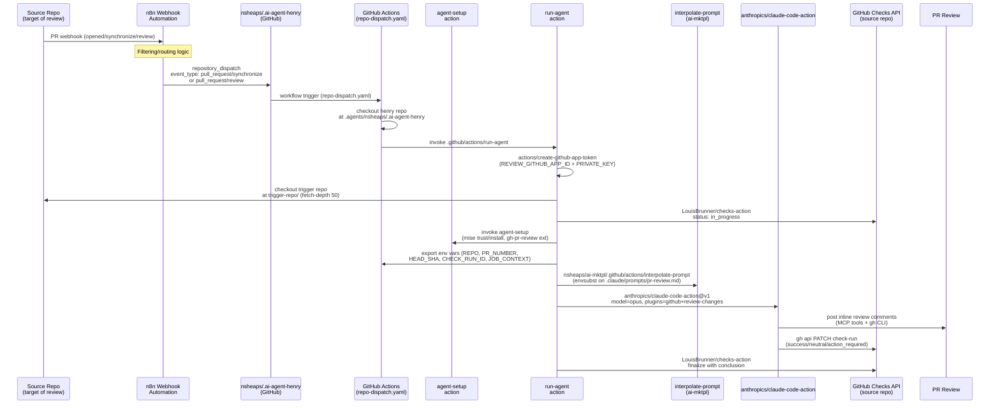
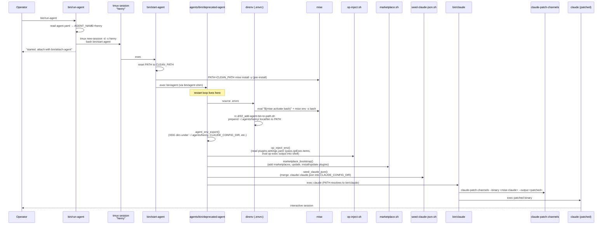

# Henry Agent — Comprehensive Technical Report

**Source repo:** `nsheaps/.ai-agent-henry` at `/home/user/.ai-agent-henry`
**Purpose of this document:** Design input for the `agent-template` project. Focuses on
*what* exists, *how* it is implemented, and *what is generic vs. Henry-specific*.

---

## Table of Contents

1. [Architecture Overview](#1-architecture-overview)
2. [CI-Review Dispatch Pipeline](#2-ci-review-dispatch-pipeline)
3. [Local Launch Architecture (bin/)](#3-local-launch-architecture-bin)
4. [Claude Identity & Configuration](#4-claude-identity--configuration)
5. [Prompt Templates](#5-prompt-templates)
6. [Rules](#6-rules)
7. [Skills](#7-skills)
8. [Scheduled Tasks (Crons)](#8-scheduled-tasks-crons)
9. [Plugin Ecosystem](#9-plugin-ecosystem)
10. [Infrastructure Files](#10-infrastructure-files)
11. [External Dependencies & Services](#11-external-dependencies--services)
12. [Generic vs. Henry-Specific Analysis](#12-generic-vs-henry-specific-analysis)

---

## 1. Architecture Overview

Henry has **two operating modes**:

| Mode | Trigger | Session type | Output target |
|------|---------|--------------|---------------|
| **CI-review** | GitHub App webhook → n8n → `repository_dispatch` → GitHub Actions → `claude-code-action` | Headless, non-interactive | GitHub PR review comments + check run |
| **Local interactive** | Operator runs `bin/run-agent` on developer machine | tmux session, persistent restart loop | Terminal / Discord |

The CI-review mode is Henry's primary purpose (automated peer review). The local mode is for development, coordination with other agents (Jack, Alex), and project management tasks.

Key files:
- `agent.yaml` — single `name: henry` declaration, source of truth for agent identity
- `CLAUDE.md` — top-level pointer; delegates all rules to `.claude/rules/`
- `.claude/CLAUDE.md` — dev-reference: config dir layout, tooling
- `.claude/PERSONA.md` — roles (quality-assurance, agent-human-resources, project-manager)
- `.claude/SYSTEM-PROMPT-ADDENDUM.md` — iterative task-execution instruction (skills-first, validate-in-chunks)

---

## 2. CI-Review Dispatch Pipeline

### 2.1 Sequence Diagram



### 2.2 Dispatch Payload Schema

Defined at `docs/schemas/review-dispatch-payload.schema.json`. Both webhook-origin (n8n) and workflow-origin (dispatch-review.yaml) must emit this structure:

```json
{
  "referer": "owner/repo/.github/workflows/dispatch-review.yaml",
  "action_branch": "main",
  "source": {
    "repo": "owner/repo",
    "pr_number": 42,
    "head_sha": "<40-char SHA>",
    "head_ref": "branch-name",
    "base_ref": "main"
  },
  "trigger": {
    "event": "pull_request",
    "action": "synchronize",
    "label": ""
  }
}
```

`action_branch` allows testing agent code from a non-main branch without touching the source repo.

### 2.3 Workflow: `repo-dispatch.yaml`

File: `.github/workflows/repo-dispatch.yaml`

Listens for `repository_dispatch` event types:
- `pull_request/synchronize`
- `pull_request/review`

Steps:
1. Debug annotation (referer, event type)
2. Checkout henry repo at `ACTION_BRANCH` into `.agents/nsheaps/.ai-agent-henry`
3. Call `.github/actions/run-agent` with full trigger payload, repo, ref, and secrets

Secrets consumed: `REVIEW_GITHUB_APP_ID`, `REVIEW_GITHUB_APP_PRIVATE_KEY`, `REVIEW_ANTHROPIC_API_KEY`, `CLAUDE_CODE_OAUTH_TOKEN`.

### 2.4 Consumer-Side Dispatch: `dispatch-review.yaml` / `dispatch-review.yaml.example`

**Option A (current):** `dispatch-review.yaml` — delegates to a reusable workflow at `nsheaps/agents/.github/workflows/review-dispatch.yaml@main`.
- Gate condition: PR is open AND has `request-review` label
- Auth: `AUTOMATION_GITHUB_APP_ID` + `AUTOMATION_GITHUB_APP_PRIVATE_KEY` (routing only — reviewer-identity is separate)

**Option B (legacy example):** `dispatch-review.yaml.example` — self-contained per-repo dispatcher. Uses `peter-evans/repository-dispatch@v4` to fire directly at `nsheaps/.ai-agent-henry`. Kept as documentation for repos not yet migrated to the centralized gate.

### 2.5 GitHub Actions: `run-agent/action.yaml`

File: `.github/actions/run-agent/action.yaml`

**Inputs:**

| Input | Required | Description |
|-------|----------|-------------|
| `trigger` | yes | Full JSON payload from `client_payload` |
| `trigger-repo` | yes | `owner/repo` of the PR source |
| `trigger-ref` | yes | Git ref to checkout |
| `event-name` | yes | `pull_request/synchronize` or `pull_request/review` |
| `github-token` | no | Bypass App token; use a pre-generated token |
| `app-id` | no | GitHub App ID (required if `github-token` empty) |
| `private-key` | no | GitHub App private key |
| `anthropic-api-key` | no | Anthropic API key for Claude |
| `claude-code-oauth-token` | no | Alternative to API key |

**Steps (in order):**
1. `qoomon/actions--context@v5` — job context for `JOB_CONTEXT` variable
2. Parse repo owner/name from `trigger-repo`
3. `actions/create-github-app-token` (SHA-pinned) — generate installation token scoped to source repo owner
4. Resolve final github-token (param or generated)
5. Extract `head_sha` from trigger payload
6. `actions/checkout` of source repo into `trigger-repo/` (fetch-depth 50)
7. `LouisBrunner/checks-action@v3.1.0` — create `AI Code Review` check run in `in_progress` state
8. `agent-setup` action — mise trust/install, gh-pr-review extension
9. Export trigger fields to `$GITHUB_ENV`: `REPO`, `PR_NUMBER`, `HEAD_SHA`, `CHECK_RUN_ID`, `WORKFLOW_RUN_URL`, `JOB_CONTEXT` (heredoc for multiline)
10. `nsheaps/ai-mktpl/.github/actions/interpolate-prompt` — `envsubst` on `.claude/prompts/pr-review.md`
11. `anthropics/claude-code-action@v1` — runs Claude with:
    - `model: opus`
    - `plugins: github@nsheaps-ai-mktpl, review-changes@nsheaps-ai-mktpl`
    - `plugin_marketplaces: https://github.com/nsheaps/ai-mktpl.git`
    - `additionalDirectories: [trigger-repo/, .claude/tmp/, ~/.claude/tmp/]`
    - Denied tools: `mcp__github_ci__*`, `Bash(gh pr checks:*)`, `Bash(git push:*)`
    - Env: `GH_PAGER=cat`, `GH_PROMPT_DISABLED=true`, `CLAUDE_CODE_REMOTE=true`
12. `LouisBrunner/checks-action` — finalize check run (always runs). Conclusion maps: `success`→success, `cancelled`→cancelled, other→failure.

### 2.6 GitHub Actions: `agent-setup/action.yaml`

File: `.github/actions/agent-setup/action.yaml`

Two composite steps:
1. `mise trust --yes && mise install --yes` (if mise available)
2. Install `gh extension install agynio/gh-pr-review` if not already present

Input: `github-token` (for gh extension install auth).

### 2.7 GitHub Actions: `with-post-step/action.yaml`

File: `.github/actions/with-post-step/action.yaml`

Third-party utility (`pyTooling/Actions`). Runs a main command and registers a post-step command for cleanup. Currently present in the repo but not actively used in the review pipeline.

Inputs: `main` (command), `post` (command), `key` (state variable name). Uses `node20` runtime.

---

## 3. Local Launch Architecture (bin/)

### 3.1 Launch Flow Diagram



### 3.2 Key Scripts

**`agent.yaml`** — Single field `name: henry`. Read by every launcher script via grep+sed (not yq) to avoid PATH issues before mise activates.

**`bin/run-agent`** — Idempotent entry point. Checks `tmux has-session`, exits 0 if already running. Creates detached tmux session running `bash bin/start-agent`. Source: `bin/lib/tmux.sh`.

**`bin/start-agent`** — Resets PATH to `CLEAN_PATH` (`~/.local/bin:/usr/local/bin:/usr/bin:/bin`). Pre-installs mise tools with the clean PATH. Execs `bin/agent --no-tmux` (which is the `deprecated-agent` path).

**`bin/agent`** — Thin shim. Reads `agent.yaml` via grep+sed, execs `$DEPRECATED_AGENT henry $REPO_DIR`. Hardcoded path: `/home/nsheaps/src/nsheaps/agents/apps/agent-cli/bin/deprecated-agent`. The actual restart loop lives in that canonical script. **This shim is intentionally byte-identical across all agents.**

**`bin/claude`** — Agent-aware Claude wrapper. Responsibilities:
1. Calls `agent_env_export()` to set XDG dirs and Claude env vars
2. Resolves mise-pinned claude binary via `mise which claude`
3. Checks if patched binary symlink is version-current; skips re-patching if so
4. Calls `claude-patch-channels` to patch (channel allowlist bypass)
5. Writes unique-per-launch output: `bin/patched/<version>/claude.<epoch>`
6. Atomically relinks `bin/claude-patched` symlink
7. Execs via symlink; falls back to unpatched if patching failed

**`bin/attach-agent`**, **`bin/run-and-attach-agent`** — Convenience wrappers around tmux attach.

**`bin/test-agent`** — (contents not read; likely test runner for the launcher scripts)

### 3.3 Library Scripts (`bin/lib/`)

**`agent-env.sh`** — `agent_env_export()` function. Sets all per-agent env vars from `AGENT_NAME`:
- `AGENT_HOME_DIR=$HOME/.agents/$AGENT_NAME`
- XDG dirs: `XDG_CONFIG_HOME`, `XDG_DATA_HOME`, `XDG_STATE_HOME`, `XDG_CACHE_HOME` all under `AGENT_HOME_DIR`
- XDG search dirs prepended so agent config takes priority over system defaults
- `CLAUDE_CONFIG_DIR=$AGENT_HOME_DIR/.claude` — isolates claude state per agent
- `GH_CONFIG_DIR`, `GIT_CONFIG_GLOBAL` — per-agent gh and git config
- `DISABLE_AUTOUPDATER=1`, `FORCE_AUTOUPDATE_PLUGINS=1`
- `CLAUDE_CODE_ATTRIBUTION_HEADER=0` — disable per-message attribution header
- `CLAUDE_AUTO_BACKGROUND_TASKS=1`, `CLAUDE_CODE_DISABLE_FEEDBACK_SURVEY=1`, etc.
- `CLAUDE_CODE_EXPERIMENTAL_AGENT_TEAMS=1`

**`agent-name.sh`** — `agent_name_resolve()` function. Reads `agent.yaml` via grep+sed for pre-mise contexts.

**`claude-patch.sh`** — Helpers for the binary patching workflow:
- `claude_patch_resolve_bin()` — `mise which claude`
- `claude_patch_extract_version()` — parse version from mise install path layout
- `claude_patch_path_for_version(version, epoch)` — unique per-launch output path
- `claude_patch_symlink_path()` — stable `bin/claude-patched` link
- `claude_patch_version_from_target(path)` — reverse: extract version from patched path
- `claude_patch_resolve_patcher()` — finds `claude-patch-channels` binary

**`marketplace.sh`** — `marketplace_bootstrap()` and `marketplace_prune_orphans()`:
- Reads `extraKnownMarketplaces` from `.claude/settings.json`, runs `claude plugin marketplace add <repo>`
- Runs `claude plugin marketplace update`
- Resolves install scope per-plugin from `installed_plugins.json` (project vs. user scope)
- Runs `claude plugin install` for missing plugins
- Runs `claude plugin update` for every enabled plugin (rebinds to latest cached version)
- Emits structured summary for inclusion in agent's first-turn launcher log
- `marketplace_prune_orphans()` — runs `claude plugin prune -y -s {user,project}` for both scopes (gated on subcommand existence, requires claude v2.1.121+)

**`op-inject.sh`** — `op_inject_env()`:
- Reads `plugins.settings.yaml` `.["1pass"].opExec.items[]`
- Calls `op-exec <item-ref>` for each item, evals the exported shell code into current shell
- Logs variable names (not values) for diagnostics
- Non-fatal; skips if `op-exec`/`op`/`yq` unavailable or op not authenticated

**`seed-claude-json.sh`** — `seed_claude_json()`:
- Source: `REPO_DIR/.claude/.claude.json`
- Target: `CLAUDE_CONFIG_DIR/.claude.json`
- Merge semantics: `jq -s '.[0] * .[1]' seed target` (target wins on conflicts)
- Semantic diff check: skips write if no meaningful change (avoids spurious logs)
- Purpose: pre-seed `hasCompletedOnboarding`, `bypassPermissionsModeAccepted`, per-project trust flags

**`stdlib.sh`** — Common shell utilities: color/ANSI output, `retry`, `debounce`, `spinner`, `find_files`, `find_up`, `expand_path`, `create_dir_symlink`, `sync_directory`. No functional side effects on source.

**`tmux.sh`** — `tmux_session_exists`, `tmux_make_session`, `tmux_attach_session`. Passes `AGENT_NAME` via `-e` to prevent inheritance from parent shell.

**`patch-binary.py`** — Python script (not read in detail). Part of the `claude-patch-channels` toolchain for the channel allowlist patch.

**`test-env.sh`** — Environment validation script for the launcher.

### 3.4 rc.d/ Shell Init Scripts

Loaded by `.envrc` in sorted order:

| File | Purpose |
|------|---------|
| `rc.d/00_direnv-helpers.sh` | Sources `stdlib.sh`; sets `DIRENV_WARN_TIMEOUT=3m`; loads optional `.envrc.options`; sets `DIRENV_LOG_FORMAT`; `watch_dir rc.d/`; `watch_file .git/HEAD` |
| `rc.d/01_mise-activate.sh` | `mise trust` (if needed); `mise install -y`; prints outdated tools; `eval "$(mise activate bash)"`; `eval "$(mise env -s bash)"` |
| `rc.d/02_add-agent-bin-to-path.sh` | Prepends `~/.agents/henry/.local/bin` to PATH so patched claude wins over mise shim |
| `rc.d/05_add-bin-to-path.sh` | (name suggests adding repo `bin/` to PATH — not read in detail) |

### 3.5 Environment Chain

```
bin/run-agent → tmux session → bin/start-agent
  → CLEAN_PATH (reset)
  → mise install -y (pre-install)
  → bin/agent (deprecated-agent shim)
    → direnv (.envrc)
      → rc.d/*.sh (mise activate, PATH prepend)
    → agent_env_export() (XDG, CLAUDE_CONFIG_DIR, etc.)
    → op_inject_env() (1Password secrets via op-exec)
    → marketplace_bootstrap()
    → seed_claude_json()
    → exec claude (resolves to bin/claude wrapper)
      → claude-patch-channels (binary patching)
      → exec patched binary
```

Environment files:
- `.envrc` — sources all `rc.d/*.sh`
- `.envrc.template` — per-agent envrc template; sources `$AGENT_HOME_DIR/.env.local`
- `$AGENT_HOME_DIR/.env.local` — 1Password-managed runtime secrets (written by `1pass` plugin)
- `$AGENT_HOME_DIR/.envrc` — copy of `.envrc.template`; sourced by the agent restart loop

---

## 4. Claude Identity & Configuration

### 4.1 `CLAUDE.md` (top-level)

Two-liner: names the agent, delegates to `.claude/PERSONA.md` and `.claude/rules/`. No procedural content.

### 4.2 `.claude/CLAUDE.md`

Dev reference: maps config subdirectories (rules/, commands/, skills/, agents/, plans/, settings*.json). References `mise`, `direnv`, `bin/`, `rc.d/`.

### 4.3 `.claude/PERSONA.md`

Roles (all Henry-specific):
- `quality-assurance`
- `agent-human-resources`
- `project-manager` (primary)

Role definitions are canonical in `nsheaps/agents:.claude/agents/`.

### 4.4 `.claude/HANDLER.md`

Pointer only: "see .claude/contacts/nate-heaps.md". Does not contain contact information directly.

### 4.5 `.claude/SYSTEM-PROMPT-ADDENDUM.md`

10-step iterative task-execution instruction:
1. Generic plan
2. Review/re-read skills via `Skill()`
3. Re-plan with specifics (include validation + definition-of-done)
4. Execute using skills
5. Validate iterative change
6. Review plan goals
7. Add event log entry
8. Repeat from step 3
9. Final validation
10. Pass on (PR/mention/issue)

**Generic.** Applies to any agent.

### 4.6 `.claude/settings.json`

Key configuration:

| Field | Value | Notes |
|-------|-------|-------|
| `model` | `"sonnet"` | Interactive mode default |
| `permissions.defaultMode` | `"bypassPermissions"` | No prompts |
| `permissions.skipDangerousModePermissionPrompt` | `true` | |
| `effortLevel` | `"medium"` | |
| `attribution.commit` | `"\nCo-Authored-By: Agent Henry <henry-nsheaps[bot]@users.noreply.github.com>"` | Agent identity in commits |
| `env.DISCORD_ALLOW_BOTS` | `"true"` | Discord integration |
| `env.CLAUDE_CODE_AUTO_COMPACT_WINDOW` | `"500000"` | |
| `statusLine` | `bunx -y ccstatusline@latest` | |
| `teammateMode` | `"tmux"` | Multi-agent team |
| `remoteControlAtStartup` | `true` | |

**Allowed tools** (pre-approved, no prompt):
`Skill`, `Glob`, `Grep`, `WebSearch`, `WebFetch` (github.com, githubusercontent.com, anthropic.com, claude.ai), `Bash` (git log/diff/status/rev-parse/fetch/show/remote/rm/mv/branch, gh pr/run/issue views), `wc`, `chmod`, `readlink`, `mkdir`, `ls`.

**Denied:** `Bash(rm -rf /:*)`.

**Ask:** force-push variants, `rm -rf`, `gh pr view --web`.

**Enabled plugins** (18 total):

| Plugin | Source |
|--------|--------|
| `1pass@ai-mktpl` | nsheaps/ai-mktpl |
| `agentic-behavior@ai-mktpl` | nsheaps/ai-mktpl |
| `common-sense@ai-mktpl` | nsheaps/ai-mktpl |
| `dangerous-bypass@ai-mktpl` | nsheaps/ai-mktpl |
| `deep-research@ai-mktpl` | nsheaps/ai-mktpl |
| `discord@ai-mktpl` | nsheaps/ai-mktpl |
| `edit-utils@ai-mktpl` | nsheaps/ai-mktpl |
| `github@ai-mktpl` | nsheaps/ai-mktpl |
| `github-app@ai-mktpl` | nsheaps/ai-mktpl |
| `mise@ai-mktpl` | nsheaps/ai-mktpl |
| `scm-utils@ai-mktpl` | nsheaps/ai-mktpl |
| `sequential-thinking@ai-mktpl` | nsheaps/ai-mktpl |
| `skills-maintenance@ai-mktpl` | nsheaps/ai-mktpl |
| `shared-lib@ai-mktpl` | nsheaps/ai-mktpl |
| `playwright@claude-plugins-official` | Official |
| `plugin-dev@claude-plugins-official` | Official |
| `hookify@claude-plugins-official` | Official |
| `cron-utils@agents` | nsheaps/agents |
| `task-utils@agents` | nsheaps/agents |

**Marketplaces:**
- `ai-mktpl`: `github:nsheaps/ai-mktpl@main`
- `agents`: `github:nsheaps/agents` (no ref = default branch)

### 4.7 `.claude/plugins.settings.yaml`

```yaml
1pass:
  envLocal:
    path: '$AGENT_HOME_DIR/.env.local'
    sourceChain: '$AGENT_HOME_DIR/.envrc'
  opExec:
    items:
      - 'op://Agent-Henry/ENVIRONMENT'
    targets: [sessionStartBashEnv, envLocal]
    recursiveResolve: true

github-app:
  ref: "op://Agent-Henry/github--app--henry"

github:
  autoInstall: false

mise:
  autoInstallTools: true
  autoTrust: true
```

### 4.8 `.claude/.claude.json`

Seed file committed to the repo. Contains:
- `hasCompletedOnboarding: true`
- `bypassPermissionsModeAccepted: true`
- `theme: "dark"`
- Project trust flags for the canonical checkout path

---

## 5. Prompt Templates

Location: `.claude/prompts/`

These are NOT Claude Code agent definitions or slash commands. They are plain markdown files consumed by GitHub Actions workflows via `envsubst`.

### 5.1 `pr-review.md`

The primary CI-review prompt. Variables substituted at workflow runtime:

| Variable | Source |
|----------|--------|
| `${REPO}` | `trigger.source.repo` |
| `${PR_NUMBER}` | `trigger.source.pr_number` |
| `${CHECK_RUN_ID}` | `LouisBrunner/checks-action` output |
| `${WORKFLOW_RUN_URL}` | `${GITHUB_SERVER_URL}/.../runs/${GITHUB_RUN_ID}` |
| `${JOB_CONTEXT}` | JSON from `qoomon/actions--context@v5` |

**Review Steps (embedded in prompt):**
1. Get diff info (MCP + gh CLI)
2. Review previous reviews (own and others)
3. Track findings in a local doc (no memory trust)
4. Manage previous comments/threads (see partials)
5. Create pending review
6. Add inline comments with suggestion blocks
7. Fetch review comment URLs for cross-linking
8. Draft review summary
9. Minimize own previous reviews (not others')
10. Submit review (REQUEST_CHANGES / APPROVE / COMMENT)
11. Update check run (success/neutral/action_required)
12. Post-review verification

**Critical Rules (embedded):** No test/progress comments; full review inline (no "see URL"); use `<details>`/`<summary>` HTML; do not base review on CI output; use repo docs for style guidance.

### 5.2 `partials/review-formatting.md`

Referenced by name from `pr-review.md` (not pre-substituted). Claude reads at runtime via filesystem access.

Content:
- Emoji legend (✅ ❔ ⚠️ ❌)
- Shields.io badges: Quality, Security, Simplicity, Confidence (all 0-100%)
- Badge color thresholds: green ≥85%, yellow ≥65%, red <65%
- Review structure template (Markdown with `<details>`/`<summary>` + P0/P1/P2 follow-ups)
- Required footnotes (workflow run URL, external sources)

### 5.3 `partials/review-thread-management.md`

Referenced at runtime. Covers:
- Minimizing own PR comments via GraphQL `minimizeComment` mutation with `OUTDATED` classifier
- Resolving review threads (when to resolve vs. leave open)
- Updating existing comments via `updateIssueComment` mutation
- Never touching other users' threads

### 5.4 `prompts/CLAUDE.md`

Documentation for the prompts folder. Explains:
- Substitution mechanism: pure `envsubst` (no conditionals, no loops, no includes)
- Full variable table
- Partials pattern (read at runtime by Claude, not pre-substituted)
- File naming conventions
- How to add a new prompt
- envsubst gotchas

### 5.5 Prompt Interpolation Skill

`.claude/skills/prompt-interpolation/SKILL.md` — Agent skill for authoring/extending prompt templates. Documents variables, envsubst limitations, gotchas, partial pattern, workflow wiring recipe, verification checklist, and local smoke-test command.

---

## 6. Rules

All rules live in `.claude/rules/`. Rules are loaded on every API call and define behavioral constraints.

### Henry-Specific Rules

| File | Content |
|------|---------|
| `ci-review-workflow.md` | Architecture: CI pipeline flow; session model (each review = headless, output to PR); key implications (self-contained, no interactive questions) |
| `discord-architecture.md` | Discord MCP plugin; inbound via `<channel source="discord">` tags; outbound via `reply` tool; bot token via `op read`; channel access via `~/.claude/channels/discord/access.json` |
| `temp-mention-only.md` | Temporary: Henry only responds to Discord messages that directly mention him (by name or `@1493957087988809828`) |

### Generic / Reusable Rules

| File | Generic? | Content |
|------|----------|---------|
| `bash-scripting.md` | Yes | Prefer Grep/Glob over bash; no chaining; no pipes; scripts >3 lines to files; no manual structured data formatting |
| `code-quality.md` | Yes (mostly) | Clean working dir before tasks; no force-push/amend-pushed; git config scope; no auto-remove lock files; test before done; safe file deletion |
| `glossary.md` | Org-specific | Defines "Task" (capital T) as Claude Code TaskCreate |
| `how-to-politely-correct-someone.md` | Yes | Spinach rule; challenge assumptions; structured disagreement pattern |
| `intellectual-honesty-in-responses.md` | Yes | "Did you miss that?" responses; cite evidence or admit gap |
| `never-say-done-prematurely.md` | Yes | "Done" = fully validated chain (compile → run → e2e → review → iterate → compare to original) |
| `scheduled-tasks.md` | Yes | Cron persistence via `.claude/scheduled-tasks.yaml`; CronList-first dedup; catch-up check |
| `selective-responses.md` | Yes | Only respond when adding value; no echo/relay; silence is valid |
| `task-planning.md` | Yes | Explore before implementing; Plan before executing; STEM mindset; persist plans to files; acknowledge requirement changes |
| `todo-management.md` | Yes | Todos before every tool use; capture mid-task messages; delegate todos to agents |
| `tool-preferences.md` | Yes | Background execution; save external data to files; built-in tools over bash; YAML for structured data |
| `when-something-doesnt-work.md` | Yes | OOPS pattern: what happened, why, how to fix; update rules/skills before retrying |

---

## 7. Skills

Location: `.claude/skills/`

### `prompt-interpolation/SKILL.md`

**Henry-specific.** Covers the envsubst pipeline, variable table, authoring rules, partial pattern, workflow wiring, verification checklist. References `run-agent/action.yaml` and `ai-mktpl/.github/actions/interpolate-prompt`.

### `active-convo-goes-idle/SKILL.md`

**Generic (candidate for upstream to `agentic-behavior` plugin).** Marked `<!-- UPSTREAM: agentic-behavior -->`.

Decision logic for whether to send a 15-minute idle reminder when blocked waiting on handler/peers. Covers:
- "Idle" = conversation-idle, not agent-idle (subagents working = agent working)
- 15-min threshold; one reminder per idle period
- Proactive override: if stopping because blocked, post immediately, don't wait for cron
- Decision checklist: really blocked? really 15min? already sent? can handler act now?
- Reminder format: `<@user-id>` mention + bulleted blockers with links
- User ID table for the team (handler + agents)

### `idle-5-min/SKILL.md`

**Generic (candidate for upstream to `sched-utils`).** Marked `<!-- UPSTREAM: sched-utils -->`.

Cron delegate for the 5-minute self-poll. Covers:
- Three-bucket task check: in_progress, MONITORING(), AGENT() tasks, background shells
- Self-correction discipline fire ladder (1st/2nd/3rd tick)
- Delegates to `active-convo-goes-idle` for the 15m check
- Output contract: terse chat line only when material change; default silent

### `audit-iterate-zero-gaps/SKILL.md`

Not read in detail. Appears related to Henry's audit/iteration workflow.

---

## 8. Scheduled Tasks (Crons)

File: `.claude/scheduled-tasks.yaml`

Persistent crons recreated on session start. Henry uses CronList-first dedup (does not blindly recreate — checks for existing crons first to prevent duplicates after compaction continuation).

Current state of tasks:

| Name | Cron | Enabled | Purpose |
|------|------|---------|---------|
| `meta-20260423-check` | `7 */2 * * *` | **false** | META milestone status check (disabled: bot lacks Discord thread access) |
| `issue-migration-safety-checkpoint` | `*/15 * * * *` | **false** | Phase migration resume checkpoint |
| `issue-migration-audit-checkin` | `*/15 * * * *` | **false** | Audit progress (disabled: audit complete) |
| `issue-migration-progress` | `*/5 * * * *` | **false** | Phase 1-9 completion tracker |
| `tracking-files-update` | `7,22,37,52 * * * *` | **false** | PR/issue tracking files refresh |
| `idle-5-min` | `*/5 * * * *` | **true** | Runs `Skill(idle-5-min)` |

Only `idle-5-min` is currently active.

---

## 9. Plugin Ecosystem

### 9.1 Marketplace Sources

```json
"extraKnownMarketplaces": {
  "ai-mktpl": { "source": { "source": "github", "repo": "nsheaps/ai-mktpl", "ref": "main" } },
  "agents":   { "source": { "source": "github", "repo": "nsheaps/agents" } }
}
```

### 9.2 Plugin Summary

**From `ai-mktpl` (nsheaps/ai-mktpl):**
- `1pass` — 1Password secret injection, `op-exec` item resolution, env-local chain
- `agentic-behavior` — Skills for agent operation patterns (idle, restart, correct-behavior)
- `common-sense` — Design principles (KISS, YAGNI, DRY) for review guidance
- `dangerous-bypass` — Permission bypass patterns
- `deep-research` — Multi-source web research harness
- `discord` — Discord MCP integration; `reply` tool, channel access control
- `edit-utils` — Code editing utilities
- `github` — GitHub CLI + MCP tools (`mcp__github__*` tools used in review)
- `github-app` — GitHub App token management; `op://Agent-Henry/github--app--henry` ref
- `mise` — Tool version management integration
- `scm-utils` — Source control management utilities
- `sequential-thinking` — Step-by-step reasoning
- `skills-maintenance` — Skill documentation upkeep
- `shared-lib` — Shared bash libraries (log.sh, hook-output.sh, etc.)

**From official marketplace:**
- `playwright` — Browser automation
- `plugin-dev` — Plugin development helpers
- `hookify` — Rule-to-hook automation

**From `agents` (nsheaps/agents):**
- `cron-utils` — CronCreate/CronList/CronDelete; session persistence skills
- `task-utils` — TaskCreate/TaskUpdate/TaskList management

**Used only in CI (not in settings.json, loaded via `claude-code-action` `plugins` input):**
- `review-changes@nsheaps-ai-mktpl` — PR diff review tooling

---

## 10. Infrastructure Files

### 10.1 `mise.toml`

Tool versions (all pinned):

| Tool | Version | Purpose |
|------|---------|---------|
| `npm:@anthropic-ai/claude-code` | 2.1.137 | Claude CLI |
| `github:nsheaps/op-exec` | 0.1.17 | 1Password secret injection wrapper |
| `github:nsheaps/claude-utils` | 0.12.56 | Includes `claude-patch-channels` |
| `npm:prettier` | 3.8.3 | Markdown formatting |
| `npm:eslint` | 10.4.0 | JS linting |
| `gh` | 2.92.0 | GitHub CLI |
| `jq` | 1.8.1 | JSON processor |
| `yq` | 4.53.2 | YAML processor |
| `node` | 24.16.0 | Node.js |
| `bun` | 1.3.14 | Bun runtime |

**Tasks defined:**
- `format` — `prettier --write '**/*.md'`
- `format-check` — `prettier --check '**/*.md'`
- `lint` — format + shell syntax check (`bash -n`) for `bin/*` and `bin/lib/*.sh`
- `lint-check` — check-only version of lint

### 10.2 `workspace.Dockerfile`

CI workspace image based on `ubuntu:26.04`. Installed at build time:

| Tool | Install method |
|------|---------------|
| git, jq, curl, wget, build-essential, python3 | apt |
| Docker CLI | Docker apt repo |
| Doppler | Doppler apt repo |
| GitHub CLI | gh apt repo |
| Node.js 20.15.0 | nodejs.org tarball |
| ripgrep 14.1.1 | GitHub release |
| otel-cli 0.4.5 | GitHub release (equinix-labs) |

Creates `runner` user with limited sudo. Sets `CI=true`, `GITHUB_ACTIONS=true`.

Notable: TODO comment says "swap to using mise and also install python, go, direnv, brew".

### 10.3 `.github/workflows/` (non-review)

| File | Purpose |
|------|---------|
| `ci.yaml` | Lint + validate (not read in detail) |
| `lint.yaml` | Lint workflow |
| `apply-repo-settings.yaml` | Syncs `.github/settings.yml` |
| `sync-main-to-edge.yaml` | Managed by `nsheaps/.github`; syncs main → edge branch |
| `pr-status-dispatch.yaml` | Consumer-repo template; fires `pr-status-refresh` dispatch to `nsheaps/.org` on PR state changes |

### 10.4 `.gitupstream`

Not read in detail. Likely configures upstream tracking for the repo.

### 10.5 `renovate.json5`

Not read in detail. Presumably configures Renovate Bot for dependency update PRs.

### 10.6 `.claude/hookify.block-non-main-checkout.local.md`

Local hookify rule (not committed to shared config). Blocks non-main branch checkouts.

### 10.7 `.mise/tasks/claude-statusline`

Single mise task. Provides the statusline command displayed in Claude's UI.

---

## 11. External Dependencies & Services

| Service | Role | How Used | Config/Auth |
|---------|------|----------|-------------|
| **1Password** | Secret management | `op-exec` reads `op://Agent-Henry/ENVIRONMENT` + `op://Agent-Henry/github--app--henry`; injects env vars at launch | `OP_SERVICE_ACCOUNT_TOKEN` in env; `1pass@ai-mktpl` plugin + `op-inject.sh` |
| **GitHub App (`henry-nsheaps`)** | Review identity; API auth | Generates installation tokens scoped to source repo; posts PR reviews, check runs | `REVIEW_GITHUB_APP_ID`, `REVIEW_GITHUB_APP_PRIVATE_KEY` secrets; `github-app@ai-mktpl` plugin |
| **n8n** | Webhook routing | Receives GitHub PR webhooks, filters, fires `repository_dispatch` to henry repo | Referenced in README; workflow at [notyetitodesnt.com/workflows/659](https://notyetitodesnt.com/workflows/659) |
| **anthropics/claude-code-action** | Headless review execution | Runs Claude Code in GitHub Actions with prompt, plugins, and additional directories | `@v1`; inputs: `anthropic_api_key` or `claude_code_oauth_token`, `plugin_marketplaces`, `plugins`, `settings`, `prompt` |
| **nsheaps/ai-mktpl** | Plugin marketplace | Provides `github`, `review-changes`, and 12 other plugins; provides `interpolate-prompt` action | `extraKnownMarketplaces.ai-mktpl` in settings.json; `plugin_marketplaces` in claude-code-action |
| **nsheaps/agents** | Plugin marketplace + canonical launcher | `cron-utils`, `task-utils` plugins; `deprecated-agent` launcher binary | `extraKnownMarketplaces.agents`; hardcoded path in `bin/agent` shim |
| **Discord** | Agent communication | Henry receives messages from handler/peers; replies via `mcp__plugin_discord_discord__reply` | `DISCORD_BOT_TOKEN` via 1Password; `discord@ai-mktpl` plugin |
| **mise** | Tool version management | Pins all dev tools; activates via direnv; `mise which claude` for binary resolution | `mise.toml`; `mise@ai-mktpl` plugin |
| **LouisBrunner/checks-action** | GitHub Checks API | Creates and finalizes check runs on source repo | `@v3.1.0`; `github-token` input |
| **Shields.io** | Review badges | Generates score badges in review markdown | Public API; no auth |
| **context7 (via plugin)** | Documentation lookup | Recent docs search during review | Via agentic-behavior or deep-research plugin |
| **ccstatusline** | Terminal status bar | `bunx -y ccstatusline@latest` | `statusLine.command` in settings.json |

**Official documentation links:**
- `anthropics/claude-code-action`: https://github.com/anthropics/claude-code-action
- Claude Code Hooks: https://docs.claude.com/en/docs/claude-code/hooks
- Claude Code Env Vars: https://code.claude.com/docs/en/env-vars
- Claude Code Plugins Reference: https://code.claude.com/docs/en/plugins-reference
- GitHub Apps: https://docs.github.com/en/apps/creating-github-apps
- GitHub Checks API: https://docs.github.com/en/rest/checks
- 1Password CLI (`op`): https://developer.1password.com/docs/cli
- mise: https://mise.jdx.dev
- XDG Base Directory spec: https://wiki.archlinux.org/title/XDG_Base_Directory

---

## 12. Generic vs. Henry-Specific Analysis

### 12.1 Fully Generic — Goes Directly into Agent Template

These components apply to any Claude Code agent with minimal or no modification:

| Component | File(s) | Notes |
|-----------|---------|-------|
| `agent.yaml` | `agent.yaml` | Replace `name: henry` with agent name |
| `bin/agent` shim | `bin/agent` | Comment says "intentionally byte-identical across agents"; change only the `DEPRECATED_AGENT` path if needed |
| `bin/claude` | `bin/claude` | Fully generic; reads AGENT_NAME at runtime |
| `bin/start-agent`, `bin/run-agent`, `bin/attach-agent`, `bin/run-and-attach-agent` | `bin/` | Fully generic |
| `bin/lib/agent-env.sh` | `bin/lib/agent-env.sh` | Fully generic; derives all paths from `AGENT_NAME` |
| `bin/lib/agent-name.sh` | `bin/lib/agent-name.sh` | Fully generic |
| `bin/lib/claude-patch.sh` | `bin/lib/claude-patch.sh` | Fully generic |
| `bin/lib/marketplace.sh` | `bin/lib/marketplace.sh` | Fully generic |
| `bin/lib/op-inject.sh` | `bin/lib/op-inject.sh` | Fully generic |
| `bin/lib/seed-claude-json.sh` | `bin/lib/seed-claude-json.sh` | Fully generic |
| `bin/lib/stdlib.sh` | `bin/lib/stdlib.sh` | Fully generic |
| `bin/lib/tmux.sh` | `bin/lib/tmux.sh` | Fully generic |
| `rc.d/00_direnv-helpers.sh` | rc.d | Fully generic |
| `rc.d/01_mise-activate.sh` | rc.d | Fully generic |
| `rc.d/02_add-agent-bin-to-path.sh` | rc.d | Fully generic; derives path from AGENT_NAME |
| `.envrc` | `.envrc` | Fully generic |
| `.envrc.template` | `.envrc.template` | Fully generic |
| `.claude/.claude.json` | `.claude/.claude.json` | Generic seed; project paths are per-agent (change canonical path) |
| `.claude/SYSTEM-PROMPT-ADDENDUM.md` | `.claude/SYSTEM-PROMPT-ADDENDUM.md` | Fully generic task-execution instruction |
| Rules: bash-scripting, code-quality (most), how-to-politely-correct, intellectual-honesty, never-say-done-prematurely, selective-responses, task-planning, todo-management, tool-preferences, when-something-doesnt-work | `.claude/rules/` | Generic behavioral rules |
| `scheduled-tasks.md` rule | `.claude/rules/scheduled-tasks.md` | Generic; CronList-dedup pattern is important |
| Skills: `idle-5-min`, `active-convo-goes-idle` | `.claude/skills/` | Generic; both marked `<!-- UPSTREAM: ... -->` |
| `mise.toml` structure | `mise.toml` | Generic structure; tool versions are per-agent |
| `workspace.Dockerfile` | `workspace.Dockerfile` | Generic CI workspace; tool list may vary by agent role |
| Settings: `permissions.allow/deny/ask` pattern | `.claude/settings.json` | Generic structure; specific tools vary by role |
| Settings: `attribution.commit` | `.claude/settings.json` | Template with `{{AGENT_BOT_LOGIN}}` placeholder |
| Settings: `extraKnownMarketplaces` | `.claude/settings.json` | Generic structure; marketplace URLs may differ |

### 12.2 Henry-Specific — Replace with Placeholders in Template

These components encode Henry's CI-review role and should become parameterized placeholders or be omitted from a blank template:

| Component | File(s) | Template approach |
|-----------|---------|-------------------|
| CI-review dispatch pipeline | `.github/workflows/repo-dispatch.yaml`, `.github/actions/run-agent/`, `.github/actions/agent-setup/` | Keep as optional "CI-triggered agent" module; parameterize role, prompt template path, plugins |
| `pr-review.md` prompt | `.claude/prompts/pr-review.md` | Henry-specific; template gets a placeholder `prompts/example.md` |
| Prompt partials | `.claude/prompts/partials/` | Henry-specific review formatting; template shows folder structure only |
| `prompts/CLAUDE.md` | `.claude/prompts/CLAUDE.md` | Keep as documentation for "CI prompt" pattern |
| `dispatch-review.yaml` / `.example` | `.github/workflows/dispatch-review.yaml*` | Consumer-repo template; belongs in example/docs |
| `CLAUDE.md` (top-level) | `CLAUDE.md` | Replace persona reference with `{{AGENT_NAME}}` |
| `PERSONA.md` | `.claude/PERSONA.md` | Replace with per-agent persona |
| `HANDLER.md` | `.claude/HANDLER.md` | Replace with per-agent handler info or remove |
| `ci-review-workflow.md` rule | `.claude/rules/ci-review-workflow.md` | Henry-specific; omit from template; note as example |
| `discord-architecture.md` rule | `.claude/rules/discord-architecture.md` | Discord-specific; include as optional module |
| `temp-mention-only.md` rule | `.claude/rules/temp-mention-only.md` | Temporary operational rule; omit from template |
| `plugins.settings.yaml` | `.claude/plugins.settings.yaml` | Structure is generic; `op://Agent-Henry/...` refs are Henry-specific |
| `1pass.opExec.items[]` | `.claude/plugins.settings.yaml` | Replace `op://Agent-Henry/ENVIRONMENT` with `op://{{VAULT}}/ENVIRONMENT` |
| `github-app.ref` | `.claude/plugins.settings.yaml` | Replace `op://Agent-Henry/github--app--henry` with `op://{{VAULT}}/{{APP_ITEM}}` |
| `attribution.commit` | `.claude/settings.json` | Replace `henry-nsheaps[bot]` with `{{BOT_LOGIN}}` |
| `DISCORD_ALLOW_BOTS` env | `.claude/settings.json` | Discord-specific; conditional on Discord plugin |
| Scheduled tasks (all disabled) | `.claude/scheduled-tasks.yaml` | Content is Henry-operational; template gets empty tasks array with comments |
| `idle-5-min` cron entry | `.claude/scheduled-tasks.yaml` | Cron pattern is generic; `Skill(idle-5-min)` prompt is generic |
| `docs/schemas/review-dispatch-payload.schema.json` | `docs/schemas/` | Henry-specific; document as example schema |
| `prompt-interpolation` skill | `.claude/skills/prompt-interpolation/SKILL.md` | Henry-specific but documents a broadly useful pattern |
| `hookify.block-non-main-checkout.local.md` | `.claude/` | Operational override; omit from template |
| GitHub App secrets | (secrets) | Template: `REVIEW_GITHUB_APP_ID`, `REVIEW_GITHUB_APP_PRIVATE_KEY` as required secrets doc |

### 12.3 Key Patterns Worth Capturing in Template

1. **XDG isolation per agent:** Every tool that honors XDG automatically writes to the agent's namespace via `agent-env.sh`. Template should include this as the standard isolation mechanism.

2. **Canonical launcher via `agent.yaml`:** `name:` field in `agent.yaml` is the single source of truth read by all scripts. The shim pattern (`bin/agent` → `deprecated-agent`) allows the launcher logic to be shared across agents.

3. **Clean PATH baseline in `bin/start-agent`:** Resetting PATH before mise activation prevents stale tool paths from prior sessions leaking in.

4. **`seed-claude-json.sh` merge semantics:** Committed seed + jq merge (target-wins) ensures a fresh `CLAUDE_CONFIG_DIR` doesn't require manual onboarding. Target-wins is essential for not destroying runtime state on restart.

5. **Marketplace bootstrap with scope resolution:** `marketplace.sh` correctly handles project vs. user scope by consulting `installed_plugins.json`. Without this, plugins install at user scope even when enabled at project scope.

6. **Unique-per-launch patched binary:** The `bin/patched/<version>/claude.<epoch>` pattern prevents "Text file busy" on rapid restarts. The stable `bin/claude-patched` symlink is atomically relinked.

7. **envsubst prompt interpolation for CI agents:** Clean separation of prompt template (`.claude/prompts/`) from workflow mechanics (`.github/actions/`). The `CLAUDE.md` in the prompts folder and the `prompt-interpolation` skill fully document the pattern.

8. **Dispatch payload schema:** `docs/schemas/review-dispatch-payload.schema.json` enforces contract between dispatchers (n8n, workflow) and the receiver. Template should include schema pattern for any agent that receives dispatched payloads.

9. **CronList-first dedup on session start:** Prevents duplicate crons after compaction continuation (where the process doesn't restart but context rolls over). This distinction is documented in `rules/scheduled-tasks.md` and is important for any agent using crons.

10. **Partials via runtime filesystem access:** Prompt partials are read by Claude at runtime via `additionalDirectories`, not pre-substituted. This allows modular prompt templates without a preprocessing step.

---

*Report generated by automated source analysis of `/home/user/.ai-agent-henry` for the `agent-template` project.*
