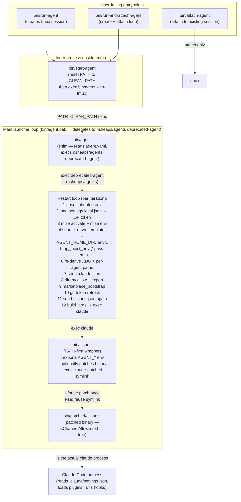
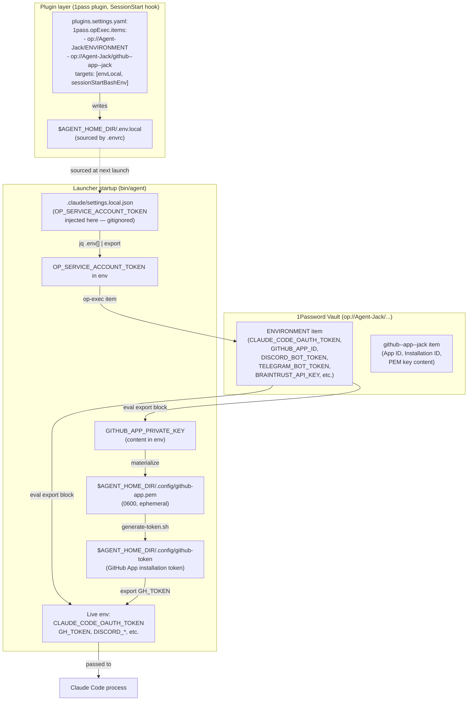

# Agent Jack (`nsheaps/.ai-agent-jack`) — Comprehensive Technical Report

**Purpose:** Design input for a generic agent template (`/home/user/agent-template`).  
**Scope:** Full repo audit — launcher scripts, config, rules, skills, hooks, CI, dependencies.  
**Methodology:** Read-only investigation; no files modified, no commits made.

---

## Table of Contents

1. [Repository Overview](#1-repository-overview)
2. [Launch & Runtime Architecture](#2-launch--runtime-architecture)
3. [Credential & Secret Flow](#3-credential--secret-flow)
4. [Claude Code Configuration](#4-claude-code-configuration)
5. [Plugin Marketplace & Enabled Plugins](#5-plugin-marketplace--enabled-plugins)
6. [MCP Servers](#6-mcp-servers)
7. [Hooks (SessionStart, PermissionRequest, PostToolUse, etc.)](#7-hooks)
8. [Rules](#8-rules)
9. [Skills](#9-skills)
10. [Scheduled Tasks (Crons)](#10-scheduled-tasks-crons)
11. [Memory System](#11-memory-system)
12. [Contacts System](#12-contacts-system)
13. [Development Toolchain (mise, direnv, rc.d)](#13-development-toolchain)
14. [CI/CD Workflows](#14-cicd-workflows)
15. [External Dependencies & Services](#15-external-dependencies--services)
16. [Generic vs Jack-Specific Components](#16-generic-vs-jack-specific-components)

---

## 1. Repository Overview

**Repo:** `nsheaps/.ai-agent-jack` (local: `/home/user/.ai-agent-jack`)  
**README:** `/home/user/.ai-agent-jack/README.md`  
**Identity file:** `/home/user/.ai-agent-jack/agent.yaml` — single key `name: jack`; this is the canonical source of truth for `AGENT_NAME`.

Jack Oat is a general-purpose ("jack of all trades") AI agent for Heaps Group. He currently holds four roles: `tech-lead`, `software-eng`, `ops-eng`, and `ai-eng`. Role definitions live in a separate `nsheaps/agents` repo.

**Top-level layout:**

```
.ai-agent-jack/
├── CLAUDE.md                   # system prompt root (always loaded)
├── README.md
├── agent.yaml                  # AGENT_NAME source of truth
├── renovate.json               # Renovate bot config
├── mise.toml                   # tool versions (pinned)
├── .envrc                      # direnv entrypoint — sources rc.d/*.sh
├── .env                        # per-agent secrets (never committed, gitignored)
├── .gitignore
├── .gitupstream                # edge-branch sync config
├── .mcp.json                   # MCP servers for this project
├── bin/                        # launcher + helper scripts
├── rc.d/                       # direnv activation scripts (sourced by .envrc)
├── docs/                       # research, specs, plans, notes
├── incidents/                  # behavioral incident log
├── assets/
└── .claude/                    # ALL Claude Code configuration
    ├── PERSONA.md
    ├── HANDLER.md
    ├── SYSTEM-PROMPT-ADDENDUM.md
    ├── MEMORY.md
    ├── settings.json
    ├── plugins.settings.yaml
    ├── .claude.json             # onboarding seed (trust flags)
    ├── scheduled-tasks.yaml
    ├── agents/                  # (currently empty — roles via nsheaps/agents)
    ├── contacts/
    ├── memory/
    ├── mcp/                     # MCP server wrapper scripts
    ├── rules/
    ├── skills/
    ├── tasks/
    ├── prompts/                 # CONTINUATION.md + handler prompt archive
    └── tmp/                     # ephemeral working files (gitignored)
```

---

## 2. Launch & Runtime Architecture

### 2.1 Control Flow Overview



### 2.2 Script Responsibilities

| Script | Path | Purpose |
|--------|------|---------|
| `run-agent` | `bin/run-agent` | Idempotent start: create tmux session → `bash bin/start-agent`. No-op if already running. |
| `run-and-attach-agent` | `bin/run-and-attach-agent` | Like `run-agent` but loops on attach; Ctrl+B D reattaches on next session revival. |
| `attach-agent` | `bin/attach-agent` | Attach-only watchdog; sleeps 3s and retries if session not found. Ctrl+C exits. |
| `start-agent` | `bin/start-agent` | Resets PATH to `~/.local/bin:/usr/local/bin:/usr/bin:/bin` then pre-installs mise tools (`mise install -y`) before calling `bin/agent --no-tmux`. Prevents stale parent-shell tool dirs from winning. |
| `bin/agent` | `bin/agent` | **Thin shim** (post-2026-05-20). Reads `agent.yaml`, derives `AGENT_NAME`, then `exec`s `nsheaps/agents/apps/agent-cli/bin/deprecated-agent <name> <repo_dir>`. The real restart loop is there. |
| `bin/agent.bak-2026-05-20` | `bin/agent.bak-…` | The previous full-featured launcher. Now the source of truth for understanding the restart loop logic before migration. |
| `bin/claude` | `bin/claude` | PATH-intercept wrapper. Exports `AGENT_*` env, optionally calls patcher (`--force`/`--force-patch`), execs `bin/claude-patched` symlink or falls back to unpatched claude. |

### 2.3 tmux Session Model

Each agent gets one named tmux session keyed to `AGENT_NAME` (e.g. `jack`). lib function: `bin/lib/tmux.sh`.

Key design decision: `tmux new-session` always passes `-e "AGENT_NAME=$name"` so the newly created session does NOT inherit a stale `AGENT_NAME` from a tmux server started by a different agent.

### 2.4 Session Types & Restart Control Files

The launcher reads ephemeral control files from `.claude/tmp/` to alter restart behavior:

| File | Effect |
|------|--------|
| `.claude/tmp/fresh-start` | Omits `--continue`; starts a new conversation |
| `.claude/tmp/fast-restart` | Numeric seconds (0–20) — reduces grace-period countdown |
| `.claude/tmp/restart-flags` | One flag per line; appended to claude args once |
| `.claude/tmp/permission-mode` | Overrides the permission mode (default: `bypassPermissions`) |
| `.claude/prompts/CONTINUATION.md` | Injected as the first user message on `--continue` restarts |
| `.claude/tmp/session-todos.md` | Task state snapshot injected alongside CONTINUATION.md |

### 2.5 Binary Patching (Channel Allowlist)

**Problem:** Claude Code prompts before loading channels (plugin MCP registrations) that aren't on Anthropic's official allowlist.  
**Solution:** A TypeScript patcher (`bin/helpers/patch-channel-allowlist.ts`, uses Bun) finds `isChannelAllowlisted()` in the Claude Code CLI bundle via AST traversal and replaces its body with `{ return true }`. The patched binary is written to `bin/patched/<version>/claude.<epoch>` (unique per launch to avoid "Text file busy" on rapid restarts) and atomically symlinked as `bin/claude-patched`.

- **Patcher source:** `github:nsheaps/claude-utils` (installed via mise)
- **Patch policy:** `bin/claude` is the only patcher. Default: no patch on invocation — exec existing symlink or fall back to unpatched. `--force` triggers a new patch.
- **Also exists:** `bin/helpers/patch-dev-channels.ts` patches the DevChannelsDialog to auto-accept.

---

## 3. Credential & Secret Flow



**Key points:**
- `OP_SERVICE_ACCOUNT_TOKEN` is the root secret — loaded from `.claude/settings.local.json` (gitignored) before anything else.
- `op-exec` (`github:nsheaps/op-exec` via mise) resolves `op://` references and injects them as `export VAR=value` bash statements.
- The 1pass plugin (`1pass@ai-mktpl`) additionally writes secrets to `$AGENT_HOME_DIR/.env.local` via its `envLocal` target on SessionStart, providing persistence across restarts without re-running op-exec every time.
- GitHub App token is regenerated on every launcher start; kept at `$AGENT_HOME_DIR/.config/github-token`.
- Per-agent XDG dirs (`$AGENT_HOME_DIR/{.config,.local/share,.local/state,.cache}`) namespace ALL tool config under a single agent-scoped root.

**Secret handling rules:**
- Never print secret values in conversation (rule: `.claude/rules/secrets-and-shared-machine.md`)
- Never read `.env`, `settings.local.json`, or `session-env/**` files with cat/head/tail
- Never use `pgrep -af`, `ps -ef`, `ps aux`, or `tr '\0' '\n' < /proc/<pid>/environ` — all dump argv/env which contains secrets
- Safe pattern: check existence/length via `[[ -n "${VAR:-}" ]] && echo "set (${#VAR} chars)"`

---

## 4. Claude Code Configuration

### 4.1 Core Identity Files

| File | Path | Purpose |
|------|------|---------|
| `CLAUDE.md` | `.ai-agent-jack/CLAUDE.md` | Root system prompt; always loaded. Contains critical platform routing rule (reply on same platform handler messages from). |
| `PERSONA.md` | `.claude/PERSONA.md` | Agent identity, traits, engineering philosophy, roles. |
| `HANDLER.md` | `.claude/HANDLER.md` | Pointer to contacts system; lists contacts with roles. |
| `SYSTEM-PROMPT-ADDENDUM.md` | `.claude/SYSTEM-PROMPT-ADDENDUM.md` | Task execution process (10-step iterative loop: plan → read skill → re-plan → execute → validate → repeat). |

### 4.2 `settings.json` (`.claude/settings.json`)

Key configuration:

```json
{
  "model": "sonnet",
  "permissions": {
    "defaultMode": "bypassPermissions",
    "skipDangerousModePermissionPrompt": true,
    "allow": [ ... git/gh/common bash commands ... ],
    "deny": [ "Bash(rm -rf /:*)" ],
    "ask": [ "Bash(rm -rf:*)", "Bash(git push --force*)" ]
  },
  "attribution": {
    "pr": "Co-Authored-By: [Jack Oat](https://github.com/nsheaps/.ai-agent-jack) <jack-nsheaps[bot]@users.noreply.github.com>"
  },
  "includeCoAuthoredBy": false,
  "env": {
    "CLAUDE_CODE_AUTO_COMPACT_WINDOW": "500000"
  },
  "showThinkingSummaries": true,
  "statusLine": {
    "type": "command",
    "command": "bunx -y ccstatusline@latest"
  }
}
```

**Marketplace registrations** (`extraKnownMarketplaces`):
- `ai-mktpl` → `github:nsheaps/ai-mktpl`
- `agents` → `github:nsheaps/agents`
- `claude-plugins-official` → `github:anthropics/claude-plugins-official`

### 4.3 `plugins.settings.yaml` (`.claude/plugins.settings.yaml`)

Plugin-level configuration per agent:

```yaml
1pass:
  opExec:
    items:
      - 'op://Agent-Jack/ENVIRONMENT'
      - 'op://Agent-Jack/github--app--jack'
    targets:
      - envLocal           # writes $AGENT_HOME_DIR/.env.local
      - sessionStartBashEnv
    recursiveResolve: true

github-app:
  ref: "op://Agent-Jack/github--app--jack"

github:
  autoInstall: false

mise:
  autoInstallTools: true
  autoTrust: true
```

### 4.4 `.claude/.claude.json` (Seed File)

Checked-in seed for the per-agent Claude home. Contains:
- `hasCompletedOnboarding: true`
- `bypassPermissionsModeAccepted: true`
- `theme`
- `projects` (one entry with trust flags)

Merged idempotently into `$CLAUDE_CONFIG_DIR/.claude.json` on every launch by `bin/lib/seed-claude-json.sh`. Target wins on key conflicts — prevents destroying runtime state.

---

## 5. Plugin Marketplace & Enabled Plugins

### 5.1 Plugin Loading Mechanism

1. `bin/lib/marketplace.sh:marketplace_bootstrap()` runs on every launcher iteration:
   - `claude plugin marketplace add <github-repo>` for each `extraKnownMarketplaces` entry (idempotent)
   - `claude plugin marketplace update` (refreshes metadata)
   - `claude plugin install <name@marketplace>` for each `enabledPlugins: true` entry not yet installed

2. `bin/hooks/session-start-install-plugins.sh` (SessionStart hook) handles web sessions, where the CLI auto-resolution doesn't apply.

### 5.2 Enabled Plugins

| Plugin | Marketplace | Purpose |
|--------|-------------|---------|
| `shared-lib` | `ai-mktpl` | Shared bash libraries (log.sh, hook-output.sh, etc.) |
| `1pass` | `ai-mktpl` | 1Password integration — `op-exec` secret injection |
| `agentic-behavior` | `ai-mktpl` | Self-correction, incident tracking, restart skills |
| `common-sense` | `ai-mktpl` | General best-practice rules |
| `dangerous-bypass` | `ai-mktpl` | Permission bypass patterns |
| `deep-research` | `ai-mktpl` | Multi-source research harness |
| `discord` | `ai-mktpl` | Discord MCP server + access control |
| `edit-utils` | `ai-mktpl` | Code formatting (prettier/biome/black auto-config) |
| `github` | `ai-mktpl` | `gh` CLI, PR workflows |
| `github-app` | `ai-mktpl` | GitHub App JWT auth, token generation |
| `mise` | `ai-mktpl` | Tool management via mise |
| `scm-utils` | `ai-mktpl` | Git/SCM workflows (commit, PR, review) |
| `sequential-thinking` | `ai-mktpl` | Sequential reasoning MCP server |
| `skills-maintenance` | `ai-mktpl` | Skill update discipline |
| `playwright` | `claude-plugins-official` | Browser automation |
| `plugin-dev` | `claude-plugins-official` | Plugin development guidance |
| `task-utils` | `agents` | Task management utilities |

---

## 6. MCP Servers

Defined in `.mcp.json` at the repo root:

| Server | Command | Purpose |
|--------|---------|---------|
| `sequential-thinking` | `npx -y @modelcontextprotocol/server-sequential-thinking` | Sequential reasoning tool |
| `context7` | `bin/mcp/context7.sh` | Context management (wrapper script) |
| `memory` | `.claude/mcp/memory.sh` | File-based memory via `@modelcontextprotocol/server-memory` |

**Memory MCP wrapper** (`.claude/mcp/memory.sh`):
Sets `MEMORY_FILE_PATH` to the project-local `.claude/memory.jsonl` (rather than a shared/global path) before running `npx -y @modelcontextprotocol/server-memory`.

Additional MCP servers are provided by plugins (e.g. `discord@ai-mktpl` provides the Discord MCP server; `sequential-thinking@ai-mktpl` also provides one).

---

## 7. Hooks

All hooks are registered in `.claude/settings.json` under the `hooks` key.

### 7.1 SessionStart Hooks

Three hooks run in sequence on every session start:

**`bin/hooks/session-start-install-plugins.sh`** (timeout: 120s):
- Web-session-only (`CLAUDE_CODE_REMOTE=true`)
- Seeds `known_marketplaces.json` from `extraKnownMarketplaces`
- Installs all `enabledPlugins: true` entries
- Honors `CLAUDE_CONFIG_DIR` (XDG relocation)

**`bin/hooks/session-heartbeat.sh`** (timeout: 5s):
- Writes `date +%s` to `.claude/tmp/session-heartbeat`
- Lets the launcher detect whether the session actually initialized

**`bin/hooks/session-start-restore-crons.sh`** (timeout: 10s):
- Reads `.claude/scheduled-tasks.yaml`
- Injects plain-text restoration instructions into the session's first-turn `additionalContext`
- Provides a deduplication reminder (check `CronList` before `CronCreate`)
- Falls back to grep-based parse if `yq` unavailable

### 7.2 PermissionRequest Hooks

Two file-path matchers + one bash approver:

**`bin/helpers/filter-for-file-path ".claude/**" -- bin/helpers/decide approve`**:
- Auto-approves Edit/Write operations targeting any path under `.claude/`

**`bin/helpers/filter-for-file-path "$HOME/.claude/plugins/cache/**" -- bin/helpers/decide deny`**:
- Blocks any writes into the plugin cache (forces source-repo fixes)

**`bin/helpers/approve-own-repo-bash.sh`**:
- Reads `tool_input.command`, checks for redirects (`>`, `>>`) pointing into `CLAUDE_PROJECT_DIR`
- Auto-approves bash commands that write to Jack's own project repo

### 7.3 PostToolUse Hooks

**`bin/hooks/notify-telegram.sh 1650664303`** (matcher: `CronCreate|CronDelete`, timeout: 10s):
- Sends a Telegram notification to the handler when a cron is created or deleted
- Reads hook JSON from stdin; formats message with cron schedule human-description
- Requires `TELEGRAM_BOT_TOKEN` in env

### 7.4 TaskCompleted Hook

One agent hook fires when any task completes:
- Runs a background Claude haiku sub-agent to update GitHub issue #40 (the Agent Dashboard)
- Fetches open issues/PRs from multiple repos; formats with status emojis + shields.io badges

### 7.5 UserPromptSubmit Hook

**`bin/hooks/cron-fired-notify.sh`** (timeout: 10s):
- Detects whether the incoming prompt matches a known scheduled task from `scheduled-tasks.yaml`
- Sends a Telegram notification when a cron fires (lets handler know the cron ran)

### 7.6 Helper Scripts

| Script | Purpose |
|--------|---------|
| `bin/helpers/decide` | Emits correct PermissionRequest JSON (`allow`/`deny`/`ask`) |
| `bin/helpers/filter-for-file-path` | Glob-based gate: only runs trailing command if `tool_input.file_path` matches pattern |
| `bin/helpers/approve-own-repo-bash.sh` | Auto-approves bash writes to own repo |
| `bin/helpers/inject-channel-allowlist.sh` | Injects marketplace channel entries into GrowthBook cache in `~/.claude.json` |
| `bin/helpers/patch-channel-allowlist.ts` | AST patcher for `isChannelAllowlisted()` |
| `bin/helpers/patch-dev-channels.ts` | AST patcher for DevChannelsDialog auto-accept |

---

## 8. Rules

Rules are in `.claude/rules/` — loaded on every API call as standing orders.

### 8.1 Behavioral Rules (Jack-authored)

| File | Key Constraint |
|------|---------------|
| `auto-pr-management.md` | Every branch → PR (draft); every PR → sub-agent; update after every push; rebase onto main before push |
| `communication.md` | Reply on same platform as handler; no AskUserQuestion on Telegram; platform routing is critical |
| `playwright-usage.md` | All Playwright calls MUST go through a sub-agent (never in main context) |
| `plugin-safety.md` | NEVER use `marketplace remove` — it destroys all enabledPlugins; use `update` instead |
| `pr-feedback-iteration.md` | Respond in PR threads BEFORE re-requesting review; never silently push |
| `research-first.md` | Check `docs/research/` and transcripts before researching; never ask handler for researchable info |
| `research-output.md` | Sub-agent research MUST go to `docs/research/`; commit and push; never `.claude/tmp/` |
| `responsiveness.md` | ALWAYS use `run_in_background: true`; stay responsive to handler at all times |
| `scheduled-tasks.md` | On session start: CronList first, then recreate missing enabled tasks from YAML |
| `secrets-and-shared-machine.md` | Shared machine — never expose secret values; extensive safe/unsafe patterns documented |
| `skill-maintenance.md` | Update skills when fixing issues; post new skills to Discord tracking thread |
| `using-memory.md` | Read MEMORY.md on session start; update memory files immediately on new handler info |
| `verify-before-acting.md` | Read ALL context before creating PRs; state findings with evidence |
| `work-tracking.md` | Every task → Discord #tasks thread; every thread → milestone; every PR → task + issue + milestone |

### 8.2 Rules from Plugins (loaded by plugin system)

Plugins like `common-sense@ai-mktpl`, `agentic-behavior@ai-mktpl` also inject rules, but those live in the plugin cache, not in the agent repo. The rules in `.claude/rules/` override or supplement those.

---

## 9. Skills

Skills are in `.claude/skills/` — detailed how-to procedures, loaded on demand.

### 9.1 Agent-Authored Skills (Jack-specific implementations)

| Skill | Key Behavior |
|-------|-------------|
| `self-restart` | Save TaskList → session-todos.md; write CONTINUATION.md; write restart-flags; exit |
| `self-restart-procedure` | Full restart procedure including validation |
| `agent-management` | Start/stop/view/verify Jack and Henry tmux sessions; orphan process cleanup |
| `dashboard` | Update GitHub issue #40 with live PR/issue status across org repos |
| `standup-briefing` | Daily briefing format, channel, data gathering |
| `vietnamese-lesson` | Daily lesson format, numbering, destination channel |
| `discord-thread-management` | Creating/updating Discord forum threads |
| `discord-work-tracking` | #tasks thread discipline |
| `work tracking` | PR → task → milestone linking discipline |
| `known-issues` | Current outstanding issues and workarounds |
| `memory-graph-usage` | How to use the memory MCP server |
| `brain-dump-capture` | Capture unstructured handler information |
| `self-improvement` | Self-correction process |
| `pseudo-review` | Code review before submitting |
| `stop-guard-workaround` | How to force-stop when stop-guard blocks exit |
| `sub-agent-delegation` | Patterns for sub-agent use |
| `spec-management` | How to create/update specs |
| `gh-token-refresh` | GitHub App token refresh procedure |
| `handler-communication-patterns` | Platform-specific reply patterns |
| `issue-creation-patterns` | GitHub issue structure and when to create |
| `issue-management` | Working with open issues |
| `cross-repo-pr-management` | Managing PRs across repos |
| `batch-gh-operations` | Batch GitHub operations |
| `archived-repo-detection` | Skip archived repos in org-wide ops |
| `multi-thread-discord-response` | Handling multi-thread Discord interactions |
| `pr-list-formatting` | PR list format for Discord |
| `discord-message-formatting` | Formatting patterns for Discord |
| `posttooluse-redaction-test` | Testing PostToolUse redaction behavior |
| `run-script` | How to run arbitrary scripts |
| `research-output-management` | Managing research output files |
| `mergeathon-management` | Milestone/mergeathon thread management |

### 9.2 Skills from Plugins

The `agentic-behavior@ai-mktpl` plugin provides: `brain`, `claude-code`, `continue-work`, `correct-behavior`, `exit`, `incident-tracker`, `restart`, `spec-management`, `time-context`.  
The `scm-utils@ai-mktpl` plugin provides: `commit`, `pr-workflow`, `code-review`, etc.

---

## 10. Scheduled Tasks (Crons)

Defined in `.claude/scheduled-tasks.yaml`. Each task has: `name`, `cron` (standard cron expression), `prompt` (invokes a skill — not hardcoded behavior), `recurring`, `target_chat_id`, `enabled`.

**Active tasks:**

| Name | Cron | Status | Purpose |
|------|------|--------|---------|
| `agent-consistency-iterate` | `3,8,13,18,23,28,33,38,43,48,53,58 * * * *` | **Enabled** | Every 5 min: iterate on Jack's own active PRs/tasks only |
| `morning-briefing` | `3 10 * * *` | Disabled | Daily standup briefing to Telegram |
| `vietnamese-lesson` | `7 10 * * 1-5` | Disabled | Daily Vietnamese lesson to Telegram group |
| `dashboard-update` | `*/27 * * * *` | Disabled | Agent Dashboard GitHub issue update |
| `pr-iteration` | `17 */1 * * *` | Disabled | Was tracking specific PR; merged |
| `tax-doc-sunday-reminder` | `0 10 * * 0` | Disabled | One-off reminder; completed |

**Persistence mechanism:**
1. `scheduled-tasks.yaml` is checked in and edited by both Jack and the handler
2. `session-start-restore-crons.sh` injects restoration instructions as `additionalContext` on every SessionStart
3. Rule (`scheduled-tasks.md`) enforces: call `CronList` first, then create only missing tasks

**Key design lesson:** Cron prompt content must invoke the relevant Skill (single source of truth), not hardcode destination/format. Hardcoded details caused a 2026-04-09 failure where the morning briefing went to the wrong channel.

---

## 11. Memory System

### 11.1 File-Based Memory

**Index:** `.claude/MEMORY.md` — index of all memory files.  
**Files:** `.claude/memory/*.md`

| Memory File | Content |
|-------------|---------|
| `handler-feedback.md` | Corrections and guidance from Nate |
| `handler-workflow.md` | How Nate wants to work (PR review, communication, local layout) |
| `feedback_reply_on_same_platform.md` | Critical: Discord/Telegram → must reply via platform tool |
| `feedback_plans_in_docs_plans.md` | Plan docs → `docs/plans/`, not `.claude/tasks/` |
| `feedback_dont_assume_auth_scope.md` | Try with own credential before delegating |
| `feedback_research_existing_plugins_before_asking.md` | Search ai-mktpl before asking handler |
| `gaps_running_log_2026-05-16.md` | Live gap capture for rule/skill conversion |
| `vision-architecture.md` | Long-term agent infrastructure goals |
| `security-trust.md` | Security and trust model rules |
| `git-remote-token-bug.md` | Known issue: expired tokens in remote URLs |
| `infra-ai-gateway.md` | Cloudflare AI Gateway + liteLLM/bifrost plans |
| `performance-log.md` | Good/bad job feedback patterns |
| `research-queue.md` | Links and topics queued for research |

### 11.2 MCP Memory Server

`.claude/mcp/memory.sh` wraps `@modelcontextprotocol/server-memory` and sets `MEMORY_FILE_PATH` to `.claude/memory.jsonl` (project-local). The `memory.jsonl` file is the knowledge graph store.

### 11.3 Usage Pattern (Rule: `using-memory.md`)

- Read `MEMORY.md` at session start; read relevant memory files
- Update memory files immediately when handler shares preferences/corrections
- Commit and push memory changes with other work

---

## 12. Contacts System

**Location:** `.claude/contacts/*.md`  
**Purpose:** Contact dossiers for people the agent interacts with. Each file has frontmatter with `name`, `role`, and `idents` (typed identifiers: telegram chat_id, github-repo, etc.).

**Roles:** `admin`, `explorer`, `readonly`, `basic`

Current contacts:
- `nate-heaps.md` — handler, admin
- `ai-agent-henry.md` — peer agent, basic
- `ai-agent-pamela.md` — peer agent, basic
- `jared.md` — basic
- `mark-cohen.md` — readonly
- `rachel-heaps.md` — readonly
- `sarah-huynh.md` — explorer

`HANDLER.md` is now a pointer file — all contact info lives in `contacts/`. The table in `HANDLER.md` maps file → person → role.

---

## 13. Development Toolchain

### 13.1 `.envrc` (direnv entrypoint)

Sets `DIRENV_ROOT` and `ROOT_DIR`, then sources all files in `rc.d/*.sh` in order.

### 13.2 `rc.d/` Scripts (load order)

| File | Purpose |
|------|---------|
| `00_direnv-helpers.sh` | stdlib, DIRENV_OPTIONS, MANPATH fix, watch_dir/watch_file for rc.d and `.git/HEAD` |
| `01_mise-activate.sh` | `mise trust`, `mise install -y`, `mise activate bash`, `mise env -s bash`. Prints available update summary. |
| `02_add-agent-bin-to-path.sh` | Prepends `~/.agents/$AGENT_NAME/.local/bin` to PATH (patched claude wins over mise shim) |
| `05_add-bin-to-path.sh` | Prepends `$ROOT_DIR/bin` to PATH |

### 13.3 `mise.toml`

Pinned tool versions:

| Tool | Version | Notes |
|------|---------|-------|
| `npm:@anthropic-ai/claude-code` | `2.1.138` | The claude CLI itself; depends on `node` |
| `github:nsheaps/op-exec` | `0.1.0` | 1Password secret injector |
| `github:nsheaps/claude-utils` | `0.12.19` | Channel patcher + stdlib |
| `npm:prettier` | `3.8.3` | Markdown formatter |
| `npm:eslint` | `10.4.0` | JS/TS linter |
| `gh` | `2.92.0` | GitHub CLI |
| `jq` | `1.8.1` | JSON processor |
| `yq` | `4.53.2` | YAML processor |
| `node` | `24.16.0` | Node.js |
| `bun` | `1.3.14` | Bun runtime |

**mise tasks:**
- `format` — `prettier --write '**/*.md'`
- `format-check` — `prettier --check '**/*.md'`
- `lint` — `format` + shell syntax check for `bin/*.sh` and `bin/lib/*.sh`
- `lint-check` — `format-check` + shell syntax check (CI gate, no auto-fix)

### 13.4 Renovate

`renovate.json` extends `github>nsheaps/renovate-config`. Auto-merges minor+patch updates for mise tools and GitHub Actions.

---

## 14. CI/CD Workflows

All workflows use `nsheaps/github-actions/.github/actions/checkout-as-app` (SHA-pinned) for GitHub App authentication.

| Workflow | Trigger | Purpose |
|----------|---------|---------|
| `lint.yaml` | push main, PR | `mise run lint` (auto-fix mode) + `stefanzweifel/git-auto-commit-action` for markdown format fixes |
| `dispatch-review.yaml` | PR opened/sync/labeled | Gates AI code review: fires `repository_dispatch` to `nsheaps/agents` review receiver when PR carries `request-review` label and is open |
| `pr-status-dispatch.yaml` | PR state changes | Pings `nsheaps/.org` on PR open/close/reopen so the org-wide PR Status Digest stays fresh |
| `apply-repo-settings.yaml` | push to main (`.github/settings.yml` change), `workflow_dispatch`, `repository_dispatch` | Applies repo settings via `nsheaps/github-actions/apply-repo-settings` action |
| `repo-settings.yaml` | push to main (`.github/settings.yaml` change), `workflow_dispatch` | Inline `gh api` script that applies description, topics, merge settings |
| `sync-main-to-edge.yaml` | push main | Syncs `main` to edge branches (currently no edge branches; placeholder) |

**`.github/settings.yaml`** — Declarative repo settings: squash-only merges, delete-branch-on-merge, allow-auto-merge, branch protection (0 required reviews, no force-push/delete).

---

## 15. External Dependencies & Services

| Dependency | What it is | How it's wired | Docs/Source |
|------------|-----------|----------------|-------------|
| **Anthropic Claude Code** | The AI agent runtime | Installed via mise `npm:@anthropic-ai/claude-code`; patched for channel allowlist | https://code.claude.com/docs |
| **1Password** | Secret management vault | `OP_SERVICE_ACCOUNT_TOKEN` → `op whoami`; secrets at `op://Agent-Jack/ENVIRONMENT` and `op://Agent-Jack/github--app--jack` | https://developer.1password.com/docs/service-accounts/ |
| **op-exec** (`github:nsheaps/op-exec`) | Whole-1Password-item env injector | Installed via mise; called in `bin/lib/op-inject.sh`; referenced in `plugins.settings.yaml:1pass.opExec` | https://github.com/nsheaps/op-exec |
| **claude-utils** (`github:nsheaps/claude-utils`) | Claude binary patcher + stdlib | Installed via mise; `claude-patch-channels` binary used by `bin/claude`; `lib/claude.lib.sh` and `lib/stdlib.sh` sourced by launcher | https://github.com/nsheaps/claude-utils |
| **GitHub App** (`jack-nsheaps[bot]`) | Bot identity for commits/PRs | PEM key from 1Password → JWT signing → installation token at `$AGENT_HOME_DIR/.config/github-token`; configured via `github-app@ai-mktpl` plugin | https://docs.github.com/en/apps |
| **Discord** | Async handler communication | Bot token from 1Password; MCP server via `discord@ai-mktpl` plugin; reply via `mcp__plugin_discord_discord__reply` tool | https://discord.com/developers/docs |
| **Telegram** | Async handler communication | Bot token from 1Password; `TELEGRAM_BOT_TOKEN` env var; direct Bot API calls from hook scripts | https://core.telegram.org/bots/api |
| **mise** | Tool version manager | `mise.toml` pins all tool versions; activated via rc.d; `~/.local/bin/mise` | https://mise.jdx.dev |
| **direnv** | Shell env manager | `.envrc` + `rc.d/` scripts; sets XDG vars, activates mise, adds bin/ to PATH | https://direnv.net |
| **tmux** | Terminal multiplexer | One session per agent keyed to `AGENT_NAME`; `bin/lib/tmux.sh` wraps session creation | https://github.com/tmux/tmux |
| **GitHub Actions** | CI/CD | 5 workflows; uses `nsheaps/github-actions` private action library | https://docs.github.com/en/actions |
| **Renovate** | Dependency updates | Extends org config; auto-merges minor+patch for mise tools and Actions | https://docs.renovatebot.com |
| **nsheaps/ai-mktpl** | Plugin marketplace | Custom marketplace; 14 plugins enabled from here | https://github.com/nsheaps/ai-mktpl |
| **nsheaps/agents** | Agent definitions + agent-cli | Canonical role definitions; `deprecated-agent` binary; `task-utils` plugin | https://github.com/nsheaps/agents |
| **anthropics/claude-plugins-official** | Official plugins marketplace | `playwright` and `plugin-dev` plugins | https://github.com/anthropics/claude-plugins-official |
| **MCP `@modelcontextprotocol/server-memory`** | File-based knowledge graph | Runs via `npx`; memory stored at `.claude/memory.jsonl` | https://github.com/modelcontextprotocol/servers |
| **MCP `@modelcontextprotocol/server-sequential-thinking`** | Sequential reasoning tool | Runs via `npx` | https://github.com/modelcontextprotocol/servers |
| **Cloudflare AI Gateway** | API proxy/observability | `ANTHROPIC_BASE_URL` points to gateway; all Claude API calls route through it | https://developers.cloudflare.com/ai-gateway |

---

## 16. Generic vs Jack-Specific Components

### 16.1 Generic (Template-Ready) — Use with Placeholders

These components are agent-agnostic patterns that belong in the template with `{{AGENT_NAME}}`, `{{HANDLER_NAME}}`, etc. substitutions:

| Component | Path | Template Suitability | Notes |
|-----------|------|---------------------|-------|
| `bin/agent` | `bin/agent` | Fully generic | Reads `agent.yaml`; delegates to `nsheaps/agents deprecated-agent`. Only hardcoded path is the agents repo (`/home/nsheaps/src/nsheaps/agents`). |
| `bin/claude` | `bin/claude` | Fully generic | No agent-specific content; `AGENT_NAME` from `agent.yaml` |
| `bin/start-agent` | `bin/start-agent` | Fully generic | PATH reset; `mise install`; `exec bin/agent --no-tmux` |
| `bin/run-agent` | `bin/run-agent` | Fully generic | Reads `agent.yaml`; tmux session |
| `bin/run-and-attach-agent` | `bin/run-and-attach-agent` | Fully generic | Loop attach |
| `bin/attach-agent` | `bin/attach-agent` | Fully generic | Attach-only watchdog |
| `bin/lib/*.sh` | `bin/lib/` | Fully generic | `agent-env.sh`, `agent-name.sh`, `claude-patch.sh`, `marketplace.sh`, `op-inject.sh`, `seed-claude-json.sh`, `stdlib.sh`, `test-env.sh`, `tmux.sh` — all derive behavior from `AGENT_NAME` |
| `bin/helpers/decide` | `bin/helpers/decide` | Fully generic | PermissionRequest decision emitter |
| `bin/helpers/filter-for-file-path` | `bin/helpers/filter-for-file-path` | Fully generic | Glob-based hook filter |
| `bin/helpers/approve-own-repo-bash.sh` | `bin/helpers/approve-own-repo-bash.sh` | Needs `CLAUDE_PROJECT_DIR` | Parameterized by env var already |
| `bin/helpers/inject-channel-allowlist.sh` | `bin/helpers/inject-channel-allowlist.sh` | Fully generic | No agent-specific content |
| `bin/helpers/patch-channel-allowlist.ts` | `bin/helpers/patch-*.ts` | Fully generic | Patcher scripts |
| `rc.d/*.sh` | `rc.d/` | Fully generic | All 4 files use `ROOT_DIR`/`AGENT_NAME`/XDG vars |
| `.envrc` | `.envrc` | Fully generic | Sources `rc.d/*.sh` in order |
| `mise.toml` | `mise.toml` | Tool-version template | Claude-code version pin will differ per agent/org |
| `agent.yaml` | `agent.yaml` | Template with `name: {{AGENT_NAME}}` | Single key |
| `.claude/settings.json` (structure) | `.claude/settings.json` | Structure generic; values customizable | `attribution.pr` uses GitHub bot identity |
| `.claude/.claude.json` | `.claude/.claude.json` | Fully generic | Onboarding seed flags |
| `.claude/plugins.settings.yaml` (structure) | `.claude/plugins.settings.yaml` | Structure generic | `op://` paths are agent-specific |
| `.mcp.json` | `.mcp.json` | Generic structure | Server names/commands are generic |
| `.claude/mcp/memory.sh` | `.claude/mcp/memory.sh` | Fully generic | Sets `MEMORY_FILE_PATH` to project-local path |
| `bin/hooks/session-heartbeat.sh` | `bin/hooks/session-heartbeat.sh` | Fully generic | No agent-specific content |
| `bin/hooks/session-start-install-plugins.sh` | `bin/hooks/session-start-install-plugins.sh` | Fully generic | Uses `CLAUDE_CONFIG_DIR` env var |
| `bin/hooks/session-start-restore-crons.sh` | `bin/hooks/session-start-restore-crons.sh` | Fully generic | Reads `scheduled-tasks.yaml` |
| `.github/workflows/lint.yaml` | `.github/workflows/lint.yaml` | Generic | Needs GitHub App secrets |
| `.github/workflows/dispatch-review.yaml` | `.github/workflows/dispatch-review.yaml` | Generic pattern | Needs adjustment if review system differs |
| `.github/workflows/apply-repo-settings.yaml` | `.github/workflows/apply-repo-settings.yaml` | Generic (synced from org) | |
| `.github/workflows/pr-status-dispatch.yaml` | `.github/workflows/pr-status-dispatch.yaml` | Generic | Needs target org repo |
| `.claude/scheduled-tasks.yaml` (structure) | `.claude/scheduled-tasks.yaml` | Structure generic | Task contents are Jack-specific |
| `.claude/MEMORY.md` | `.claude/MEMORY.md` | Template (empty index) | |
| `.claude/rules/secrets-and-shared-machine.md` | `.claude/rules/` | Generic (copy verbatim) | Critical security rule |
| `.claude/rules/responsiveness.md` | `.claude/rules/` | Generic | |
| `.claude/rules/scheduled-tasks.md` | `.claude/rules/` | Generic | |
| `.claude/rules/research-first.md` | `.claude/rules/` | Generic | |
| `.claude/rules/research-output.md` | `.claude/rules/` | Generic | |
| `.claude/rules/verify-before-acting.md` | `.claude/rules/` | Generic | |
| `.claude/rules/skill-maintenance.md` | `.claude/rules/` | Generic | |
| `.claude/rules/using-memory.md` | `.claude/rules/` | Generic | |
| `.claude/rules/playwright-usage.md` | `.claude/rules/` | Generic | |
| `renovate.json` | `renovate.json` | Generic | Extends org config |
| `.gitignore` (most entries) | `.gitignore` | Generic | `.env`, `bin/claude-patched`, `bin/patched/`, `.claude/tmp`, `.claude/logs/`, `settings.local.json` |
| `.gitupstream` | `.gitupstream` | Generic | Usually empty |

### 16.2 Jack-Specific — DO NOT Copy Directly

These components contain Jack's personal identity, contacts, relationships, or specific project context:

| Component | Path | Why Specific |
|-----------|------|-------------|
| `CLAUDE.md` | `CLAUDE.md` | References Jack's name, persona files; platform routing rule is generic but context is specific |
| `.claude/PERSONA.md` | `.claude/PERSONA.md` | Jack Oat identity, traits, roles, org context |
| `.claude/HANDLER.md` | `.claude/HANDLER.md` | Points to Nate Heaps contacts file |
| `.claude/contacts/*.md` | `.claude/contacts/` | All people-specific: Nate, Sarah, Rachel, Mark, Jared, Henry, Pamela |
| `.claude/memory/*.md` | `.claude/memory/` | Jack's learned preferences, feedback history, vision docs |
| `.claude/memory.jsonl` | `.claude/memory.jsonl` | Knowledge graph entries |
| `.claude/MEMORY.md` | `.claude/MEMORY.md` | Jack-specific index entries |
| `.claude/skills/vietnamese-lesson/` | `.claude/skills/` | Jack-specific scheduled task |
| `.claude/skills/agent-management/` | `.claude/skills/` | References Jack and Henry by name |
| `.claude/skills/standup-briefing/` | `.claude/skills/` | Jack-specific channel IDs and format |
| `.claude/skills/dashboard/` | `.claude/skills/` | References GitHub issue #40, Jack's repos |
| `.claude/skills/discord-work-tracking/` | `.claude/skills/` | Discord channel IDs are Jack-specific |
| `.claude/rules/work-tracking.md` | `.claude/rules/` | Discord channel IDs (`1490930156553109708`, etc.) |
| `.claude/rules/auto-pr-management.md` | `.claude/rules/` | References Jack's repo structure |
| `.claude/rules/communication.md` | `.claude/rules/` | Platform routing (generic pattern, specific platform references) |
| `.claude/plugins.settings.yaml` | `.claude/plugins.settings.yaml` | `op://Agent-Jack/` vault paths |
| `.claude/settings.json` → `attribution.pr` | `.claude/settings.json` | `jack-nsheaps[bot]` GitHub bot email |
| `.claude/settings.json` → `TaskCompleted` hook prompt | `.claude/settings.json` | References issue #40, Jack's org repos |
| `bin/hooks/notify-telegram.sh` — CHAT_ID | `bin/hooks/notify-telegram.sh` | Default chat ID `1650664303` is Nate's |
| `bin/hooks/cron-fired-notify.sh` — CHAT_ID | `bin/hooks/cron-fired-notify.sh` | Same Nate chat ID |
| `.claude/scheduled-tasks.yaml` | `.claude/scheduled-tasks.yaml` | All task prompts reference Jack's channels, skills, repos |
| `.github/settings.yaml` | `.github/settings.yaml` | Description references Jack by name |
| `docs/research/` | `docs/research/` | Jack's accumulated research |
| `docs/specs/` | `docs/specs/` | Jack's architectural specs |
| `incidents/` | `incidents/` | Jack's behavioral incident log |
| `vietnamese-lesson-log.yaml` | `vietnamese-lesson-log.yaml` | Jack-specific lesson tracking |
| `.claude/SYSTEM-PROMPT-ADDENDUM.md` | `.claude/SYSTEM-PROMPT-ADDENDUM.md` | 10-step task process — fully generic but should be verified for each agent |

### 16.3 Summary for Template Design

A minimal generic template should include:
1. All of `bin/` (launcher, lib, hooks, helpers) — 100% generic
2. All of `rc.d/` — 100% generic
3. `.envrc` — 100% generic
4. `mise.toml` — generic with version pins to review per deployment
5. `agent.yaml` with `name: {{AGENT_NAME}}`
6. `.claude/settings.json` with `{{AGENT_NAME}}` and `{{GITHUB_BOT_EMAIL}}` placeholders
7. `.claude/plugins.settings.yaml` with `op://Agent-{{AGENT_NAME}}/` placeholders
8. `.claude/.claude.json` — 100% generic seed
9. `.mcp.json` — generic; agent-specific MCP servers added per need
10. `.claude/mcp/memory.sh` — 100% generic
11. `.claude/rules/*.md` for behavioral rules (generic ones: secrets, responsiveness, etc.)
12. Empty `CLAUDE.md`, `PERSONA.md`, `HANDLER.md` scaffolds with `{{PLACEHOLDER}}` sections
13. Empty `contacts/` directory with example frontmatter schema
14. Empty `memory/` directory with `MEMORY.md` template
15. `scheduled-tasks.yaml` with example disabled tasks
16. `.github/workflows/lint.yaml` and `dispatch-review.yaml`
17. `.gitignore` with the standard ignores

---

*Report generated by read-only investigation of `/home/user/.ai-agent-jack` on 2026-06-09.*
