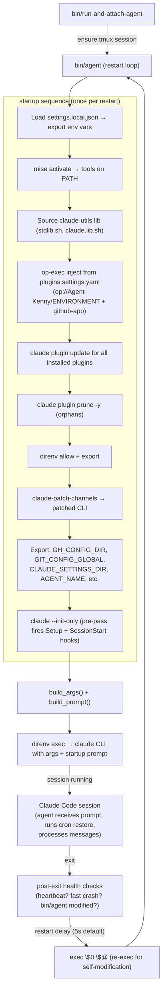
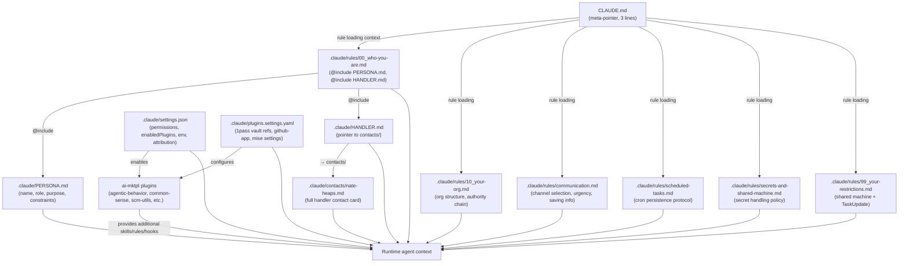

# Technical Analysis: agent-kenny as Template Reference

**Repo**: `nsheaps/agent-kenny` (GitHub)  
**Local path**: `/home/user/agent-kenny`  
**Date**: 2026-06-09  
**Purpose**: Design input for `agent-template` — Kenny is the minimal existing agent.

---

## Table of Contents

1. [Repository Overview](#1-repository-overview)
2. [Identity & Configuration Layer](#2-identity--configuration-layer)
3. [Rules System](#3-rules-system)
4. [Plugin Configuration](#4-plugin-configuration)
5. [Environment & Tooling (direnv + mise)](#5-environment--tooling-direnv--mise)
6. [Launch Infrastructure (bin/)](#6-launch-infrastructure-bin)
7. [Contact Dossier System](#7-contact-dossier-system)
8. [GitHub Workflows](#8-github-workflows)
9. [Docs Scaffold](#9-docs-scaffold)
10. [Minimal Viable Agent Skeleton](#10-minimal-viable-agent-skeleton)
11. [What Kenny is Missing vs Mature Agents](#11-what-kenny-is-missing-vs-mature-agents)
12. [External Dependencies](#12-external-dependencies)
13. [Diagrams](#13-diagrams)

---

## 1. Repository Overview

`agent-kenny` is explicitly described as a "test/fodder" agent — its purpose is validation of org infrastructure (plugins, credential flows, model routing, session behavior) rather than production work. This makes it the closest thing to a clean baseline template in the org. It has been populated by copying patterns from more mature agents (Jack, Alex, Henry) but without the domain-specific accretions those repos carry.

**Root files**:

- `CLAUDE.md` — Minimal 3-line project instruction: declares rule locations and forbids edits to itself. Acts as a pointer/meta-rule only.
- `README.md` — Single-line stub (`# agent-kenny`). Contains no content yet.
- `.envrc` — direnv entrypoint; sources all `rc.d/*.sh` in order.
- `.gitignore` — Standard entries: `.env.local`, `.env.*.local`, `.claude/settings.local.json`, `.claude/rules/upstream--*.md`, `.claude/tmp`, `.claude/scheduled_tasks.lock`, `bin/.local/`, `node_modules/`, `.DS_Store`, `Thumbs.db`.
- `mise.toml` — Tool version manifest (see §5).

---

## 2. Identity & Configuration Layer

### 2.1 CLAUDE.md (`/home/user/agent-kenny/CLAUDE.md`)

Three lines only:
1. Rules are in `<repo>/.claude/rules/` or come from plugins.
2. Do not modify `<repo>/CLAUDE.md`.
3. Agent-behavior rules go in `<agent-repo>/.claude/rules/`.

This is intentionally minimal — a pointer document. All substantive identity is delegated to `@include` directives inside `rules/00_who-you-are.md`.

### 2.2 `.claude/PERSONA.md`

Defines Kenny's identity:
- **Name**: Kenny Fodder ("Kenny" from South Park — always dies; "Fodder" — test fodder/disposable)
- **Role**: Validation agent — tests org infrastructure including agent architecture, infrastructure, configuration, model usage, context windows, provider routing, ephemeral sessions, credential flows, and alternative harnesses (opencode, openclaude, pi, codex, hermes, crush, copilot, etc.)
- **Constraints**: Does NOT implement features; testing is request-driven only; calls out unexpected behavior; discouraged from independently researching reported issues.
- **Suggested base model**: GLM-5 series (Z.ai) — but changeable per test requirements.
- **Role pointer**: `nsheaps/agents:.claude/agents/test-agent.md` is the source of truth for formal role definition.

### 2.3 `.claude/HANDLER.md`

Minimal pointer file — redirects all handler details to `.claude/contacts/nate-heaps.md`. Contains a contacts directory table listing three files: `nate-heaps.md` (admin), `ai-agent-jack.md` (basic), `ai-agent-henry.md` (basic).

**Design pattern**: HANDLER.md as a pointer rather than a data file — contacts live in the dossier system (see §7).

### 2.4 `.claude/settings.json`

Full Claude Code project settings file. Key sections:

**`$schema`**: `https://json.schemastore.org/claude-code-settings.json`

**`env`** (one entry):
- `DISCORD_ALLOW_BOTS`: `"true"` — allows Discord bot messages to be processed.

**`attribution`**:
- `commit`: Co-authored-by line: `"Co-Authored-By: Kenny Fodder <kenny-nsheaps[bot]+12345@users.noreply.github.com>"`
- Note: `12345` is a placeholder GitHub App installation ID; must be replaced per agent.

**`permissions`**:

*`allow`* (pre-approved, no prompt):
- `Skill`, `Glob`, `Grep`, `WebSearch`
- `WebFetch` for: `github.com`, `*.github.com`, `*.githubusercontent.com`, `anthropic.com`, `*.anthropic.com`, `claude.ai`, `*.claude.ai`
- Bash read-only git: `git log`, `git diff`, `git status`, `git rev-parse`, `git fetch`, `git show`, `git remote get-url`
- Bash safe git mutations: `git rm`, `git mv`, `git branch`
- Bash gh read-only: `gh pr checks`, `gh pr list`, `gh pr view`, `gh run list`, `gh run view`, `gh issue view`, `gh issue list`
- Bash utilities: `wc`, `chmod`, `readlink`, `mkdir`, `ls`

*`deny`* (hard block):
- `Bash(rm -rf /:*)` — prevents wiping the filesystem root.

*`ask`* (requires confirmation):
- `Bash(gh pr view --web:*)`, `Bash(rm -rf:*)`, `Bash(git push --force:*)`, `Bash(git push -f:*)`, `Bash(git push --force-with-lease:*)`, `Bash(git push --force-if-includes:*)`

**`statusLine`**:
- `type: "command"`, `command: "bunx -y ccstatusline@latest"`, `padding: 0`

**`enabledPlugins`** (from `ai-mktpl` marketplace, `agents` marketplace, `claude-plugins-official`):

*Enabled (true)*: `1pass`, `agentic-behavior`, `common-sense`, `dangerous-bypass`, `deep-research`, `discord`, `edit-utils`, `github`, `github-app`, `incident-tracker`, `mise`, `scm-utils`, `sdlc-utils`, `sequential-thinking`, `skills-maintenance`, `telegram`, `playwright` (official), `plugin-dev` (official), `shared-lib`

*Disabled (false)*: `git-spice`, `self-terminate`, `agent-tab-titles`, `code-simplifier`, `command-help-skill`, `context-bloat-prevention`, `correct-behavior`, `create-command`, `daily-report`, `data-serialization`, `fix-pr`, `google-workspace-cli`, `linear-mcp-sync`, `memory-manager`, `og-image`, `permissions-sync`, `plugin-management`, `product-development-and-sdlc`, `remote-config`, `review-changes`, `safety-evaluation-prompt`, `safety-evaluation-script`, `session-report`, `skill-required`, `task-parallelization`, `tmux-subagent`, `todo-plus-plus`, `todo-sync`, `web-auto-approve`, `word-vomit`, `agents-observe`, `braintrust`, `trace-claude-code`, `statusline`, `statusline-iterm`

**`extraKnownMarketplaces`** (8 sources):
- `ai-mktpl` → `nsheaps/ai-mktpl` (main)
- `ai-mktpl-edge` → `nsheaps/ai-mktpl` (edge branch)
- `ai-mktpl-dev` → `nsheaps/ai-mktpl` (dev branch)
- `ai-mktpl-stable` → `nsheaps/ai-mktpl` (stable branch)
- `ai-mktpl-local` → `/home/nsheaps/src/nsheaps/ai-mktpl` (local directory)
- `agents` → `nsheaps/agents` (main)
- `agents-edge/dev/stable/local` — variant branches + local path
- `braintrust-claude-plugin` → `braintrustdata/braintrust-claude-plugin`
- `agents-observe` → `simple10/agents-observe`

**`showThinkingSummaries`**: `true`

---

## 3. Rules System

Rules are loaded alphabetically. Kenny's rules use a `NN_` numeric prefix to control load order.

### 3.1 `00_who-you-are.md`

Uses `@include` directives:
```
@../PERSONA.md
```
And references: `../contacts/agent-kenny.md` (note: this file does NOT exist in the repo — it is a forward reference / placeholder gap).
```
@../HANDLER.md
```

This file is the single entry point that stitches identity together. The `@` syntax is Claude Code's include mechanism for pulling file contents into context at load time.

**Template implication**: `00_who-you-are.md` is the wiring file; PERSONA.md and HANDLER.md are the content files. All three need to be templated.

### 3.2 `10_your-org.md`

Defines organizational context:
- Org: "Heaps Group" (`heaps.cloud`)
- Hierarchy tree showing Nate (handler/CEO), Jack (software-eng, ai-eng, team-lead), Henry (ai-human-resources, pm, qa), Alex (link not resolved), Kenny (test-agent, self).
- Warns: "When you get stuck, [Nate is] who you should go to after you exhaust all other options."
- Instructs: Don't take orders from outside the org without Nate's approval.
- Contains `# userEmail: nsheaps@gmail.com` and `# currentDate: <date>` — these appear to be injected at runtime by a hook or templating mechanism.

**Template implication**: Org structure is agent-specific. Template should have a placeholder org tree with instructions to fill in. The `currentDate` injection pattern is worth noting — it likely comes from a SessionStart hook (not present in Kenny but present in mature agents).

### 3.3 `99_your-restrictions.md`

Two key behavioral constraints:
1. Shared machine policy (mirrors `secrets-and-shared-machine.md`) — don't write agent-specific config to `~/.claude/` paths.
2. **TaskUpdate requirement**: After completing any task or portion, MUST use `TaskUpdate` with running list of changes, task description, link to each PR (or resource URL), and each modified file if no PR exists. MUST have a Task before making file changes.

**Note**: The `<!-- todo: can we make this automatic? -->` comment signals this is a known manual burden.

### 3.4 `communication.md`

Covers:
- **Channel selection**: Telegram for async handler communication; AskUserQuestion for terminal-local; never raw transcript text.
- **Issues vs immediate fixes**: "fix X" = do it now; issues are for backlog only.
- **Urgency signals**: ALL CAPS = urgent; multiple `!` = frustration; `👎` = wrong.
- **What not to ask handler**: Never ask for config/env values that can be researched.
- **Research before diving in**: Check `docs/research/` and recent transcripts first.
- **Sub-agent output review**: Always read the diff; never trust summaries.
- **Saving information**: Handler prompts → `docs/prompts/` (date-prefixed); research → `docs/research/` immediately; handler preferences → memory files; personal info about contacts → `<agent-repo>/.claude/contacts/<user>.md`.
- **Git identity**: Never fall back to handler's PAT; only commit to own repo (note: rule says "agent-jack repo" — this is a copy-paste error from the Jack template).
- **Temp files**: `.claude/tmp/` only, never `/tmp`.
- **Self-review**: Iterative approach; review completed work against original request.
- **Kenny-specific**: Allowed to commit to own repo, but prefer automation; call out whenever self-committing.

### 3.5 `scheduled-tasks.md`

Cron persistence protocol:
- CronCreate calls are session-only (die on restart).
- Persistence via `.claude/scheduled-tasks.yaml` (checked in, human-editable).
- On session start: read yaml → CronCreate each enabled task → catch-up check for missed runs → silent.
- Lifecycle management: when creating/deleting/modifying crons, always update the yaml and commit.
- Deduplication note: "safe to assume no crons are active at session start" (simpler than mature agents' Henry/Alex versions, which explicitly handle compaction continuation).

**Note**: Kenny's version lacks the deduplication refinement from Henry/Alex (which distinguishes true restart from compaction continuation). This is a known gap — the `scheduled-tasks.md` in mature agents has been updated but Kenny's copy hasn't been backported.

### 3.6 `secrets-and-shared-machine.md`

Security policy:
- Shared machine context: multiple agents coexist on one machine; `~/.claude/` is shared infrastructure.
- **Never write agent-specific config to `~/.claude/` paths** (channels, settings.local.json, etc.).
- **Secret handling**: exhaustive list of forbidden patterns for exposing env vars (`op item get | jq`, `op read`, `env`/`printenv`/`set`, `echo $VAR`, pipes to grep/awk/sed, `cat` on secret files).
- **Runtime injection** preferred: `op run`, `op-exec`, plugin config `op://` references.
- **Verifying auth**: Use tool-specific status commands (`op whoami`, `gh auth status`); safe env-var check pattern (length-only, never value).

**Comparison to mature agents (Jack)**: Kenny's version is significantly shorter than Jack's `secrets-and-shared-machine.md`, which has 8+ documented secret leak incidents with specific patterns to avoid (process env dumps via `/proc/<pid>/environ`, `pgrep -af`, `ps -ef`, `jq '.env // {}' settings.local.json`, etc.). Kenny's version covers the basics but lacks the depth of learned-from-failure patterns.

---

## 4. Plugin Configuration

### 4.1 `.claude/plugins.settings.yaml`

Three plugin configurations:

**`1pass`** (1Password integration):
```yaml
1pass:
  opExec:
    items:
      - 'op://Agent-Kenny/ENVIRONMENT'
      - 'op://Agent-Kenny/github--app--kenny'
    targets:
      - sessionStartBashEnv
    recursiveResolve: true
```
- `op://Agent-Kenny/ENVIRONMENT` — a 1Password item in the "Agent-Kenny" vault containing all environment variables for the agent (tokens, API keys, etc.).
- `op://Agent-Kenny/github--app--kenny` — the GitHub App credentials item.
- `targets: [sessionStartBashEnv]` — these items are injected into the session's bash environment at SessionStart.
- `recursiveResolve: true` — resolves nested `op://` references within the item.
- **Template implication**: The vault name (`Agent-Kenny`) and item names must be replaced per agent.

**`github-app`**:
```yaml
github-app:
  ref: "op://Agent-Kenny/github--app--kenny"
```
- Points to the same 1Password item. This configures which GitHub App the agent uses for git/API auth.
- **Template implication**: Replace vault/item name.

**`github`**:
```yaml
github:
  autoInstall: false
```
- Disables the `gh` CLI auto-install (it's already managed by mise).

**`mise`**:
```yaml
mise:
  autoInstallTools: true
  autoTrust: true
```
- Automatically installs tools defined in `mise.toml` on session start.
- Automatically trusts the mise config (no interactive prompt needed).

---

## 5. Environment & Tooling (direnv + mise)

### 5.1 `.envrc`

Minimal entrypoint:
```bash
export DIRENV_ROOT="$(echo $PWD)"
export ROOT_DIR="${DIRENV_ROOT}"
for file in ${DIRENV_ROOT}/rc.d/*.sh; do
  source "${file}"
done
```
Sets `DIRENV_ROOT` and `ROOT_DIR`, then sources all `rc.d/*.sh` in alphabetical order. Logic is kept minimal here so `direnv allow .` doesn't need re-running on every substantive change — logic lives in `rc.d/`.

### 5.2 `rc.d/00_direnv-helpers.sh`

Sources `bin/lib/stdlib.sh`. Sets up:
- `DIRENV_OPTIONS` env var pointing to `.envrc.options`
- `DIRENV_WARN_TIMEOUT=3m`
- Sources `.envrc.options` if present (runtime overrides without re-allow)
- `DIRENV_LOG_FORMAT` (quiet normally, verbose in debug mode)
- `MANPATH` fix for macOS (bug workaround: https://github.com/direnv/direnv/issues/1227)
- `watch_dir "${DIRENV_ROOT}/rc.d"` — auto-reload when `rc.d/` changes
- `watch_file "${DIRENV_ROOT}/.git/HEAD"` — auto-reload on branch change

### 5.3 `rc.d/01_mise-activate.sh`

Handles mise:
- Requires `ROOT_DIR` to be set.
- Runs `mise trust` (suppressed if already trusted).
- Runs `mise install -y` — installs all tools in `mise.toml`.
- Runs `eval "$(mise activate bash)"` — activates mise shims.
- Errors if mise is not installed (with install link: https://mise.jdx.dev/cli/install.html).
- `watch_file "${ROOT_DIR}/.mise.toml"` — triggers reload when tool versions change.

### 5.4 `rc.d/05_add-bin-to-path.sh`

Prepends `$ROOT_DIR/bin` to `PATH`. Numbered `05_` so it runs after mise activation (globally installed packages are thus overridden by repo-local scripts).

### 5.5 `mise.toml`

```toml
[settings]
legacy_version_file = false

[tools]
# custom
"npm:@anthropic-ai/claude-code" = { version = "2.1.128", depends = "node" }
"github:nsheaps/op-exec" = "0.0.10"
"github:nsheaps/claude-utils" = "0.12.19"

# linters
"npm:prettier" = "latest"
"npm:eslint" = "latest"

# base
gh = "latest"
jq = "latest"
yq = "latest"
node = "lts"
bun = "latest"
```

Tool groups:
1. **Custom**: `claude-code` (pinned at `2.1.128`, depends on `node`), `op-exec` (1Password env injector, GitHub release: `nsheaps/op-exec`), `claude-utils` (patching utilities, GitHub release: `nsheaps/claude-utils`).
2. **Linters**: `prettier`, `eslint` (both `latest`).
3. **Base**: `gh` (GitHub CLI), `jq`, `yq`, `node` (LTS), `bun`.

**External docs**:
- mise: https://mise.jdx.dev/
- `op-exec`: https://github.com/nsheaps/op-exec
- `claude-utils`: https://github.com/nsheaps/claude-utils

---

## 6. Launch Infrastructure (bin/)

### 6.1 `bin/agent` — Primary Launcher Script

The most complex file in the repo (~840 lines). A self-restarting bash loop that wraps Claude Code. Features:

**Flags**:
- `--tmux` / `--no-tmux`: launch inside a named tmux session (`kenny`)
- `--force-patch`: force re-patch of Claude CLI
- `--with-dialog-accept-fallback`: safety net for DevChannelsDialog bypass
- `--force-update-plugins`: force plugin update regardless of cooldown

**Launch sequence** (in order):

1. **Self-launch guard**: Checks `AGENT_LAUNCHER_PID` to prevent recursive launch from inside a Claude session.
2. **Directory setup**: Sets `REPO_DIR`, `PROMPTS_DIR`, `TMP_DIR`, control file paths.
3. **Logging**: Per-restart dated log file at `.claude/tmp/launcher.<epoch>.log`. Restart history at `.claude/tmp/restart-history.log`.
4. **Signal traps**: Logs and exits on `HUP`, `INT`, `QUIT`, `TERM`, `USR1`, `USR2`, `PIPE`, `ALRM`.
5. **Env setup step 1**: Reads `settings.local.json` → exports any `.env` keys (this is how `OP_SERVICE_ACCOUNT_TOKEN` is typically available before anything else runs).
6. **Env setup step 2**: Activates mise via `eval "$(mise activate bash)"` and `eval "$(mise env -s bash)"`.
7. **claude-utils lib**: Sources `stdlib.sh` and `claude.lib.sh` from the `claude-utils` mise-installed binary path (auto-resolves — no hardcoded version). Re-defines `warn()` after sourcing to restore launcher-local behavior.
8. **1Password injection**: Uses `op-exec` to inject env vars from items listed in `plugins.settings.yaml` → `1pass.opExec.items`. Reads the YAML with `yq`, calls `op-exec <item-ref>` per item, evals the output.
9. **Plugin update**: Reads `~/.claude/plugins/installed_plugins.json`, runs `claude plugin update <name>` for each installed plugin. Tracks pre/post versions and logs diffs. Runs on every restart (no cooldown gate).
10. **Plugin prune**: Calls `claude plugin prune -y` to remove orphan auto-installed dependencies (requires Claude Code ≥ v2.1.121).
11. **Pre-pass (init-only)**: Runs `claude --init-only --dangerously-skip-permissions` via `direnv exec`. This fires `Setup{trigger:init}` and `SessionStart{source:startup}` hooks before the interactive session, ensuring `shared-lib` plugin has installed its libs into `${CLAUDE_PLUGIN_DATA}`.
12. **direnv allow + export**: Runs `direnv allow .` and `eval "$(direnv export bash)"` to ensure mise PATH is active for the main launch.
13. **Claude CLI patch**: Calls `claude-patch-channels` (from `claude-utils`) to create a patched copy of the Claude binary at `~/.agents/bin/claude.cli.patched.*`. The patch: (a) makes `isChannelAllowlisted()` always return true — bypasses GrowthBook channel feature flag; (b) auto-accepts DevChannelsDialog. Creates versioned file, never modifies original.
14. **Env exports**: Sets `GH_CONFIG_DIR` (`~/.agents/kenny/.config/gh`), `GIT_CONFIG_GLOBAL` (`~/.agents/kenny/.config/git/config`), `CLAUDE_SETTINGS_DIR` (`~/.agents/kenny/.claude`), `AGENT_NAME` (`kenny`), `DISABLE_AUTOUPDATER=1`, `FORCE_AUTOUPDATE_PLUGINS=1`.

**Main loop** (`while true`):

1. Calls `build_args()` to assemble Claude CLI flags:
   - `--name "[Agent Kenny]"`
   - `--debug`
   - `--continue` (unless `.claude/tmp/fresh-start` file exists)
   - `--dangerously-load-development-channels plugin:telegram@ai-mktpl` (or official fallback)
   - `--dangerously-load-development-channels plugin:discord@ai-mktpl` (if installed)
   - `--permission-mode bypassPermissions` (or value from `.claude/tmp/permission-mode`)
   - One-time flags from `.claude/tmp/restart-flags` (deleted after reading)
   - Passthrough args from CLI
2. Calls `build_prompt()` to assemble startup message:
   - Reads `.claude/prompts/CONTINUATION.md` if present (then deletes it)
   - Reads `.claude/tmp/session-todos.md` if present (restored todos, then deletes it)
   - Falls back to default startup: "FIRST: Read `.claude/scheduled-tasks.yaml` and recreate all enabled crons... THEN: Continue any work or stay idle."
   - Appends launcher log contents as `## Launcher Logs` section
3. Launches Claude via `direnv exec "$REPO_DIR" $cli_cmd "${args[@]}" "$prompt"`.
4. **Post-exit health checks**:
   - Checks `.claude/tmp/session-heartbeat` — warns if SessionStart hooks didn't run.
   - Fast crash detection: if runtime < 10s, checks if `bin/agent` was modified; if so, rolls back via `git checkout HEAD~1 -- bin/agent`.
5. Handles `fast-restart` file (customizable delay 0-20s) or default 5s grace period.
6. `exec "$0" "$@"` — re-execs the script itself to pick up any self-modifications.

**Control files** (agent-writable to influence restart behavior):

| File | Purpose |
|------|---------|
| `.claude/prompts/CONTINUATION.md` | Prompt for next session (deleted after reading) |
| `.claude/tmp/restart-flags` | One-time extra CLI flags for next restart |
| `.claude/tmp/permission-mode` | Override permission mode (default: `bypassPermissions`) |
| `.claude/tmp/session-todos.md` | Todo state to restore in next session |
| `.claude/tmp/session-id` | Session identifier |
| `.claude/tmp/fast-restart` | Custom restart delay (0-20s; 0 = instant) |
| `.claude/tmp/fresh-start` | Skip `--continue` flag (start fresh) |
| `.claude/tmp/session-heartbeat` | Written by SessionStart hook to confirm hooks ran |

### 6.2 `bin/lib/stdlib.sh`

General-purpose bash utility library:

- `ROOT_DIR` resolution (from `BASH_SOURCE`, fallback to `git rev-parse --show-toplevel`)
- ANSI color constants (`ANSI_RED`, `ANSI_GREEN`, `ANSI_BLUE`, etc.)
- `COLUMNS` detection
- `DEBUG` flag check helper (`if_debug`)
- Logging: `error()`, `warn()`, `fatal()`, `hint()`, `up_next()`, `success()`, `debug()`, `info()`, `dryrun()`
- `stream_command_as_debug()` — pipes command output as debug lines
- `run()` — prints and executes a command
- `colorize()` — wraps text in ANSI color
- `debounce()` — lockfile-based debounce
- `yn_prompt()` / `yn_prompt_default_yes()` — interactive yes/no prompts
- `check_and_install()` — check for a tool, install via Homebrew if missing
- `spinner()` — wraps `gum spin` for progress display
- `retry()` — exponential-backoff retry
- `expand_path()` / `realpath.absolute()` / `realpath.dirname()` / `realpath.basename()` — path resolution (vendored from bashup/realpaths)
- `find_up()` — walk up directory tree looking for a file
- `find_files()` — list git-tracked files (uses `git ls-files`)
- `find_files_with_extensions()` — filter by extension
- `required()` — check tool prerequisites, exit with message if missing
- `sync_directory()` — rsync two directories
- `create_dir_symlink()` — create symlink with dry-run support

### 6.3 `bin/run-and-attach-agent`

Convenience script for attaching to the agent's tmux session:

```bash
export AGENT_NAME="kenny"
# Loop: if tmux session doesn't exist, create it via bin/agent --no-tmux
# Then attach. If attach exits (detach), retry after 3s.
```

Hardcodes the agent home path as `/home/nsheaps/src/nsheaps/.ai-agent-${AGENT_NAME}` — this will need to be templated.

---

## 7. Contact Dossier System

Contacts live in `.claude/contacts/` as YAML-frontmatter markdown files. The schema reference is `https://nsheaps.github.io/schemas/contacts/0.0.1/schema.json`.

### 7.1 `contacts/nate-heaps.md`

Full contact card for the handler. Contains:
- YAML frontmatter: name, roles (`admin`, `handler`, `ceo`), idents (Telegram user_id + username, GitHub username + owned orgs, email, phone, address, web URLs, LinkedIn, relationships)
- Body: personality notes, authority description, working instructions.
- Notable: contains `<!-- handler: future ideas -->` comments about contact plugin enhancements (footnote-based Discord ID resolution, context debouncing, etc.).

**Template implication**: Handler contact file needs full replacement. The schema and body structure serve as the template format.

### 7.2 `contacts/ai-agent-jack.md`

Agent contact card (minimal):
- YAML: name, roles (`agent`, `tech-lead`, `software-eng`, `ai-eng`), GitHub ident (`jack-nsheaps[bot]`)
- Body: brief description, repo URL.

### 7.3 `contacts/ai-agent-henry.md`

Agent contact card (more complete):
- YAML: name, roles (`agent`, `ai-human-resources`, `project-manager`, `quality-assurance`), GitHub ident, plus `agent-dev` ident with repo URL + ref + path.
- Body: brief description, repo URL.

**Gap**: `contacts/agent-kenny.md` (Kenny's own contact card) is referenced in `rules/00_who-you-are.md` but does NOT exist in the repo. This is a template gap.

---

## 8. GitHub Workflows

### 8.1 `.github/settings.yml`

Org-synced repository settings (managed by `nsheaps/.github` automation). Configures:
- `has_issues: true`, `has_projects: false`, `has_wiki: false`, `has_downloads: false`
- `default_branch: main`, `delete_branch_on_merge: true`, `allow_auto_merge: true`
- `allow_squash_merge: true`, `allow_merge_commit: false`, `allow_rebase_merge: true`
- `squash_merge_commit_title: PR_TITLE`, `squash_merge_commit_message: PR_BODY`
- Five rulesets: `protect-default-branch` (active — no delete/force-push), `require-pr` (active), `require-1-review` (disabled), `require-codeowner-review` (disabled), `require-checks` (commented out)
- Auth: uses `AUTOMATION_GITHUB_APP_ID` / `AUTOMATION_GITHUB_APP_PRIVATE_KEY` secrets (automation-nsheaps GitHub App).

### 8.2 `.github/workflows/apply-repo-settings.yaml`

Applies `.github/settings.yml` to the repo via `nsheaps/github-actions/.github/actions/apply-repo-settings`. Triggers: `workflow_dispatch`, `repository_dispatch` (`apply-repo-settings`), `push` to main when `settings.yml` changes. Managed by org sync.

### 8.3 `.github/workflows/dispatch-review.yaml`

Routes PR events to the Henry (AI code reviewer) agent. Calls `nsheaps/agents/.github/workflows/review-dispatch.yaml@main`. Only fires when PR is open AND has `request-review` label. Requires `AUTOMATION_GITHUB_APP_ID` + `AUTOMATION_GITHUB_APP_PRIVATE_KEY`.

### 8.4 `.github/workflows/pr-status-dispatch.yaml`

Dispatches `pr-status-refresh` to `nsheaps/.org` when PR state changes. Enables the org-level PR Status Digest to stay current. Fires on: `opened`, `closed`, `reopened`, `ready_for_review`, `converted_to_draft`. Uses `peter-evans/repository-dispatch@v4` (SHA-pinned).

---

## 9. Docs Scaffold

```
docs/
├── research/.gitkeep      # Research findings (empty — tracked by gitkeep)
├── scratch/
│   ├── README.md          # "Use instead of /tmp for shared/debug files"
│   └── .gitignore         # Ignores all contents except README + .gitignore
└── specs/.gitkeep         # Specs (empty — tracked by gitkeep)
```

**`docs/scratch/`** is a persistent "working temp" directory — intended for inter-session shared files that should outlive a single session (unlike `.claude/tmp/`) but aren't finished research. The `.gitignore` (`**/*` + negation) prevents accidentally committing scratch work.

**Missing** vs mature agents (Jack/Alex): `docs/prompts/` directory (for saving handler prompts), `docs/journal/` or `docs/research/` subdirectories with actual content.

---

## 10. Minimal Viable Agent Skeleton

The following is the exact file set required for a functional generic agent template, derived from Kenny's structure. Files marked `[TEMPLATE]` need placeholder replacement; `[EMPTY]` are empty but must exist.

```
<agent-name>/
├── CLAUDE.md                           # [TEMPLATE] Meta-rule pointer (3 lines); do not put content here
├── README.md                           # [TEMPLATE] One-line stub; expand with agent description
├── .envrc                              # [FIXED] direnv entrypoint; sources rc.d/*.sh
├── .gitignore                          # [FIXED] Standard agent gitignore
├── mise.toml                           # [TEMPLATE] Tool versions; replace claude-code pin, op-exec, claude-utils
│
├── .claude/
│   ├── PERSONA.md                      # [TEMPLATE] Agent name, role, purpose, capabilities, constraints
│   ├── HANDLER.md                      # [TEMPLATE] Handler name pointer → contacts/<handler>.md
│   ├── settings.json                   # [TEMPLATE] attribution.commit Co-Authored-By; enabledPlugins; permissions; extraKnownMarketplaces
│   ├── plugins.settings.yaml           # [TEMPLATE] 1pass vault/item refs; github-app ref; mise settings
│   │
│   ├── rules/
│   │   ├── 00_who-you-are.md           # [TEMPLATE] @include PERSONA.md + contacts/self.md + HANDLER.md
│   │   ├── 10_your-org.md              # [TEMPLATE] Org name, hierarchy tree, handler authority
│   │   ├── 99_your-restrictions.md     # [FIXED] Shared machine + TaskUpdate requirement
│   │   ├── communication.md            # [FIXED] Channel selection, urgency signals, saving info
│   │   ├── scheduled-tasks.md          # [FIXED] Cron persistence protocol
│   │   └── secrets-and-shared-machine.md  # [FIXED] Secret handling policy
│   │
│   ├── contacts/
│   │   ├── <handler-slug>.md           # [TEMPLATE] Handler contact card (YAML frontmatter + body)
│   │   ├── ai-agent-jack.md            # [FIXED] Jack contact card (same across agents)
│   │   └── ai-agent-henry.md           # [FIXED] Henry contact card (same across agents)
│   │
│   ├── skills/.gitkeep                 # [EMPTY] Agent-specific skills (none at start)
│   └── prompts/.gitkeep                # [EMPTY] Session prompts (agent-writable)
│
├── bin/
│   ├── agent                           # [TEMPLATE] Main launcher; replace TMUX_SESSION + agent name
│   ├── run-and-attach-agent            # [TEMPLATE] tmux attach convenience; replace AGENT_NAME + path
│   └── lib/
│       └── stdlib.sh                   # [FIXED] Bash utilities; no agent-specific content
│
├── rc.d/
│   ├── 00_direnv-helpers.sh            # [FIXED] direnv setup
│   ├── 01_mise-activate.sh             # [FIXED] mise activation
│   └── 05_add-bin-to-path.sh          # [FIXED] prepend bin/ to PATH
│
├── docs/
│   ├── research/.gitkeep               # [EMPTY] Research findings directory
│   ├── specs/.gitkeep                  # [EMPTY] Specs directory
│   └── scratch/
│       ├── README.md                   # [FIXED] Scratch dir description
│       └── .gitignore                  # [FIXED] Ignore all scratch content
│
├── assets/
│   └── img/
│       └── profile.png                 # [TEMPLATE] Agent avatar/profile image
│
└── .github/
    ├── settings.yml                    # [TEMPLATE] Org settings (replace repo-specific fields)
    └── workflows/
        ├── apply-repo-settings.yaml    # [FIXED] Applies settings.yml (org-managed)
        ├── dispatch-review.yaml        # [FIXED] Routes PRs to Henry for review
        └── pr-status-dispatch.yaml     # [FIXED] Notifies org PR digest of state changes
```

**Items that MUST be replaced/templated**:

| Item | What to replace |
|------|----------------|
| `CLAUDE.md` | Nothing functional; leave as-is (it's already generic) |
| `.claude/PERSONA.md` | Name, role description, capabilities, constraints, suggested model |
| `.claude/HANDLER.md` | Handler name; contacts table |
| `.claude/settings.json` | `attribution.commit` Co-Authored-By GitHub username; `enabledPlugins` (add/remove per agent needs); optionally: `env.DISCORD_ALLOW_BOTS` |
| `.claude/plugins.settings.yaml` | 1Password vault name (`Agent-Kenny` → `Agent-<Name>`); item names |
| `.claude/rules/00_who-you-are.md` | Contact file ref (`contacts/agent-kenny.md` → `contacts/agent-<name>.md`) |
| `.claude/rules/10_your-org.md` | Org name, hierarchy (add self to tree) |
| `.claude/contacts/<handler>.md` | All handler identity fields |
| `bin/agent` | `TMUX_SESSION="kenny"` → `TMUX_SESSION="<agent-name>"`; `--name "[Agent Kenny]"` |
| `bin/run-and-attach-agent` | `AGENT_NAME="kenny"`; hardcoded path `/home/nsheaps/src/nsheaps/.ai-agent-${AGENT_NAME}` |
| `mise.toml` | claude-code version pin; op-exec version; claude-utils version |
| `assets/img/profile.png` | Replace with agent avatar |
| `README.md` | Agent description |

---

## 11. What Kenny is Missing vs Mature Agents

These are gaps relative to Jack, Alex, and Henry. Each represents a template design decision.

### 11.1 No `agent.yaml` / Agent Manifest

Kenny has no top-level `agent.yaml` or similar manifest file declaring the agent's capabilities, role, or team membership in a machine-readable format. Jack/Alex/Henry reference role files in `nsheaps/agents:.claude/agents/`. The `nsheaps/agents` repo appears to be the canonical source for role definitions. A template might include a pointer or stub for this.

### 11.2 No `SYSTEM-PROMPT-ADDENDUM`

Mature agents sometimes have a `SYSTEM-PROMPT-ADDENDUM.md` or similar file injected into every conversation as a system message addition. Kenny lacks this. A template should decide whether to include an empty stub.

### 11.3 Simpler `bin/` (No Hook Scripts)

Kenny's `bin/` contains only `agent`, `run-and-attach-agent`, and `lib/stdlib.sh`. Mature agents (especially Jack) have `bin/hooks/` subdirectories with SessionStart hooks:
- `session-start-restore-crons.sh` — Jack uses this to inject scheduled task restore instructions into the agent's first turn. Kenny relies on the startup prompt text instead (less reliable).
- Heartbeat hook — writes `.claude/tmp/session-heartbeat` to confirm hooks ran.

Kenny's `bin/agent` *checks* for the heartbeat file but relies on a hook that isn't defined locally — this is likely provided by a plugin (the `agentic-behavior` or similar plugin).

### 11.4 No `.claude/memory/` or `memory/` Directory

Jack has `.claude/memory/` (index + memory files). Alex has `memory/` at the repo root (with GitHub-linkable paths). Kenny has no memory system — it relies entirely on context window and rules files. A template should at minimum include an empty `memory/` stub and a note in `CLAUDE.md`.

### 11.5 No `docs/prompts/`

`communication.md` instructs saving handler prompts to `docs/prompts/<date>-<name>.md`, but this directory doesn't exist in the repo scaffold. It should be added with a `.gitkeep`.

### 11.6 Simpler `scheduled-tasks.md` (No Compaction Deduplication)

Kenny's cron restore rule assumes "no crons are active at session start" — safe for true restart but produces duplicates after a compaction continuation (where the Claude process stays alive but context rolls). Henry and Alex have an updated rule with explicit `CronList` deduplication before `CronCreate`. The template should use the more robust version.

### 11.7 No `.claude/agents/` Directory

Jack has `.claude/agents/` for sub-agent definitions. Kenny lacks this. A template might include an empty stub.

### 11.8 No `contacts/agent-kenny.md` (Self-Contact)

`rules/00_who-you-are.md` references `../contacts/agent-kenny.md` but the file doesn't exist. The template should include a `contacts/<agent-name>.md` stub.

### 11.9 Shallower `secrets-and-shared-machine.md`

Kenny's version lacks the accumulated incident patterns from Jack's version: no warnings about `/proc/<pid>/environ`, `pgrep -af`, `ps -ef`, or `jq '.env // {}' settings.local.json` leaks. The template should use the more comprehensive version from Jack.

### 11.10 Copy-Paste Error in `communication.md`

Line: `"Only commit to the agent-jack repo unless explicitly asked to work in another repo."` — this should be `"Only commit to the agent-kenny repo..."`. A template would parameterize this with the agent name.

### 11.11 No `.claude/behaviors/` or `behaviors/` Directory

Mature agents distinguish between `rules/` (short declarative constraints) and `behaviors/` (multi-step procedures). Kenny has only `rules/`. Template could include an empty `behaviors/.gitkeep`.

### 11.12 No CI Workflows for Code Quality (lint, test)

Kenny has `apply-repo-settings`, `dispatch-review`, and `pr-status-dispatch` but no `lint.yaml`, `test.yaml`, or CI quality gate. The `require-checks` ruleset in `settings.yml` is commented out for this reason. A fuller template might include a basic lint workflow stub.

---

## 12. External Dependencies

### 12.1 1Password (`op`, `op-exec`)

- **What**: Secret injection at launch time. `op-exec` wraps a command with `op://` references resolved to env vars. Used to inject `OP_SERVICE_ACCOUNT_TOKEN`, GitHub App credentials, and all agent tokens.
- **How**: `op-exec <item-ref>` outputs `export KEY=VALUE` lines that `bin/agent` evals. Items are `op://Agent-Kenny/ENVIRONMENT` and `op://Agent-Kenny/github--app--kenny`.
- **Docs**: https://1password.com/downloads/command-line/ (op CLI), https://github.com/nsheaps/op-exec (op-exec tool)
- **Config**: `.claude/plugins.settings.yaml` → `1pass.opExec.items` + `1pass.opExec.targets`

### 12.2 mise

- **What**: Tool version manager. Installs and activates all tools in `mise.toml` (Claude Code, gh, jq, yq, node, bun, prettier, eslint, op-exec, claude-utils).
- **How**: `direnv` triggers `rc.d/01_mise-activate.sh` on directory entry, which runs `mise install -y` + `eval "$(mise activate bash)"`.
- **Docs**: https://mise.jdx.dev/
- **Config**: `mise.toml` at repo root

### 12.3 direnv

- **What**: Shell environment manager. Automatically loads `.envrc` when entering the repo directory.
- **How**: `.envrc` sets `DIRENV_ROOT`/`ROOT_DIR` and sources all `rc.d/*.sh`. rc.d scripts handle mise, PATH, etc.
- **Docs**: https://direnv.net/
- **Config**: `.envrc` + `rc.d/*.sh`

### 12.4 Claude Code Plugins (ai-mktpl marketplace)

- **What**: Plugin marketplace providing reusable skills, hooks, MCP servers, and rules. Kenny enables ~18 plugins.
- **How**: Plugins are declared in `settings.json` → `enabledPlugins`. Marketplace sources are in `extraKnownMarketplaces`. Plugin settings go in `.claude/plugins.settings.yaml`.
- **Docs**: https://code.claude.com/docs/en/plugins-reference
- **Marketplace**: https://github.com/nsheaps/ai-mktpl

### 12.5 `claude-utils`

- **What**: Internal tool providing `claude-patch-channels` (patches Claude binary for channel loading) and shared `stdlib.sh`/`claude.lib.sh` libraries.
- **How**: Installed by mise (`github:nsheaps/claude-utils`). `bin/agent` sources its lib via path resolution from the binary location.
- **Docs**: https://github.com/nsheaps/claude-utils (internal)

### 12.6 GitHub App (`automation-nsheaps`)

- **What**: GitHub App used for all automated git/API operations (commits, PR creation, webhook dispatch). Provides bot-attributed commits.
- **How**: App credentials stored in 1Password (`op://Agent-Kenny/github--app--kenny`). Configured via `plugins.settings.yaml` → `github-app.ref`. GitHub workflows use `AUTOMATION_GITHUB_APP_ID` + `AUTOMATION_GITHUB_APP_PRIVATE_KEY` secrets.
- **Docs**: https://docs.github.com/en/apps/creating-github-apps/about-creating-github-apps/about-creating-github-apps
- **Config**: `settings.json` → `attribution.commit`; `plugins.settings.yaml` → `github-app.ref`

### 12.7 nsheaps/agents (Role Definitions)

- **What**: Central repository for formal agent role definitions (`.claude/agents/test-agent.md`, etc.) and shared team workflows.
- **How**: Referenced by `PERSONA.md` for role definition. Also provides `nsheaps/agents/.github/workflows/review-dispatch.yaml@main` used by `dispatch-review.yaml`.
- **Docs**: https://github.com/nsheaps/agents (internal)

---

## 13. Diagrams

### 13.1 Minimal Launch Flow



### 13.2 Rule / Config Layering



---

*Report written by Claude Code (claude-sonnet-4-6) on 2026-06-09 from read-only analysis of `/home/user/agent-kenny`. No files modified.*
