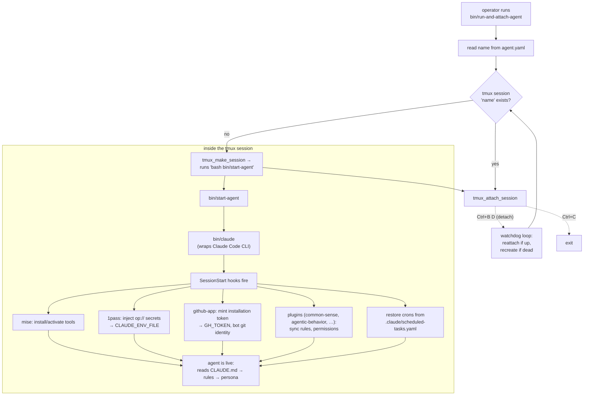

# Architecture

How a launched agent is wired together.

## Identity flows from one file

`agent.yaml`'s `name:` is the single source of truth. The launcher scripts parse it with a minimal `grep`+`sed` (not `yq`) and **never** inherit the name from the environment — this prevents cross-agent contamination on a shared tmux server. Everything per-agent derives from `name`: the XDG home at `~/.agents/<name>`, the tmux session name, and (by convention) the 1Password vault.

## Launch flow

The scripts are the source of truth; read them rather than trusting this diagram if they diverge:

- `bin/run-and-attach-agent` — entrypoint: start-if-needed + attach loop (watchdog on detach).
- `bin/run-agent` — start without attaching.
- `bin/attach-agent` — attach to an existing session.
- `bin/start-agent` — what runs *inside* the tmux session; launches `bin/claude`.
- `bin/claude` — wrapper around the Claude Code CLI (flags, system-prompt addendum, logging).
- `bin/lib/`, `bin/helpers/` — shared shell helpers (e.g. `tmux.sh`).
- `bin/install-plugins` — materializes the marketplace + enabled plugins.
- `bin/hooks/` — SessionStart hooks (e.g. cron restore).

## Configuration layers

| Layer | Where | Survives restart? |
| --- | --- | --- |
| Repo-scope settings | `.claude/settings.json` (committed) | ✅ — canonical |
| Plugin settings | `.claude/plugins.settings.yaml` (committed) | ✅ |
| Rules | `.claude/rules/*.md` (committed) + plugin-provided | ✅ |
| Trust seed | `.claude/.claude.json` (committed) | ✅ |
| User-scope settings | `$CLAUDE_CONFIG_DIR/settings*.json` | ❌ — wiped on restart; don't rely on it |
| In-memory crons | created via `CronCreate` at runtime | ❌ — restored from `scheduled-tasks.yaml` |
| Secrets | 1Password, injected per session | ✅ (in 1Password, not the repo) |

Anything that must outlive a restart belongs in a **committed** file. See `.claude/rules/scheduled-tasks.md` and `.claude/rules/memory-location.md`.

## Environment & isolation

- `mise.toml` pins tools; `rc.d/*.sh` activate mise and add `bin/` + the agent bin dir to PATH.
- `.envrc` / `.envrc.template` (direnv) load the per-agent environment.
- Each agent gets an isolated home at `~/.agents/<name>` so multiple agents can share one host without clobbering each other's `~/.claude`, git config, or GH config.

## Runtime data vs. memory

- **Memory** (durable, handler-shareable): `memory/*.md`, indexed by `.claude/MEMORY.md`. NOT under `$CLAUDE_CONFIG_DIR`.
- **Transcripts / session-internal state**: under `$CLAUDE_CONFIG_DIR/projects/...` — managed by the harness, not memory.
- **Temp**: `.claude/tmp/` only (never system `/tmp` on a shared machine).
